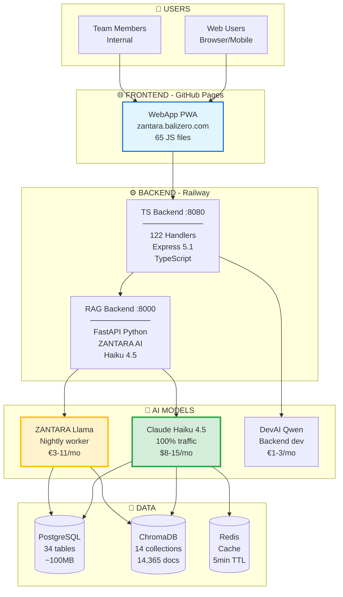
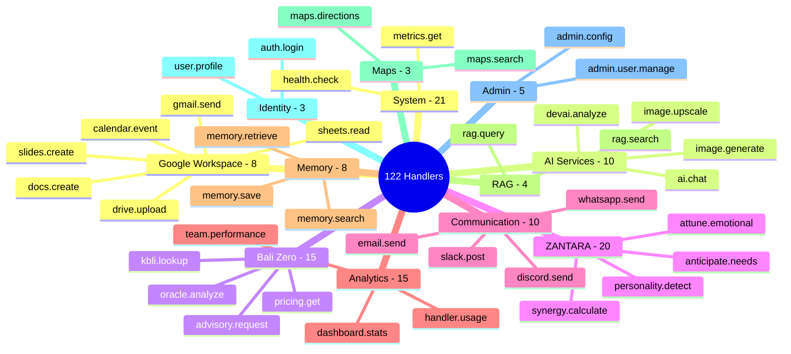
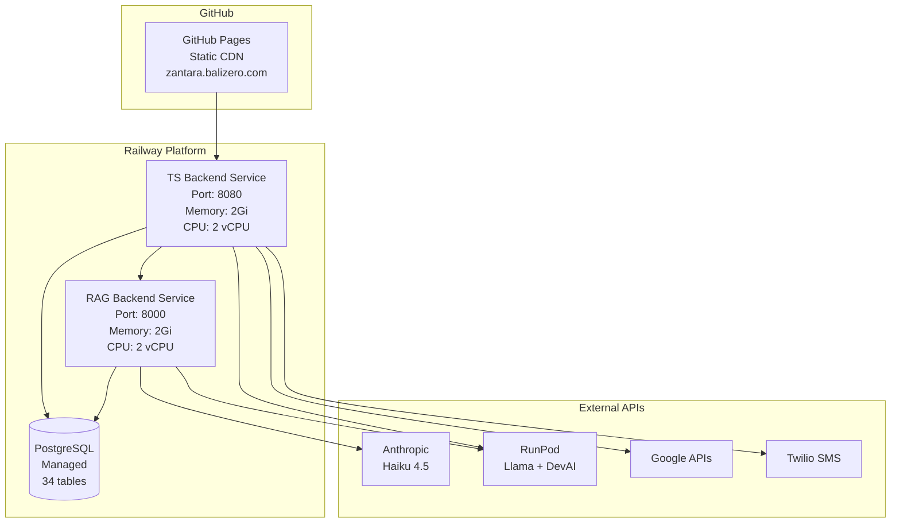

# 🗺️ PROJECT MAP - NUZANTARA

**Visual overview of the entire system**

---

## 🌍 System Architecture (Bird's Eye View)



---

## 📂 Codebase Structure

```
/home/user/nuzantara/
│
├── 📱 apps/                           # Deployable applications
│   ├── backend-ts/                    # TypeScript API Backend
│   │   ├── src/
│   │   │   ├── handlers/              # 122 handlers (19 categories)
│   │   │   │   ├── google-workspace/  # 8 handlers (Gmail, Drive...)
│   │   │   │   ├── ai-services/       # 10 handlers (AI chat, image)
│   │   │   │   ├── bali-zero/         # 15 handlers (pricing, KBLI)
│   │   │   │   ├── zantara/           # 20 handlers (ZANTARA intel)
│   │   │   │   ├── communication/     # 10 handlers (WhatsApp, email)
│   │   │   │   ├── analytics/         # 15 handlers (dashboard)
│   │   │   │   ├── memory/            # 8 handlers (save, retrieve)
│   │   │   │   └── ... 12 more categories
│   │   │   │
│   │   │   ├── services/              # 26 core services
│   │   │   │   ├── ragService.ts      # RAG backend proxy
│   │   │   │   ├── oauth2-client.ts   # Google OAuth
│   │   │   │   ├── postgres.ts        # Database
│   │   │   │   └── ...
│   │   │   │
│   │   │   ├── middleware/            # 16 middleware
│   │   │   ├── core/                  # Handler registry, loader
│   │   │   └── routes/                # Express routes
│   │   │
│   │   └── tests/                     # Unit tests
│   │
│   ├── backend-rag/                   # Python RAG Backend
│   │   ├── backend/
│   │   │   ├── app/
│   │   │   │   ├── main_integrated.py # FastAPI app
│   │   │   │   └── routers/           # API routers
│   │   │   │
│   │   │   ├── services/              # 48 services
│   │   │   │   ├── claude_haiku_service.py
│   │   │   │   ├── search_service.py  # ChromaDB search
│   │   │   │   ├── golden_answer_service.py
│   │   │   │   ├── cultural_rag_service.py
│   │   │   │   └── ...
│   │   │   │
│   │   │   └── data/
│   │   │       └── chroma/            # ChromaDB storage
│   │   │
│   │   └── scrapers/                  # Data ingestion scripts
│   │
│   └── webapp/                        # Frontend PWA
│       ├── index.html
│       ├── chat.html
│       ├── src/                       # 65 JS files
│       │   ├── services/              # API client, cache
│       │   └── components/            # UI components
│       └── manifest.json              # PWA config
│
├── 📚 docs/                           # Documentation (48 files)
│   ├── 🌌 galaxy-map/                # Architecture (6 docs) ⭐
│   │   ├── README.md
│   │   ├── 01-system-overview.md
│   │   ├── 02-technical-architecture.md
│   │   ├── 03-ai-intelligence.md
│   │   ├── 04-data-flows.md
│   │   └── 05-database-schema.md
│   │
│   ├── 💻 examples/                  # Code examples (5 docs) ⭐
│   │   ├── README.md
│   │   ├── HANDLER_INTEGRATION.md
│   │   ├── RAG_SEARCH_EXAMPLE.md
│   │   ├── TOOL_CREATION.md
│   │   └── API_CLIENT_EXAMPLES.md
│   │
│   ├── 🚨 operations/                # Operations (2 docs) ⭐
│   │   ├── INCIDENT_RESPONSE.md
│   │   └── MONITORING_GUIDE.md
│   │
│   ├── 🔐 security/                  # Security (1 doc) ⭐
│   │   └── SECURITY_GUIDE.md
│   │
│   ├── 🚀 deployment/                # Deploy guides (5 docs)
│   ├── 📖 guides/                    # Setup guides (5 docs)
│   ├── 🧪 testing/                   # Testing (1 doc)
│   ├── 🏗️ architecture/             # Architecture (5 docs)
│   ├── 🤖 ai/                        # AI docs (5 docs)
│   ├── 📡 api/                       # API docs (3 docs)
│   └── 📊 status/                    # Status reports (2 docs)
│
├── 🤖 .claude/                       # DevAI Workspace
│   ├── START_HERE.md                 # Read first! ⭐
│   ├── QUICK_REFERENCE.md            # 1-page cheat sheet ⭐
│   ├── PROJECT_MAP.md                # This file ⭐
│   ├── HANDOVER_GUIDE.md             # Handover procedures ⭐
│   ├── PROJECT_CONTEXT.md            # Full system context
│   │
│   ├── CURRENT_SESSION_W1.md         # Window 1 session
│   ├── CURRENT_SESSION_W2.md         # Window 2 session
│   ├── CURRENT_SESSION_W3.md         # Window 3 session
│   ├── CURRENT_SESSION_W4.md         # Window 4 session
│   │
│   ├── ARCHIVE_SESSIONS.md           # All past sessions
│   └── ... (60+ other docs)
│
└── 📦 Other
    ├── package.json
    ├── tsconfig.json
    ├── .env.example
    └── README.md
```

---

## 🎯 Handler Categories (122 Total)



---

## 🗄️ Database Schema

### PostgreSQL (34 Tables)

```
Core (4 tables):
├── users                      # User profiles, auth
├── conversations              # Chat history
├── memory_facts               # User preferences
└── memory_entities            # Named entities

Business (3 tables):
├── clients                    # CRM client data
├── projects                   # Client projects
└── work_sessions              # Time tracking

ZANTARA (4 tables):
├── golden_answers             # Pre-generated FAQ ⚡
├── query_clusters             # Query mappings
├── cultural_knowledge         # JIWA chunks
└── nightly_worker_runs        # Worker logs

Oracle (19 tables):
├── VISA (5 tables)            # Immigration
├── KBLI (6 tables)            # Business classification
├── TAX (4 tables)             # Tax knowledge
└── PROPERTY (4 tables)        # Real estate

Analytics (3 tables):
├── team_analytics
├── performance_metrics
└── handler_executions

Audit (1 table):
└── audit_logs                 # Security events
```

### ChromaDB (14 Collections)

```
Knowledge (14,365 documents):
├── zantara_books           # 12,907 docs (90% of total)
├── visa_oracle             # ~500 docs
├── kbli_eye                # ~1,000 docs
├── tax_genius              # ~800 docs
├── legal_architect         # ~600 docs
├── legal_updates           # ~400 docs
├── bali_zero_pricing       # ~100 docs
├── property_listings       # ~300 docs
├── property_knowledge      # ~200 docs
├── tax_updates             # ~300 docs
├── tax_knowledge           # ~500 docs
├── kb_indonesian           # ~200 docs
├── cultural_insights       # ~58 docs (ZANTARA generated)
└── oracle_kbli_knowledge   # ~1,000 docs
```

---

## 🔄 Request Flows

### Flow 1: User Chat (Realtime)

```
User → WebApp → TS Backend → RAG Backend
  ↓
Check Golden Answer (10-20ms) ?
  ├── HIT (50-60%) → Return cached ⚡
  └── MISS (40-50%) → Search ChromaDB → Haiku 4.5 → Generate (1-2s)
```

### Flow 2: Nightly Worker

```
Cron (2 AM UTC) → ZANTARA Llama Worker
  ↓
Extract queries from PostgreSQL (last 7 days)
  ↓
Cluster semantically (100-200 clusters)
  ↓
For each cluster:
  - Search ChromaDB (RAG context)
  - Generate golden answer with Llama
  - Save to golden_answers table
  ↓
Duration: 4-6 hours
Cost: €0.50-1.00
```

---

## 🚀 Deployment Architecture



**URLs:**
- Frontend: https://zantara.balizero.com
- TS Backend: https://ts-backend-production-568d.up.railway.app
- RAG Backend: https://scintillating-kindness-production-47e3.up.railway.app
- Railway Dashboard: https://railway.app/project/1c81bf3b-3834-49e1-9753-2e2a63b74bb9

---

## 📊 Key Metrics

```
Performance:
├── Golden Answer: 10-20ms (50-60% queries) ⚡⚡⚡
├── Redis Cache: 2ms (select queries) ⚡⚡⚡⚡
├── Haiku + RAG: 1-2s (40-50% queries) ⚡
└── With Tools: 2-4s (complex) ⚡

Costs (Monthly):
├── Claude Haiku: $8-15
├── ZANTARA Llama: €3-11
├── DevAI Qwen: €1-3
└── Total: $15-30 ✅

Resources:
├── Codebase: 60,500 lines
├── Handlers: 122 files
├── Services: 48 Python + 26 TypeScript
├── Docs: 48 files
└── DB Size: ~100MB PostgreSQL + ~500MB ChromaDB
```

---

## 🎯 Quick Navigation

**Getting Started:**
1. `.claude/START_HERE.md` - Quick start (2 min)
2. `.claude/QUICK_REFERENCE.md` - Cheat sheet (1 page)
3. `.claude/PROJECT_MAP.md` - This file (visual overview)

**Architecture Deep Dive:**
4. `docs/galaxy-map/README.md` - Complete system map
5. `docs/galaxy-map/01-system-overview.md` - High-level architecture

**Code Examples:**
6. `docs/examples/HANDLER_INTEGRATION.md` - Create handlers
7. `docs/examples/RAG_SEARCH_EXAMPLE.md` - Use RAG backend

**Operations:**
8. `docs/operations/INCIDENT_RESPONSE.md` - When things break
9. `docs/operations/MONITORING_GUIDE.md` - Metrics & alerts

**Security:**
10. `docs/security/SECURITY_GUIDE.md` - Auth, encryption, audit

---

**You now have a complete map of NUZANTARA!** 🗺️✨

**Next:** Start working with `.claude/HANDOVER_GUIDE.md` for session management.
