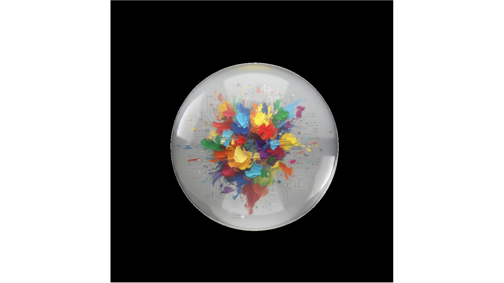

# POST-DEPLOY: Fix Console Errors

## PROBLEMI RILEVATI IN PRODUZIONE

Dalle immagini della console su `zantara.balizero.com/chat.html`:

### 1. ❌ 404 Error: `image.svg` non trovato
```
GET https://zantara.balizero.com/assets/images/image.svg 404 (Not Found)
```

**Causa:** Il file esiste localmente ma potrebbe non essere deployato su GitHub Pages.

**File coinvolto:**
- `webapp-dev/chat.html:1240` - Riferimento all'immagine
- `webapp-dev/assets/images/image.svg` - File esistente localmente

---

### 2. ❌ Uncaught Error: `sse-client.js:6`
```
Uncaught (da sse-client.js:6)
```

**Causa:** Il file usa `import` ES6 ma non è caricato come modulo.

**Problema:**
```javascript
// sse-client.js:6
import { API_CONFIG } from './api-config.js';  // ❌ Fallisce se non è modulo
```

**File coinvolto:**
- `webapp-dev/chat.html:1275` - `<script src="js/sse-client.js"></script>` (manca `type="module"`)

---

### 3. ❌ Uncaught Error: `conversation-client.js:12`
```
Uncaught (da conversation-client.js:12)
```

**Causa:** Stesso problema - usa `import` ES6 ma non è modulo.

**Problema:**
```javascript
// conversation-client.js:12
import { API_CONFIG } from './api-config.js';  // ❌ Fallisce se non è modulo
```

**File coinvolto:**
- `webapp-dev/chat.html:1277` - `<script src="js/conversation-client.js?v=20251107"></script>` (manca `type="module"`)

---

## SOLUZIONI

### Fix 1: Aggiungere `type="module"` agli script

**FILE:** `webapp-dev/chat.html`

**CERCA (riga ~1275-1277):**
```html
<script src="js/sse-client.js"></script>
<script src="js/zantara-client.min.js?v=20251106-debug"></script>
<script src="js/conversation-client.js?v=20251107"></script>
```

**SOSTITUISCI CON:**
```html
<script type="module" src="js/sse-client.js"></script>
<script src="js/zantara-client.min.js?v=20251106-debug"></script>
<script type="module" src="js/conversation-client.js?v=20251107"></script>
```

**NOTA:** `zantara-client.min.js` probabilmente non usa import ES6, quindi può rimanere senza `type="module"`.

---

### Fix 2: Verificare deploy di `image.svg`

**OPZIONE A:** Verificare che il file sia incluso nel deploy
```bash
# Verifica che il file esista nella directory deployata
ls -la webapp-dev/assets/images/image.svg

# Se manca, aggiungilo al commit
git add webapp-dev/assets/images/image.svg
git commit -m "fix: Add missing image.svg to assets"
```

**OPZIONE B:** Usare un fallback o rimuovere il riferimento se non necessario
```html
<!-- Se l'immagine non è critica, aggiungere onerror -->

```

**OPZIONE C:** Usare un'icona alternativa già presente
```html
<!-- Usare paint.svg che esiste già -->

```

---

## IMPLEMENTAZIONE

### Step 1: Fix script modules
```bash
cd /Users/antonellosiano/Desktop/COOKING-LAB/webapp-dev
# Modifica chat.html come sopra
```

### Step 2: Verifica file image.svg
```bash
# Verifica esistenza
ls -la assets/images/image.svg

# Se esiste, verifica che sia nel git
git ls-files assets/images/image.svg
```

### Step 3: Test locale
```bash
# Avvia server locale
npm run dev
# o
python -m http.server 8000

# Apri http://localhost:8000/chat.html
# Verifica console - non dovrebbero esserci errori di import
```

### Step 4: Deploy
```bash
# Commit modifiche
git add webapp-dev/chat.html
git add webapp-dev/assets/images/image.svg  # Se necessario
git commit -m "fix: Add type='module' to ES6 import scripts and fix image.svg"

# Push su gh-pages (se applicabile)
git push origin gh-pages
```

---

## VERIFICA POST-FIX

Dopo il deploy, verifica:

1. **Console senza errori Uncaught:**
   ```bash
   # Apri DevTools → Console
   # Non dovrebbero esserci errori "Uncaught" da sse-client.js o conversation-client.js
   ```

2. **Immagine caricata:**
   ```bash
   curl -I https://zantara.balizero.com/assets/images/image.svg
   # Dovrebbe ritornare 200 OK, non 404
   ```

3. **Funzionalità chat:**
   - Testa invio messaggi
   - Verifica streaming SSE
   - Controlla salvataggio conversazioni

---

## ALTERNATIVA: Convertire a script non-module

Se gli `import` ES6 causano problemi, alternativa è convertire i file a script tradizionali:

1. Rimuovere `import` e usare variabili globali
2. Caricare `api-config.js` prima degli altri script
3. Usare `window.API_CONFIG` invece di import

**⚠️ NOTA:** Questa soluzione è meno pulita ma più compatibile con browser vecchi.

---

## PRIORITÀ

- **ALTA:** Fix `type="module"` per `sse-client.js` e `conversation-client.js` (blocca funzionalità)
- **MEDIA:** Fix `image.svg` 404 (cosmetico, non blocca funzionalità)

---

---

## ✅ IMPLEMENTAZIONE COMPLETATA

**DATA:** 2025-01-XX  
**COMMIT:** Fix applicati e committati

### Fix Applicati:
- ✅ Aggiunto `type="module"` a `sse-client.js` in `chat.html` e `chat/index.html`
- ✅ Aggiunto `type="module"` a `conversation-client.js` in `chat.html` e `chat/index.html`
- ✅ Aggiunto `image.svg` al repository git

### File Modificati:
- `webapp-dev/chat.html` (righe 1275, 1277)
- `webapp-dev/chat/index.html` (righe 856, 858)
- `webapp-dev/assets/images/image.svg` (aggiunto al git)

### Prossimi Passi:
1. Deploy su produzione (push su gh-pages se necessario)
2. Verifica console dopo deploy - errori Uncaught dovrebbero essere risolti
3. Verifica che `image.svg` sia accessibile su produzione

**STATO:** 🟡 **IMPLEMENTATO - IN ATTESA DI DEPLOY**  
**ULTIMO AGGIORNAMENTO:** 2025-01-XX

