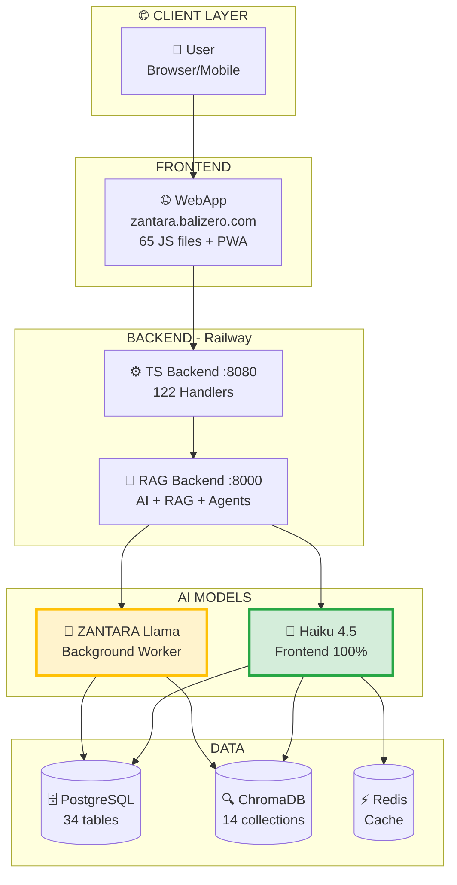
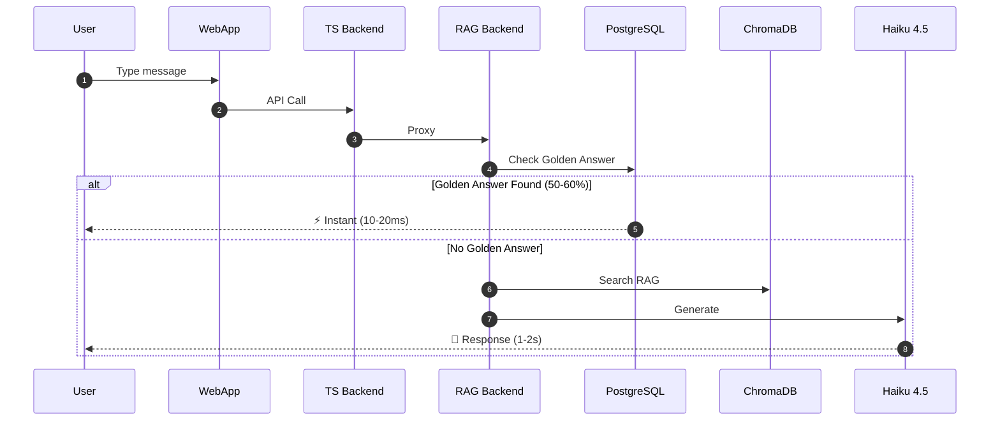
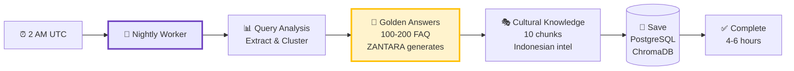
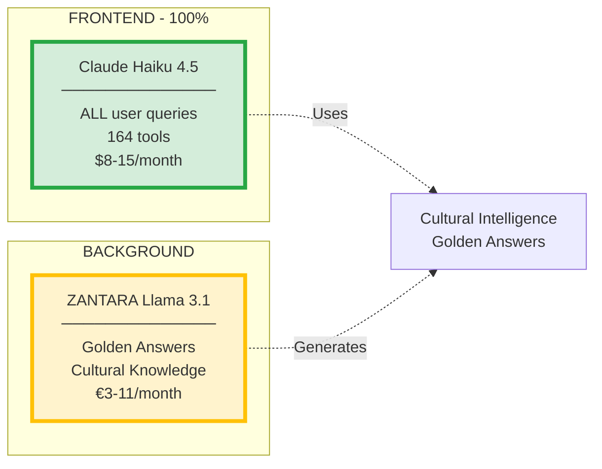
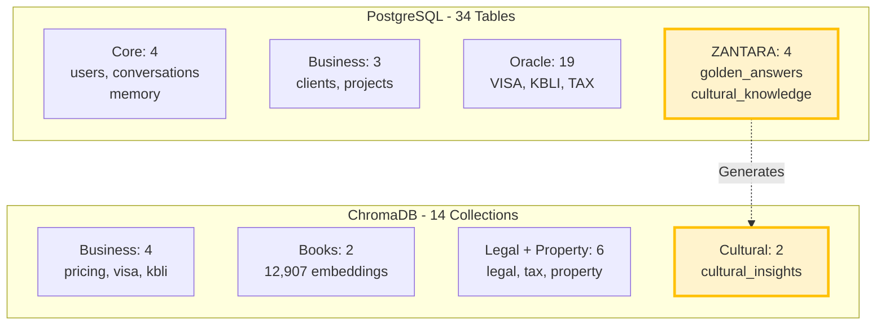
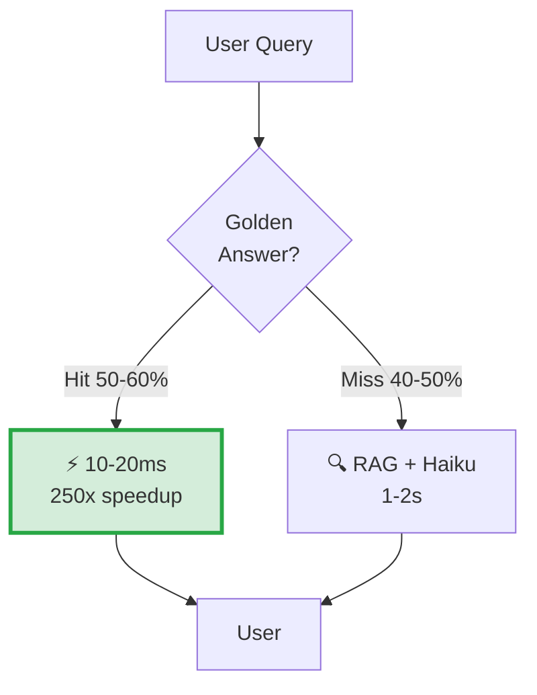
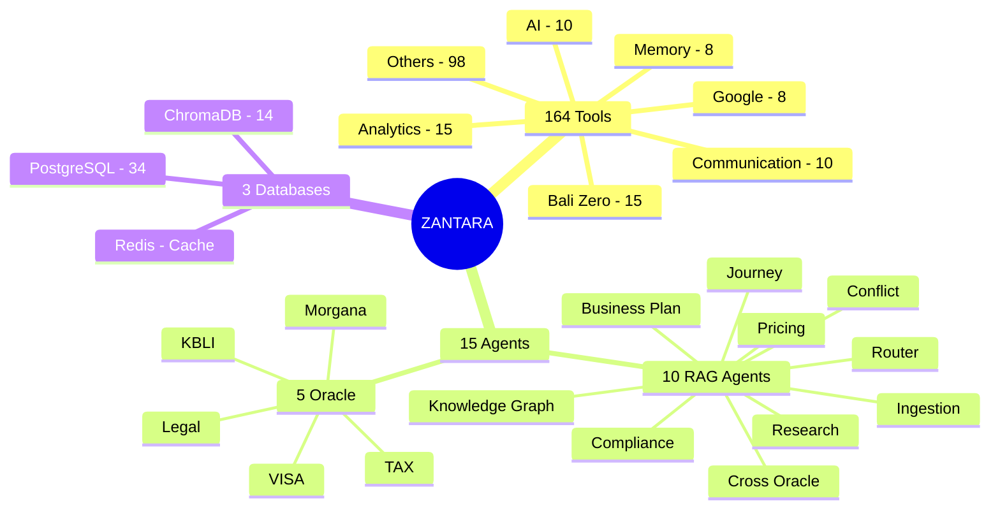
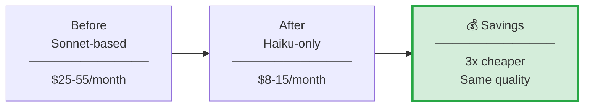

# 🗺️ NUZANTARA - SYSTEM ARCHITECTURE DIAGRAM

**View this file on GitHub to see the rendered diagrams automatically!**

---

## 📊 DIAGRAM 1: COMPLETE SYSTEM OVERVIEW

---

## 🔄 DIAGRAM 2: USER REQUEST FLOW

---

## 🌙 DIAGRAM 3: ZANTARA NIGHTLY WORKER

---

## 🤖 DIAGRAM 4: AI MODELS

---

## 🗄️ DIAGRAM 5: DATABASE STRUCTURE

---

## ⚡ DIAGRAM 6: PERFORMANCE

---

## 🎯 DIAGRAM 7: ZANTARA CAPABILITIES

---

## 💰 DIAGRAM 8: COST COMPARISON

---

**View this file on GitHub to see all diagrams rendered automatically!**

**Link**: https://github.com/Balizero1987/nuzantara/blob/main/SYSTEM_ARCHITECTURE_DIAGRAM.md
