# 🚀 NUZANTARA Deployment Architecture

**Last Updated**: 2025-10-30
**Status**: Production (Multi-cloud hybrid)

---

## 📊 Complete Deployment Architecture

```mermaid
graph TB
    subgraph "🌐 CLIENT LAYER"
        User[👤 User<br/>Browser/Mobile]
    end

    subgraph "FRONTEND - Cloudflare Pages"
        WebApp[🌐 WebApp<br/>zantara.balizero.com<br/>──────────────<br/>Deploy: 30-60s<br/>TTFB: 230ms<br/>Edge: 330+ locations<br/>Cost: $0/month]
    end

    subgraph "ORCHESTRATOR - Fly.io"
        Orchestrator[🎯 Orchestrator<br/>nuzantara-orchestrator.fly.dev<br/>──────────────<br/>Port: 8080<br/>Region: Singapore<br/>Cost: $0-5/month]

        Router[🧭 FLAN Router<br/>Tool Selection<br/>──────────────<br/>Model: flan-t5-small<br/>Latency: 491ms warm<br/>Accuracy: 91.7%]
    end

    subgraph "BACKEND - Railway"
        RAG[🧠 RAG Backend<br/>scintillating-kindness-production<br/>──────────────<br/>Port: 8000<br/>AI: Claude Haiku 4.5<br/>Region: us-west1<br/>Cost: $10-25/month]
    end

    subgraph "DATA LAYER"
        PG[(🗄️ PostgreSQL<br/>Railway Managed<br/>──────────────<br/>34 tables<br/>Conversations + Memory)]

        Chroma[(🔍 ChromaDB<br/>Embedded in RAG<br/>──────────────<br/>14 collections<br/>14,365 docs<br/>Semantic Search)]

        R2[(☁️ Cloudflare R2<br/>Object Storage<br/>──────────────<br/>ChromaDB backup<br/>72 MB)]
    end

    subgraph "AI MODELS"
        Haiku[🤖 Claude Haiku 4.5<br/>Anthropic API<br/>──────────────<br/>100% traffic<br/>$8-15/month]

        Llama[🧠 ZANTARA Llama 3.1<br/>RunPod vLLM<br/>──────────────<br/>Background worker<br/>€3-11/month]
    end

    User --> WebApp
    WebApp --> Orchestrator
    Orchestrator --> Router
    Router --> RAG
    Orchestrator --> RAG

    RAG --> Haiku
    RAG --> Llama
    RAG --> PG
    RAG --> Chroma

    Chroma --> R2

    style WebApp fill:#e1f5ff,stroke:#0366d6,stroke-width:3px
    style Orchestrator fill:#d4edda,stroke:#28a745,stroke-width:2px
    style RAG fill:#fff3cd,stroke:#ffc107,stroke-width:2px
    style Haiku fill:#d4edda,stroke:#28a745,stroke-width:3px
```



---

## 🌍 Multi-Cloud Strategy

### Why Hybrid Architecture?

**Cost Optimization**: $15-35/month total (vs $40-165 GCP)

| Platform | Service | Cost | Why |
|----------|---------|------|-----|
| **Cloudflare Pages** | Webapp hosting | $0 | Free tier, 330+ edge locations, 230ms TTFB |
| **Fly.io** | Orchestrator + Router | $0-5 | Free tier, Singapore region, low latency Asia |
| **Railway** | RAG Backend + PostgreSQL | $10-25 | Managed DB, auto-scaling, easy deploys |
| **Cloudflare R2** | ChromaDB backup | $0 | Free tier, S3-compatible |
| **RunPod** | ZANTARA Llama | €3-11 | vLLM optimized, GPU inference |
| **Anthropic** | Claude Haiku | $8-15 | Pay-per-use, 100% traffic |

**Total**: **$15-35/month** for production system with 100% uptime

---

## 📍 Deployment URLs

### Production Endpoints

| Service | URL | Status |
|---------|-----|--------|
| **Webapp** | https://zantara.balizero.com | ✅ Cloudflare Pages |
| **Orchestrator** | https://nuzantara-orchestrator.fly.dev | ✅ Fly.io (Singapore) |
| **RAG Backend** | https://scintillating-kindness-production-47e3.up.railway.app | ✅ Railway (us-west1) |

### Backend Services

| Service | Platform | Region | Port |
|---------|----------|--------|------|
| TS Orchestrator | Fly.io | Singapore (sin) | 8080 |
| RAG Backend | Railway | Oregon (us-west1) | 8000 |
| PostgreSQL | Railway | Oregon (us-west1) | 5432 |
| ChromaDB | Embedded in RAG | Oregon (us-west1) | - |

---

## 🔄 Request Flow

### User Query Flow

```
1. User opens zantara.balizero.com
   └─> Cloudflare Pages (230ms TTFB, edge cache)

2. JavaScript calls API
   └─> Fly.io Orchestrator (Singapore, 491ms routing)

3. Orchestrator → FLAN Router
   └─> Selects appropriate tool/handler (91.7% accuracy)

4. Orchestrator → Railway RAG Backend
   └─> Claude Haiku 4.5 + ChromaDB search

5. Response back to user
   └─> Total: 1-2s for AI response
```

### Fallback System

**Primary**: Fly.io Orchestrator → Railway RAG Backend
**Fallback**: Direct webapp → Railway RAG Backend

Implemented in `apps/webapp/js/api-contracts.js:24-94`

---

## ⚡ Performance Metrics

### Frontend (Cloudflare Pages)

| Metric | Value | Comparison |
|--------|-------|------------|
| **TTFB** | 230ms | 54% faster than GitHub Pages (498ms) |
| **Deploy Time** | 30-60s | 75% faster than GitHub Pages (3-4 min) |
| **Edge Locations** | 330+ | Native Cloudflare network |
| **Bandwidth** | Unlimited | vs 100GB GitHub Pages |

### Backend (Railway + Fly.io)

| Metric | Value | Notes |
|--------|-------|-------|
| **Orchestrator Latency** | 491ms | Warm start (Fly.io) |
| **Router Accuracy** | 91.7% | FLAN-T5 tool selection |
| **RAG Response** | 1-2s | Claude Haiku + ChromaDB |
| **Golden Answers** | 10-20ms | 50-60% cache hit rate |
| **Database Queries** | <50ms | PostgreSQL on Railway |

---

## 💰 Cost Breakdown

### Monthly Costs (Production)

```
Frontend:
└─ Cloudflare Pages          $0        (free tier, unlimited bandwidth)

Orchestration:
└─ Fly.io (Orchestrator)     $0-5      (free tier + small overages)

Backend:
├─ Railway (RAG + PostgreSQL) $10-25   (pay-per-use, 2Gi RAM)
└─ Cloudflare R2 (storage)    $0       (free tier, 72 MB)

AI Models:
├─ Claude Haiku 4.5           $8-15    (100% user traffic)
└─ ZANTARA Llama 3.1          €3-11    (background worker)

──────────────────────────────────────────
TOTAL:                        $15-35/month
──────────────────────────────────────────

vs GCP (previous):            $40-165/month
SAVINGS:                      62-85% reduction
```

---

## 🚀 Deployment Process

### Webapp (Cloudflare Pages)

**Trigger**: Push to `main` branch with changes in `apps/webapp/`

**Workflow**: `.github/workflows/deploy-webapp-cloudflare.yml`

```bash
git add apps/webapp/
git commit -m "feat: update webapp"
git push origin main

# Cloudflare Pages auto-deploys in 30-60 seconds
# Live at: https://zantara.balizero.com
```

**No manual steps required** ✅

### Orchestrator (Fly.io)

**Trigger**: Manual deploy or via CI/CD

```bash
cd apps/backend-ts
flyctl deploy

# Deploy time: 2-3 minutes
# Health check: https://nuzantara-orchestrator.fly.dev/health
```

### RAG Backend (Railway)

**Trigger**: Push to `main` branch with changes in `apps/backend-rag/`

```bash
git add apps/backend-rag/
git commit -m "feat: update RAG backend"
git push origin main

# Railway auto-deploys in 3-5 minutes
# Logs: railway logs --service "RAG BACKEND"
```

---

## 🔒 Environment Variables

### Cloudflare Pages

Set via Cloudflare Dashboard → Pages → zantara-webapp → Settings → Environment variables

```bash
# API endpoints (injected at build time)
NEXT_PUBLIC_API_URL=https://nuzantara-orchestrator.fly.dev
```

### Fly.io Orchestrator

Set via `flyctl secrets set`

```bash
flyctl secrets set \
  RAG_BACKEND_URL=https://scintillating-kindness-production-47e3.up.railway.app \
  ANTHROPIC_API_KEY=sk-ant-... \
  RUNPOD_LLAMA_ENDPOINT=https://api.runpod.ai/v2/...
```

### Railway RAG Backend

Set via Railway Dashboard → Environment Variables

```bash
DATABASE_URL=postgresql://...          # Auto-managed
ANTHROPIC_API_KEY=sk-ant-...
RUNPOD_LLAMA_ENDPOINT=https://...
RUNPOD_API_KEY=rpa_...
R2_ENDPOINT=https://...
R2_ACCESS_KEY_ID=...
R2_SECRET_ACCESS_KEY=...
```

---

## 🏥 Health Checks

### All Services Health Status

```bash
# Webapp (Cloudflare Pages)
curl -I https://zantara.balizero.com/
# Expected: HTTP/2 200, server: cloudflare

# Orchestrator (Fly.io)
curl https://nuzantara-orchestrator.fly.dev/health
# Expected: {"status":"healthy","uptime":...}

# RAG Backend (Railway)
curl https://scintillating-kindness-production-47e3.up.railway.app/health
# Expected: {"status":"healthy","ai":"ready"}
```

### Monitoring URLs

- **Railway Dashboard**: https://railway.app/project/1c81bf3b-3834-49e1-9753-2e2a63b74bb9
- **Fly.io Dashboard**: https://fly.io/apps/nuzantara-orchestrator
- **Cloudflare Dashboard**: https://dash.cloudflare.com/

---

## 📈 Scalability

### Current Limits

| Service | Current | Max (Free/Starter) | Upgrade Path |
|---------|---------|-------------------|--------------|
| Cloudflare Pages | Unlimited requests | Unlimited | N/A (already unlimited) |
| Fly.io | <1k req/day | 10k req/month free | $5/month for overages |
| Railway | 2Gi RAM, 2 vCPU | $5 credit/month | $0.000231/GB-second |
| PostgreSQL | ~100MB | 1GB free | Auto-scales on Railway |

### Scaling Strategy

**0-1k users**: Current setup (free tiers) - $15-35/month
**1k-10k users**: Fly.io paid + Railway scale - $50-100/month
**10k-100k users**: Multi-region + caching - $200-500/month

---

## 🔄 Migration History

### Timeline

| Date | Event | Platform |
|------|-------|----------|
| **2025-10-05** | Initial production | GCP Cloud Run |
| **2025-10-17** | Migrated to Railway | Railway (backends) |
| **2025-10-29** | Added Fly.io orchestrator | Fly.io (Singapore) |
| **2025-10-30** | Migrated webapp | Cloudflare Pages |

### Why We Migrated

**From GCP → Railway**:
- Cost: $40-165/month → $10-25/month (62-85% savings)
- Simplicity: Managed PostgreSQL, auto-scaling
- Developer experience: Instant deploys, better logs

**From Railway → Fly.io** (Orchestrator):
- Geography: Asia latency (Singapore region)
- Free tier: Better utilization
- Redundancy: Multi-cloud fallback

**From GitHub Pages → Cloudflare Pages** (Webapp):
- Performance: 230ms vs 498ms TTFB (54% faster)
- Features: Preview URLs, instant rollbacks
- Consistency: Same stack as website (balizero-blog)
- Simplicity: 1 workflow instead of 2 (no sync needed)

---

## 🎯 Best Practices

### Deployment Checklist

**Before Deploy**:
- [ ] Test locally (all services running)
- [ ] Check environment variables are set
- [ ] Verify database migrations (if any)
- [ ] Review logs for any warnings

**After Deploy**:
- [ ] Verify health checks (all 200 OK)
- [ ] Test critical user flows
- [ ] Monitor logs for errors (first 5 minutes)
- [ ] Check performance metrics

### Rollback Strategy

**Cloudflare Pages**: Instant rollback via dashboard (Deployments → Previous version → Rollback)
**Fly.io**: `flyctl releases list && flyctl releases rollback <ID>`
**Railway**: Dashboard → Deployments → Click previous deployment → Redeploy

---

## 📚 Related Documentation

- **System Overview**: `docs/galaxy-map/01-system-overview.md`
- **Technical Architecture**: `docs/galaxy-map/02-technical-architecture.md`
- **Fly.io Deploy Success**: `FLYIO_DEPLOYMENT_SUCCESS.md`
- **Railway Guide**: `docs/guides/RAILWAY_DEPLOYMENT_GUIDE.md`

---

## 🌟 Summary

**NUZANTARA runs on a modern multi-cloud architecture**:

✅ **Cloudflare Pages** - Global edge delivery (webapp)
✅ **Fly.io** - Asia-optimized orchestration (Singapore)
✅ **Railway** - Managed backend + database (Oregon)
✅ **Multi-region fallback** - Automatic failover
✅ **Cost-optimized** - $15-35/month total (62-85% savings)
✅ **Performance-first** - 230ms TTFB, 1-2s AI responses

**The future is multi-cloud!** 🌍✨
