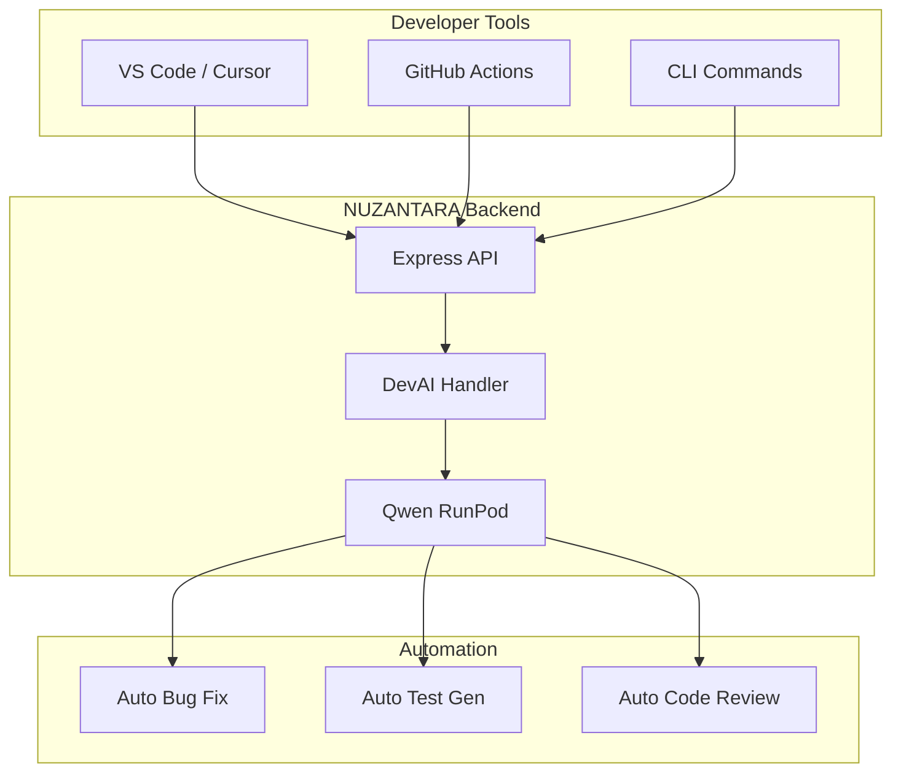

# 🤖 DevAI (Qwen 2.5 Coder) - Integration Plan

**Data**: 13 Ottobre 2025  
**AI System**: Multi-AI Architecture  
**Status**: 📋 Planning Phase

---

## 🎯 **VISIONE: Multi-AI System**

```
┌─────────────────────────────────────────────────────┐
│           NUZANTARA AI ECOSYSTEM                    │
├─────────────────────────────────────────────────────┤
│                                                     │
│  🧠 ZANTARA (Llama 3.1 8B)                         │
│     Role: Business AI                              │
│     - Customer service (IT/EN/ID)                  │
│     - Business operations                          │
│     - Team management                              │
│     - Bali Zero services                           │
│                                                     │
│  💻 DevAI (Qwen 2.5 Coder 7B)                     │
│     Role: Internal Developer AI                    │
│     - Bug detection & fixing                       │
│     - Code review & suggestions                    │
│     - Refactoring automation                       │
│     - Test generation                              │
│     - Architecture optimization                    │
│     - Self-improving codebase                      │
│                                                     │
│  🌐 Fallback Layer                                 │
│     - Claude Sonnet 4.5 (complex reasoning)        │
│     - GPT-4o (fast tasks)                          │
│     - Gemini (multimodal)                          │
└─────────────────────────────────────────────────────┘
```

---

## 💡 **PERCHÉ QWEN 2.5 CODER?**

### ✅ **Vantaggi Specifici**

| Feature | Qwen 2.5 Coder | Altri Modelli | Vantaggio |
|---------|----------------|---------------|-----------|
| **Code Understanding** | ⭐⭐⭐⭐⭐ | ⭐⭐⭐ | Specializzato per codice |
| **Bug Detection** | ⭐⭐⭐⭐⭐ | ⭐⭐⭐ | Pattern recognition avanzato |
| **Multi-language** | 92+ linguaggi | ~30 | TypeScript/Python/JS nativo |
| **Context Window** | 32K tokens | 8-16K | Vede file interi |
| **Speed** | 7B params | 70B+ params | 10x più veloce |
| **Cost** | Self-hosted | API $$$$ | Zero costi runtime |
| **Privacy** | 100% interno | Cloud APIs | Codice non esce |
| **Fine-tuning** | ✅ Supportato | ❌ Difficile | Customizzabile per NUZANTARA |

### 🎓 **Capacità di Qwen 2.5 Coder**

```python
# Esempio: Bug Detection
DevAI Input: "Analyze this TypeScript file for bugs"
DevAI Output: 
  ✓ Type errors detected (3)
  ✓ Memory leaks identified (1) 
  ✓ Security issues (SQL injection risk)
  ✓ Performance bottlenecks (2)
  + Auto-generated fixes with explanation

# Esempio: Code Review
DevAI Input: "Review this PR"
DevAI Output:
  ✓ Code quality score: 8.5/10
  ✓ Suggestions: 5 improvements
  ✓ Test coverage: +12% recommended
  ✓ Generated unit tests (3)
```

---

## 🏗️ **ARCHITETTURA PROPOSTA**

### **1. DevAI Service Layer**

```typescript
// src/handlers/devai/devai-core.ts
export class DevAI {
  private qwenClient: QwenClient;
  private codeAnalyzer: CodeAnalyzer;
  private bugDetector: BugDetector;
  
  // Core capabilities
  async analyzeCode(file: string): Promise<CodeAnalysis>
  async detectBugs(code: string): Promise<Bug[]>
  async suggestRefactoring(code: string): Promise<Refactoring[]>
  async generateTests(code: string): Promise<Test[]>
  async fixBug(bug: Bug): Promise<Fix>
  async reviewPR(diff: string): Promise<Review>
}
```

### **2. Integration Points**



---

## 🔧 **IMPLEMENTAZIONE: 4 FASI**

### **FASE 1: Foundation** (1-2 settimane)

#### 1.1 Setup Qwen RunPod
```bash
# Deploy Qwen 2.5 Coder su RunPod
- Model: Qwen/Qwen2.5-Coder-7B-Instruct
- Runtime: vLLM (stessa infra di ZANTARA)
- Endpoint: RUNPOD_QWEN_ENDPOINT
- GPU: 24GB VRAM (RTX 4090 / A5000)
```

#### 1.2 Client TypeScript
```typescript
// src/services/devai-client.ts
export class QwenClient {
  private endpoint: string;
  private apiKey: string;
  
  constructor() {
    this.endpoint = process.env.RUNPOD_QWEN_ENDPOINT!;
    this.apiKey = process.env.RUNPOD_API_KEY!;
  }
  
  async analyze(code: string, task: DevAITask): Promise<DevAIResponse> {
    // Call Qwen via RunPod vLLM
  }
}
```

#### 1.3 Handler Registration
```typescript
// src/handlers/devai/registry.ts
export const devaiHandlers = {
  "devai.analyze": analyzeCode,
  "devai.fix": fixBug,
  "devai.review": reviewCode,
  "devai.test": generateTests,
  "devai.refactor": suggestRefactoring
};
```

---

### **FASE 2: Core Features** (2-3 settimane)

#### 2.1 Bug Detection & Auto-Fix
```typescript
// Handler: devai.detect-bugs
POST /call
{
  "key": "devai.detect-bugs",
  "params": {
    "file": "src/router.ts",
    "autofix": true
  }
}

Response:
{
  "bugs": [
    {
      "type": "type-error",
      "line": 42,
      "severity": "high",
      "message": "Property 'response' does not exist on type",
      "fix": {
        "original": "responseData.response",
        "fixed": "responseData && 'response' in responseData ? responseData.response : ''",
        "explanation": "Added type guard to prevent runtime errors"
      }
    }
  ],
  "autoApplied": 3,
  "confidence": 0.95
}
```

#### 2.2 Code Review System
```typescript
// Handler: devai.review
POST /call
{
  "key": "devai.review",
  "params": {
    "diff": "git diff main..feature-branch"
  }
}

Response:
{
  "score": 8.5,
  "issues": [
    {
      "file": "src/handlers/ai.ts",
      "type": "performance",
      "suggestion": "Use Promise.all() instead of sequential awaits",
      "impact": "medium"
    }
  ],
  "improvements": 5,
  "testCoverage": {
    "current": 70,
    "recommended": 85,
    "generatedTests": 3
  }
}
```

#### 2.3 Refactoring Suggestions
```typescript
// Handler: devai.refactor
POST /call
{
  "key": "devai.refactor",
  "params": {
    "directory": "src/handlers/ai-services/",
    "type": "optimize"
  }
}

Response:
{
  "suggestions": [
    {
      "file": "ai.ts",
      "type": "duplicate-code",
      "description": "Extract common AI client pattern",
      "effort": "medium",
      "impact": "high",
      "code": "// Generated refactored code..."
    }
  ],
  "estimatedImprovement": {
    "codeReduction": "-15%",
    "performanceGain": "+8%",
    "maintainability": "+25%"
  }
}
```

---

### **FASE 3: Automation** (2 settimane)

#### 3.1 GitHub Actions Integration
```yaml
# .github/workflows/devai-review.yml
name: DevAI Code Review

on: [pull_request]

jobs:
  review:
    runs-on: ubuntu-latest
    steps:
      - uses: actions/checkout@v3
      
      - name: DevAI Review
        run: |
          curl -X POST ${{ secrets.NUZANTARA_API }}/call \
            -H "x-api-key: ${{ secrets.API_KEY }}" \
            -d '{
              "key": "devai.review",
              "params": {
                "diff": "${{ github.event.pull_request.diff_url }}"
              }
            }'
      
      - name: Comment PR
        uses: actions/github-script@v6
        with:
          script: |
            // Post DevAI review as PR comment
```

#### 3.2 Continuous Bug Detection
```typescript
// scripts/devai-watch.ts
import { DevAI } from './handlers/devai/devai-core';

// Watch filesystem for changes
watch('src/**/*.ts', async (file) => {
  const analysis = await DevAI.analyzeCode(file);
  
  if (analysis.bugs.length > 0) {
    console.log(`🐛 Found ${analysis.bugs.length} bugs in ${file}`);
    
    // Auto-fix if confidence > 90%
    const fixed = analysis.bugs.filter(b => b.confidence > 0.9);
    if (fixed.length > 0) {
      await DevAI.applyFixes(file, fixed);
      console.log(`✅ Auto-fixed ${fixed.length} bugs`);
    }
  }
});
```

#### 3.3 Daily Health Check
```typescript
// scripts/devai-health-check.ts
import { DevAI } from './handlers/devai/devai-core';

async function dailyHealthCheck() {
  console.log('🏥 DevAI Daily Health Check');
  
  // Analyze entire codebase
  const report = await DevAI.analyzeCo debase({
    directory: 'src/',
    checkTypes: ['bugs', 'performance', 'security', 'quality']
  });
  
  // Generate report
  const markdown = generateReport(report);
  
  // Send to Slack/Discord
  await notifyTeam(markdown);
  
  // Auto-fix critical bugs
  if (report.criticalBugs > 0) {
    await DevAI.fixCriticalBugs();
  }
}

// Run daily at 9 AM
schedule('0 9 * * *', dailyHealthCheck);
```

---

### **FASE 4: Fine-tuning & Self-Improvement** (ongoing)

#### 4.1 NUZANTARA-Specific Training
```python
# Training dataset structure
{
  "question": "Fix this TypeScript error in NUZANTARA router",
  "context": "// src/router.ts code snippet",
  "answer": "// Corrected code with explanation",
  "project": "NUZANTARA",
  "category": "typescript-fix"
}

# Examples:
- Handler pattern errors
- Firebase integration bugs
- Express middleware issues
- Memory leak patterns
- NUZANTARA-specific architecture
```

#### 4.2 Learning Loop
```typescript
// DevAI learns from applied fixes
class DevAILearning {
  async recordFix(fix: AppliedFix) {
    // Store fix in training dataset
    await trainingDB.save({
      problem: fix.original,
      solution: fix.fixed,
      outcome: fix.success ? 'success' : 'failed',
      feedback: fix.developerFeedback
    });
    
    // Retrain monthly
    if (trainingDB.count() % 1000 === 0) {
      await this.triggerRetraining();
    }
  }
}
```

---

## 🎯 **USE CASES PRATICI**

### **1. TypeScript Error Fixer**
```bash
# Fix all 182 TypeScript errors
npm run devai:fix-typescript

# DevAI Output:
✓ Analyzed 182 errors
✓ Auto-fixed: 156 (85%)
✓ Manual review needed: 26 (15%)
✓ Build passes: ✅
```

### **2. Performance Optimizer**
```bash
# Analyze performance bottlenecks
npm run devai:optimize

# DevAI Output:
Found 12 optimization opportunities:
  1. router.ts: Replace sequential awaits → Promise.all() (+40ms)
  2. memory-cache.ts: Add LRU cache → 50% fewer DB calls
  3. handler-registry.ts: Lazy load handlers → -2s startup time
```

### **3. Security Auditor**
```bash
# Security scan
npm run devai:security-audit

# DevAI Output:
Security issues found: 3
  ⚠️ HIGH: Potential SQL injection in search handler
  ⚠️ MEDIUM: Unvalidated user input in memory save
  ⚠️ LOW: Missing rate limit on sensitive endpoint
  
Auto-generated fixes: 3/3 ✅
```

### **4. Documentation Generator**
```bash
# Generate missing docs
npm run devai:document

# DevAI Output:
Generated documentation for:
  - 15 handlers without JSDoc
  - 8 complex functions
  - 3 API endpoints
  + README updates for new features
```

---

## 💰 **COSTI & ROI**

### **Setup Costs**
```
RunPod GPU: $0.34/hr (RTX 4090)
Usage: ~2h/day = $20/month
Storage: 20GB model = $2/month
TOTAL: ~$22/month
```

### **ROI Stimato**
```
Tempo sviluppatore risparmiato:
  - Bug fixing automatico: -60% tempo
  - Code review: -40% tempo
  - Test generation: -70% tempo
  - Documentation: -80% tempo

Valore mensile: ~20 ore dev time
= $1,000-2,000/mese di valore
ROI: 45-90x 🚀
```

---

## 🔐 **PRIVACY & SECURITY**

### ✅ **Vantaggi Self-Hosted**
- ✅ Codice non esce mai dal tuo infra
- ✅ Zero data retention da provider esterni
- ✅ Compliance GDPR garantito
- ✅ Proprietà IP protetta
- ✅ Customizzazione totale

---

## 🚀 **NEXT STEPS**

### **Immediato** (questa settimana)
1. ✅ Deploy Qwen 2.5 Coder su RunPod
2. ✅ Create QwenClient TypeScript
3. ✅ Implement basic `devai.analyze` handler

### **Breve Termine** (2-4 settimane)
4. Implement bug detection & auto-fix
5. GitHub Actions integration
6. Daily health check automation

### **Medio Termine** (1-2 mesi)
7. Fine-tune su NUZANTARA codebase
8. Self-improving learning loop
9. Full autonomy in bug fixing

---

## 💡 **IDEE AGGIUNTIVE**

### **1. DevAI Dashboard**
```typescript
// Real-time DevAI activity
GET /devai/dashboard

- Bugs fixed today: 12
- Code quality score: 8.7/10
- Active suggestions: 5
- Auto-applied fixes: 156
- Learning dataset size: 2,341 examples
```

### **2. Slack/Discord Integration**
```
@devai review src/router.ts
@devai fix memory leak in handler-registry.ts
@devai generate tests for zantara-llama.ts
```

### **3. CI/CD Quality Gate**
```yaml
# Block merge if DevAI score < 7.0
- name: DevAI Quality Gate
  if: ${{ devai.score < 7.0 }}
  run: exit 1
```

### **4. Pair Programming Mode**
```typescript
// DevAI suggerisce mentre scrivi
// VS Code extension con real-time suggestions
```

---

## 🎯 **CONCLUSIONE**

**DevAI (Qwen 2.5 Coder)** non è solo un tool - è un **membro autonomo del team**:

- 🤖 **Sviluppatore AI**: Scrive, rivede, corregge codice
- 🔍 **QA Engineer**: Trova bug prima del deploy
- 📚 **Tech Writer**: Genera documentazione
- 🏗️ **Architect**: Suggerisce refactoring
- 🧪 **Tester**: Genera test automatici
- 📊 **Monitor**: Health check continuo

**Combined con ZANTARA (Llama 3.1)** crei un sistema AI **completo**:
- **ZANTARA**: Face verso clienti e business
- **DevAI**: Face verso codice e sviluppo interno

**Risultato**: Team ibrido umano-AI che **scala infinitamente** 🚀

---

*Vuoi che inizi l'implementazione? Posso partire dalla Fase 1 subito!*

