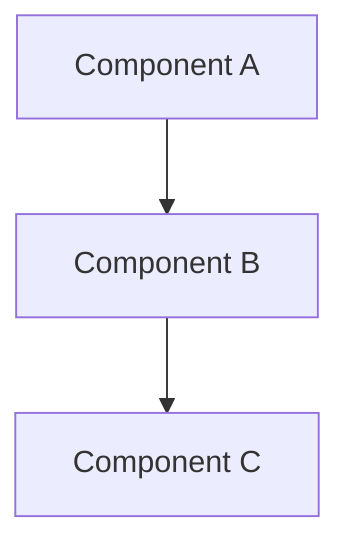
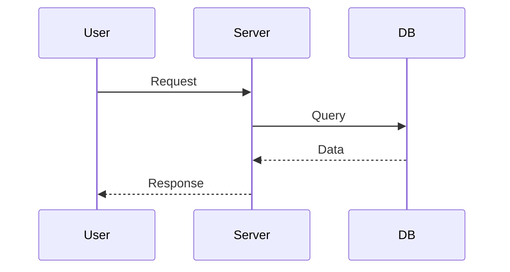
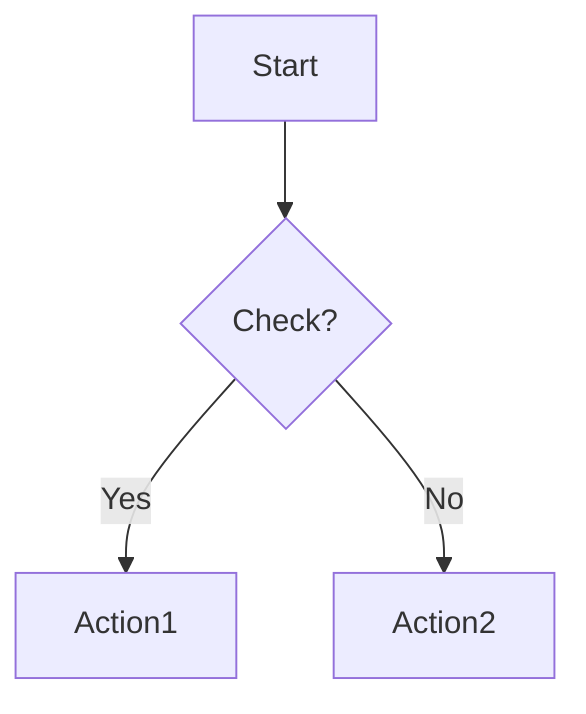

# 🎨 Guida Completa alla Visualizzazione Diagrammi Galaxy Map

**Data:** 23 Ottobre 2025
**Versione:** 1.0.0
**Per:** Nuzantara Galaxy Map Documentation

---

## 📊 Cosa Hai Adesso

### Documentazione Completa
✅ **6 documenti** in `docs/galaxy-map/`:
- `README.md` - Hub di navigazione
- `01-system-overview.md` - Panoramica sistema completo
- `02-technical-architecture.md` - Struttura codice
- `03-ai-intelligence.md` - ZANTARA, JIWA, AI models
- `04-data-flows.md` - Flussi e performance
- `05-database-schema.md` - PostgreSQL + ChromaDB

### Diagrammi Estratti
✅ **24 diagrammi Mermaid** in `docs/galaxy-map/diagrams/`:
- 1 da README.md
- 3 da 01-system-overview.md
- 3 da 02-technical-architecture.md
- 8 da 03-ai-intelligence.md
- 5 da 04-data-flows.md
- 4 da 05-database-schema.md

### Script Automatici
✅ **3 script Python** in `scripts/`:
- `extract_mermaid.py` - Estrae diagrammi da .md
- `view_diagrams.py` - Genera PNG e apre viewer
- `generate-diagrams.sh` - Wrapper bash

### Claude Skills
✅ **2 nuove skills** in `.claude/skills/`:
- `architecture-mapper.md` - Auto-update documentazione
- `diagram-manager.md` - Gestione diagrammi

---

## 🎯 3 Modi per Visualizzare i Diagrammi

### Metodo 1: VS Code (RACCOMANDATO) ⭐

**Setup (una volta sola):**
```bash
# Installa estensione
code --install-extension shd101wyy.markdown-preview-enhanced
```

**Uso quotidiano:**
1. Apri qualsiasi `.md` in `docs/galaxy-map/`
2. Premi `Cmd+Shift+V` (Mac) o `Ctrl+Shift+V` (Windows/Linux)
3. Vedi tutti i diagrammi renderizzati in real-time! ✨

**Pro:**
- ⚡ Istantaneo (zero delay)
- 🔄 Real-time preview durante editing
- 🆓 Gratis
- 🔧 Già nel tuo workflow

**Contro:**
- Nessuno! È perfetto per sviluppo

---

### Metodo 2: PNG Images 🖼️

**Setup (una volta sola):**
```bash
# Installa Mermaid CLI
npm install -g @mermaid-js/mermaid-cli
```

**Genera tutte le immagini:**
```bash
# Dalla root del progetto
python3 scripts/view_diagrams.py
```

Lo script:
1. ✅ Controlla se mermaid-cli è installato
2. ✅ Se manca, offre di installarlo
3. ✅ Genera PNG per tutti i 24 diagrammi
4. ✅ Li apre nel tuo viewer di default

**Generazione manuale:**
```bash
cd docs/galaxy-map/diagrams

for f in *.mmd; do
  mmdc -i "$f" -o "${f%.mmd}.png" -b transparent
done
```

**Pro:**
- 🖼️ Immagini ad alta qualità
- 📤 Facili da condividere
- 📊 Utilizzabili in presentazioni/Notion/Confluence
- 💾 Salvate localmente

**Contro:**
- ⏱️ Richiede rigenerazione dopo modifiche
- 📦 Richiede npm install

---

### Metodo 3: Obsidian 📝

**Setup:**
1. Scarica [Obsidian](https://obsidian.md/) (gratis)
2. Apri `~/NUZANTARA-RAILWAY` come vault
3. Naviga a `docs/galaxy-map/`

**Pro:**
- 🎨 Bellissimo UI
- 🕸️ Graph View mostra connessioni tra documenti
- 🔄 Rendering nativo Mermaid
- 📱 Mobile app disponibile

**Contro:**
- 📥 Richiede download app separata

---

## 🚀 Quick Start

### Per Vedere i Diagrammi SUBITO

**Opzione A: Hai VS Code?**
```bash
code --install-extension shd101wyy.markdown-preview-enhanced
code docs/galaxy-map/README.md
# Premi Cmd+Shift+V
```

**Opzione B: Preferisci immagini?**
```bash
python3 scripts/view_diagrams.py
# Segui le istruzioni interattive
```

**Opzione C: Vuoi provare Obsidian?**
```bash
# Scarica da: https://obsidian.md/
# Poi apri ~/NUZANTARA-RAILWAY come vault
```

---

## 📂 Struttura File

```
docs/
└── galaxy-map/                     # Documentazione principale
    ├── README.md                   # Hub di navigazione (1 diagramma)
    ├── 01-system-overview.md       # Sistema completo (3 diagrammi)
    ├── 02-technical-architecture.md # Codice (3 diagrammi)
    ├── 03-ai-intelligence.md       # AI layer (8 diagrammi)
    ├── 04-data-flows.md            # Flussi (5 diagrammi)
    ├── 05-database-schema.md       # Database (4 diagrammi)
    └── diagrams/                   # Diagrammi estratti
        ├── README.md               # Guida viewing
        ├── *.mmd                   # 24 file Mermaid
        └── *.png                   # PNG generati (opzionale)

scripts/
├── extract_mermaid.py              # Estrae diagrammi da .md
├── view_diagrams.py                # Genera PNG e apre viewer
└── generate-diagrams.sh            # Wrapper bash

.claude/skills/
├── architecture-mapper.md          # Auto-update documentazione
└── diagram-manager.md              # Gestione diagrammi
```

---

## 🔄 Workflow Raccomandato

### Sviluppo Quotidiano
1. **Usa VS Code** con Markdown Preview Enhanced
2. Modifica i file `.md` normalmente
3. `Cmd+Shift+V` per vedere preview live
4. Commit quando soddisfatto

### Presentazioni o Condivisione
1. Genera PNG: `python3 scripts/view_diagrams.py`
2. Prendi le immagini da `docs/galaxy-map/diagrams/`
3. Usa in PowerPoint, Notion, Confluence, email, etc.

### Documentazione Esterna
1. **Opzione A**: Link a GitHub (rende Mermaid automaticamente)
   - Esempio: `https://github.com/Balizero1987/nuzantara/blob/main/docs/galaxy-map/README.md`

2. **Opzione B**: Esporta PNG e embedda

3. **Opzione C**: Usa [mermaid.live](https://mermaid.live) per editing online

---

## 🛠️ Comandi Utili

### Estrai Diagrammi Dopo Modifiche
```bash
python3 scripts/extract_mermaid.py
```

**Output:**
```
📊 Extracting Mermaid diagrams from Galaxy Map documentation...

📄 Processing README.md...
   ✅ Extracted: README-01.mmd

📄 Processing 03-ai-intelligence.md...
   ✅ Extracted: 03-ai-intelligence-01.mmd
   ✅ Extracted: 03-ai-intelligence-02.mmd
   ...

✨ Done! Extracted 24 diagrams to docs/galaxy-map/diagrams/
```

### Genera Solo PNG Mancanti (Incrementale)
```bash
cd docs/galaxy-map/diagrams

for f in *.mmd; do
  png="${f%.mmd}.png"
  if [ ! -f "$png" ] || [ "$f" -nt "$png" ]; then
    mmdc -i "$f" -o "$png" -b transparent
    echo "✅ Generated $png"
  else
    echo "⏭️  Skipped $png (up to date)"
  fi
done
```

### Conta Diagrammi
```bash
ls docs/galaxy-map/diagrams/*.mmd | wc -l
# Output: 24
```

### Apri Tutti i PNG
```bash
# macOS
open docs/galaxy-map/diagrams/*.png

# Linux
xdg-open docs/galaxy-map/diagrams/
```

---

## 🤖 Automatizzazione con Claude Skills

### Architecture-Mapper Skill

Quando modifichi il codice (aggiungi handlers, services, etc.), Claude può **automaticamente**:
1. ✅ Aggiornare la documentazione in `docs/galaxy-map/`
2. ✅ Rigenerare diagrammi Mermaid se necessario
3. ✅ Validare accuratezza (counts, paths)
4. ✅ Commit automatico

**Invoca con:**
- "Claude, update the architecture docs"
- "Refresh documentation"
- (Automatico quando rileva cambiamenti)

### Diagram-Manager Skill

Quando modifichi i docs, Claude può **automaticamente**:
1. ✅ Estrarre nuovi diagrammi
2. ✅ Rigenerare PNG solo per quelli modificati
3. ✅ Validare sintassi Mermaid
4. ✅ Aprire nel viewer

**Invoca con:**
- "Claude, update diagrams"
- "Generate diagram PNGs"
- "View diagrams locally"

---

## 📊 Tipi di Diagrammi

### Graph (Architecture)

**Uso:** Architettura, struttura, dipendenze

### Sequence (Flows)

**Uso:** Request flows, interazioni temporali

### Flowchart (Processes)

**Uso:** Logic flows, decision trees

---

## ❓ FAQ

### Q: Quale metodo è il più veloce?
**A:** VS Code con Markdown Preview Enhanced. Zero setup, rendering istantaneo, integrato nel workflow.

### Q: Come condivido i diagrammi con colleghi senza GitHub?
**A:** Genera PNG (`python3 scripts/view_diagrams.py`) e invia le immagini.

### Q: I diagrammi si aggiornano automaticamente?
**A:** Sì! Quando Claude modifica i docs con `architecture-mapper`, `diagram-manager` auto-estrae i nuovi diagrammi.

### Q: Posso modificare i diagrammi?
**A:** Sì! Modifica i blocchi ` ```mermaid ... ``` ` nei file `.md`, poi riesegui `extract_mermaid.py`.

### Q: Devo committare i PNG in git?
**A:** No, generalmente no. Committi solo i `.md` e `.mmd`. I PNG sono facilmente rigenerabili. Eccezione: se usati in documentazione esterna.

### Q: Cosa succede se la sintassi Mermaid è invalida?
**A:** Vedrai errore in VS Code preview o durante generazione PNG. Valida su [mermaid.live](https://mermaid.live) prima di committare.

### Q: I diagrammi funzionano su GitHub?
**A:** Sì! GitHub rende nativamente i blocchi Mermaid nei file `.md`.

### Q: Posso usare questi diagrammi in Notion?
**A:** Sì! Genera PNG e upload su Notion. Oppure usa [Notion Mermaid embed](https://www.notion.so/help/embed-and-connect-other-apps).

---

## 💡 Tips & Best Practices

### Durante Sviluppo
✅ Usa **VS Code preview** per editing veloce
✅ Valida sintassi su [mermaid.live](https://mermaid.live) se hai dubbi
✅ Mantieni diagrammi semplici (max 15-20 nodi)
✅ Usa colori per evidenziare componenti critici

### Per Presentazioni
✅ Genera **PNG ad alta risoluzione**
✅ Usa sfondo trasparente (`-b transparent`)
✅ Considera PNG separati per ogni diagramma (già fatto!)
✅ Mantieni consistency nei colori

### Per Documentazione
✅ Committi **sempre i `.md`** con diagrammi embedded
✅ Committi **i `.mmd`** estratti (piccoli, utili)
✅ **NON committare i PNG** (rigenerabili, pesanti)
✅ Link a GitHub per documentazione esterna

### Per Collaboration
✅ Review diagrammi in PR come codice
✅ Valida accuratezza dopo merge
✅ Rigenera dopo architectural changes
✅ Mantieni README aggiornato

---

## 🎯 Prossimi Step Consigliati

### Subito (5 minuti)
1. ✅ Installa VS Code extension: `code --install-extension shd101wyy.markdown-preview-enhanced`
2. ✅ Apri `docs/galaxy-map/README.md`
3. ✅ Premi `Cmd+Shift+V`
4. ✅ Naviga tra i documenti visualizzando i diagrammi!

### Oggi (15 minuti)
5. ✅ Installa Mermaid CLI: `npm install -g @mermaid-js/mermaid-cli`
6. ✅ Genera PNG: `python3 scripts/view_diagrams.py`
7. ✅ Esplora `docs/galaxy-map/diagrams/` con Finder/Explorer

### Questa Settimana (30 minuti)
8. ✅ Scarica [Obsidian](https://obsidian.md/)
9. ✅ Apri `~/NUZANTARA-RAILWAY` come vault
10. ✅ Esplora la Graph View
11. ✅ Configura mobile sync (opzionale)

---

## 🌟 Risultato Finale

Ora hai:

✅ **Documentazione completa** (6 documenti, ~48KB)
✅ **24 diagrammi Mermaid** estratti e pronti
✅ **3 modi per visualizzarli** (VS Code, PNG, Obsidian)
✅ **Script automatici** per gestione diagrammi
✅ **Claude Skills** per auto-update
✅ **Zero friction** - workflow integrato

**Tutto locale, tutto automatico, tutto visual!** 🎨

---

## 📞 Support

**Problemi con:**
- **Mermaid syntax**: https://mermaid.live/edit
- **VS Code extension**: https://marketplace.visualstudio.com/items?itemName=shd101wyy.markdown-preview-enhanced
- **Mermaid CLI**: https://github.com/mermaid-js/mermaid-cli
- **Obsidian**: https://help.obsidian.md/

**Claude Skills:**
- Docs: https://docs.claude.com/en/docs/claude-code/skills

---

**Creato:** 23 Ottobre 2025
**Per:** Nuzantara Galaxy Map Documentation
**Con:** Claude Code + architecture-mapper + diagram-manager skills 🤖
