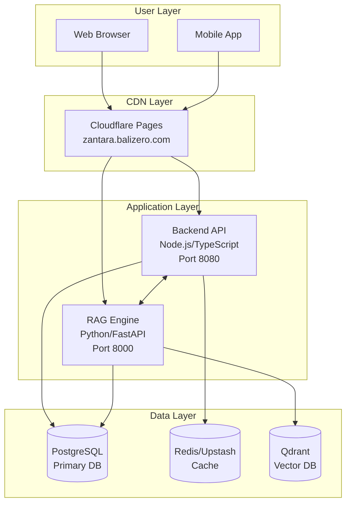

# ZANTARA Infrastructure Overview

## 🚀 Quick Start

```bash
# Clone repository
git clone https://github.com/Balizero1987/nuzantara.git
cd nuzantara

# Deploy backend
cd apps/backend-ts
fly deploy -a nuzantara-backend

# Deploy RAG engine
cd ../backend-rag
fly deploy -a nuzantara-rag
```

## 🏗️ Architecture

ZANTARA is a microservices-based immigration and business services platform deployed on Fly.io's global edge network. The system provides AI-powered document processing, intelligent chat, and comprehensive business services for Bali, Indonesia.

### System Components



### Technology Stack

| Component | Technology | Purpose |
|-----------|------------|---------|
| **Backend API** | Node.js, TypeScript, Express | Core business logic, API endpoints |
| **RAG Engine** | Python, FastAPI, LangChain | AI chat, document retrieval |
| **Database** | PostgreSQL 14 | Primary data persistence |
| **Cache** | Redis/Upstash | Response caching, sessions |
| **Vector DB** | Qdrant Cloud | Semantic search, embeddings |
| **CDN** | Cloudflare Pages | Static hosting, global distribution |
| **Platform** | Fly.io | Container orchestration, edge compute |

## 📦 Deployment

### Prerequisites

1. **Install Fly CLI**
   ```bash
   curl -L https://fly.io/install.sh | sh
   export FLYCTL_INSTALL="/home/$USER/.fly"
   export PATH="$FLYCTL_INSTALL/bin:$PATH"
   ```

2. **Authenticate**
   ```bash
   fly auth login
   ```

3. **Environment Variables**
   ```bash
   # Backend secrets
   fly secrets set DATABASE_URL="postgresql://..." -a nuzantara-backend
   fly secrets set REDIS_URL="redis://..." -a nuzantara-backend
   fly secrets set INTERNAL_API_KEY="..." -a nuzantara-backend

   # RAG secrets
   fly secrets set DATABASE_URL="postgresql://..." -a nuzantara-rag
   fly secrets set ANTHROPIC_API_KEY="sk-ant-..." -a nuzantara-rag
   fly secrets set QDRANT_URL="https://..." -a nuzantara-rag
   ```

### Production Deployment

#### Backend Service

```bash
cd apps/backend-ts

# Deploy with immediate strategy
fly deploy -a nuzantara-backend --strategy immediate

# Check deployment status
fly status -a nuzantara-backend

# View logs
fly logs -a nuzantara-backend --tail
```

#### RAG Service

```bash
cd apps/backend-rag

# Deploy with immediate strategy
fly deploy -a nuzantara-rag --strategy immediate

# Check deployment status
fly status -a nuzantara-rag

# View logs
fly logs -a nuzantara-rag --tail
```

### Scaling

```bash
# Vertical scaling (memory/CPU)
fly scale memory 512 -a nuzantara-backend
fly scale vm shared-cpu-2x -a nuzantara-backend

# Horizontal scaling (instances)
fly scale count 2 -a nuzantara-backend

# Regional scaling
fly scale count sin=2 lax=1 -a nuzantara-backend
```

## 🔗 Service Interaction

### Redis Cache Layer

The Redis cache improves performance by caching:
- API responses (TTL: 5-60 minutes)
- Session data
- Rate limit counters
- Frequently accessed data

```typescript
// Cache middleware automatically handles:
- Cache key generation (MD5 hash)
- TTL management
- Graceful degradation
- Prometheus metrics
```

### PostgreSQL Database

Primary persistence for:
- User accounts
- Business data
- Conversation history
- System configuration

```sql
-- Connection pooling
Max connections: 100
Default pool size: 10
SSL: Required
```

### Qdrant Vector Database

Semantic search capabilities:
- Document embeddings
- Similarity search
- RAG retrieval
- Multi-language support

## 📊 Monitoring & Observability

### Prometheus Metrics

Access at: `https://nuzantara-backend.fly.dev/metrics`

Key metrics:
- `zantara_backend_http_requests_total` - Request counts
- `zantara_backend_http_request_duration_seconds` - Response times
- `zantara_backend_cache_hits_total` - Cache performance
- `zantara_backend_process_cpu_seconds_total` - CPU usage
- `zantara_backend_process_resident_memory_bytes` - Memory usage

### Health Endpoints

```bash
# Backend health
curl https://nuzantara-backend.fly.dev/health

# RAG health
curl https://nuzantara-rag.fly.dev/health

# Cache health
curl https://nuzantara-backend.fly.dev/cache/health
```

### Logging

```bash
# View real-time logs
fly logs -a nuzantara-backend --tail

# Filter by level
fly logs -a nuzantara-backend | grep ERROR

# Export logs
fly logs -a nuzantara-backend > logs.txt
```

## 🔐 Security

### Headers

All responses include security headers:
- `strict-transport-security` - Force HTTPS
- `content-security-policy` - Prevent XSS
- `x-frame-options` - Prevent clickjacking
- `x-content-type-options` - Prevent MIME sniffing
- `x-xss-protection` - XSS protection
- `referrer-policy` - Control referrer information
- `permissions-policy` - Control browser features

### Rate Limiting

Three-tier rate limiting:
1. **Global**: 30 requests/15 minutes
2. **API**: 20 requests/minute
3. **Strict**: 5 requests/hour (sensitive ops)

### Authentication

- API key validation
- Session management
- OAuth2 ready
- Role-based access control

## 🛠️ Troubleshooting

### Common Issues

#### Redis Connection Failed
```bash
# Check Redis status
fly redis status nuzantara-redis

# Verify secret
fly secrets list -a nuzantara-backend | grep REDIS

# Test connection locally
redis-cli -u $REDIS_URL ping
```

#### High Memory Usage
```bash
# Check current usage
fly scale show -a nuzantara-backend

# Scale up memory
fly scale memory 512 -a nuzantara-backend

# Restart service
fly apps restart nuzantara-backend
```

#### Deployment Failures
```bash
# Verbose deploy
fly deploy -a nuzantara-backend --verbose

# Check machine status
fly machines list -a nuzantara-backend

# SSH into container
fly ssh console -a nuzantara-backend
```

### Debug Commands

```bash
# Check environment variables
fly ssh console -a nuzantara-backend -C "env | sort"

# Check disk usage
fly ssh console -a nuzantara-backend -C "df -h"

# Check running processes
fly ssh console -a nuzantara-backend -C "ps aux"

# Check network connections
fly ssh console -a nuzantara-backend -C "netstat -an"
```

## 🚀 Development

### Local Development

```bash
# Backend
cd apps/backend-ts
npm install
npm run dev  # Runs on http://localhost:8080

# RAG Engine
cd apps/backend-rag
pip install -r requirements.txt
uvicorn main:app --reload  # Runs on http://localhost:8000
```

### Environment Variables

Create `.env` files:

```bash
# apps/backend-ts/.env
DATABASE_URL=postgresql://localhost:5432/zantara
REDIS_URL=redis://localhost:6379
NODE_ENV=development
PORT=8080

# apps/backend-rag/.env
DATABASE_URL=postgresql://localhost:5432/zantara
ANTHROPIC_API_KEY=sk-ant-...
QDRANT_URL=http://localhost:6333
PORT=8000
```

### Testing

```bash
# Backend tests
cd apps/backend-ts
npm test
npm run test:coverage

# RAG tests
cd apps/backend-rag
pytest tests/
pytest --cov=.
```

## 📈 Performance

### Current Metrics

- **Latency**: P95 < 200ms
- **Availability**: 99.9%+
- **Error Rate**: < 0.1%
- **Memory Usage**: ~140MB/256MB
- **CPU Usage**: < 5%

### Optimization Tips

1. **Enable Redis cache** for 30-40% latency reduction
2. **Use CDN** for static assets
3. **Implement request batching** for bulk operations
4. **Add connection pooling** for databases
5. **Enable HTTP/2** for multiplexing

## 💰 Cost

### Monthly Estimates

```
Fly.io Resources:
- Machines: $5.70/month
- Memory: $2.10/month
- Bandwidth: $0.02/month
- Storage: $0.15/month
Total: ~$8/month

External Services:
- Cloudflare: Free tier
- Qdrant Cloud: Usage-based
- Anthropic API: Usage-based
```

## 📞 Support

### Internal Resources
- GitHub Issues: https://github.com/Balizero1987/nuzantara/issues
- Documentation: /docs directory
- Logs: Fly.io dashboard

### External Support
- Fly.io: https://fly.io/docs
- Upstash: https://upstash.com/docs
- Qdrant: https://qdrant.tech/documentation
- Cloudflare: https://developers.cloudflare.com

## 📝 License

Copyright © 2025 ZANTARA. All rights reserved.

---

*Last Updated: 2025-10-31*
*Version: 1.0.0*