# 🗺️ NUZANTARA - SYSTEM DIAGRAMS (SIMPLIFIED)

**Data**: 23 Ottobre 2025, 21:00
**Approach**: Diagrammi separati per layer per migliore leggibilità

---

## 📊 DIAGRAM 1: HIGH-LEVEL ARCHITECTURE

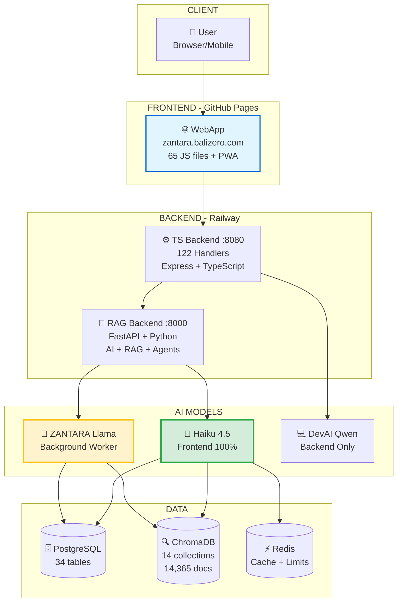

---

## 🔄 DIAGRAM 2: USER REQUEST FLOW (Simple)

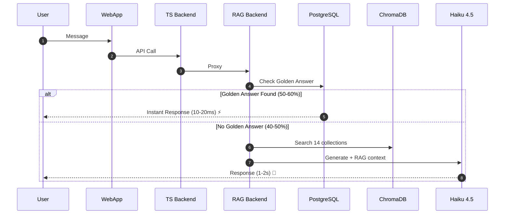

---

## 🌙 DIAGRAM 3: ZANTARA NIGHTLY WORKER

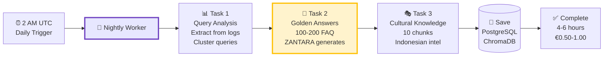

---

## 🤖 DIAGRAM 4: AI MODELS ROLES

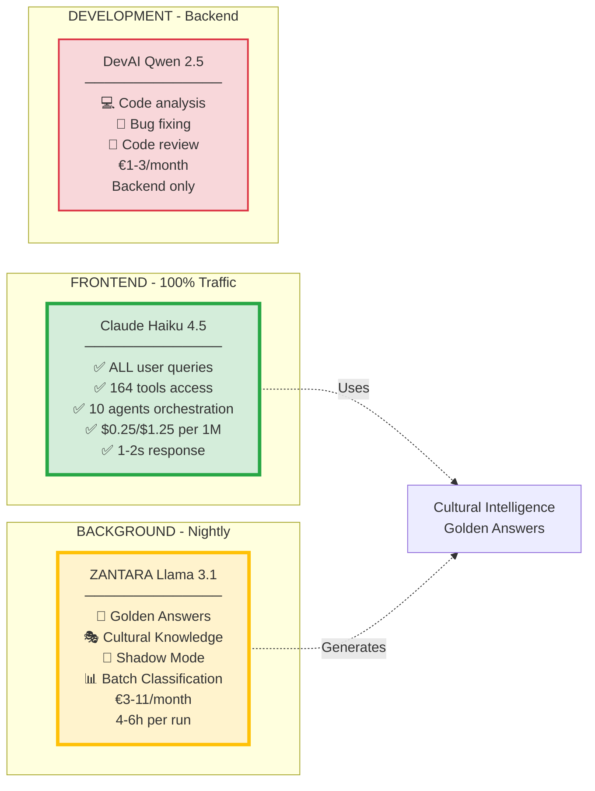

---

## 🗄️ DIAGRAM 5: DATABASE STRUCTURE

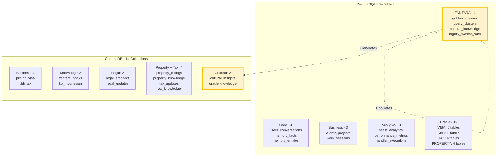

---

## 🎯 DIAGRAM 6: TOOLS & AGENTS (164 + 15)

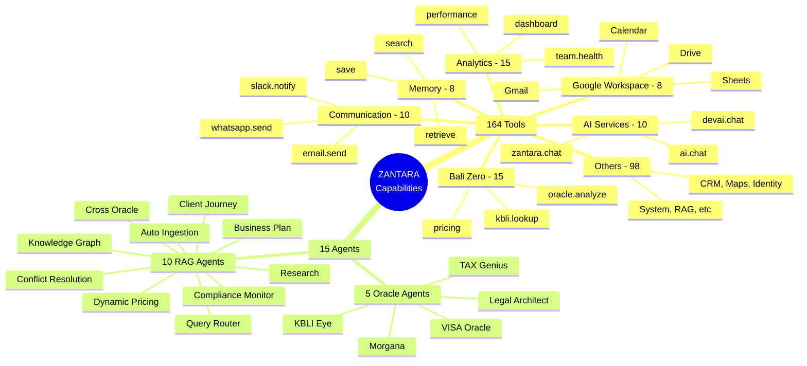

---

## ⚡ DIAGRAM 7: PERFORMANCE FLOW

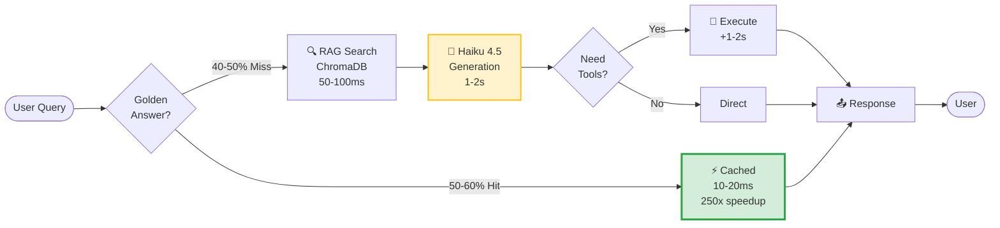

---

## 🎭 DIAGRAM 8: JIWA ARCHITECTURE (Simple)

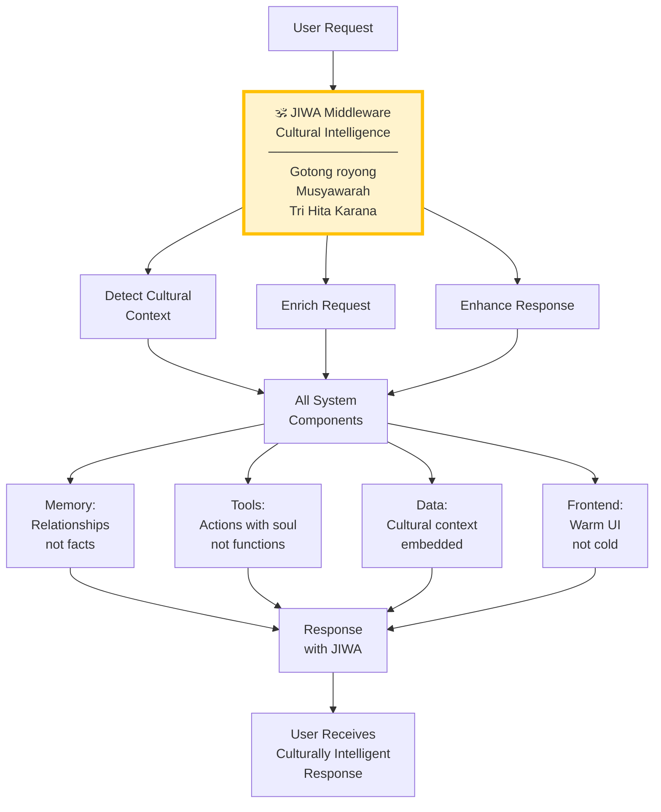

---

## 📈 DIAGRAM 9: COST & PERFORMANCE

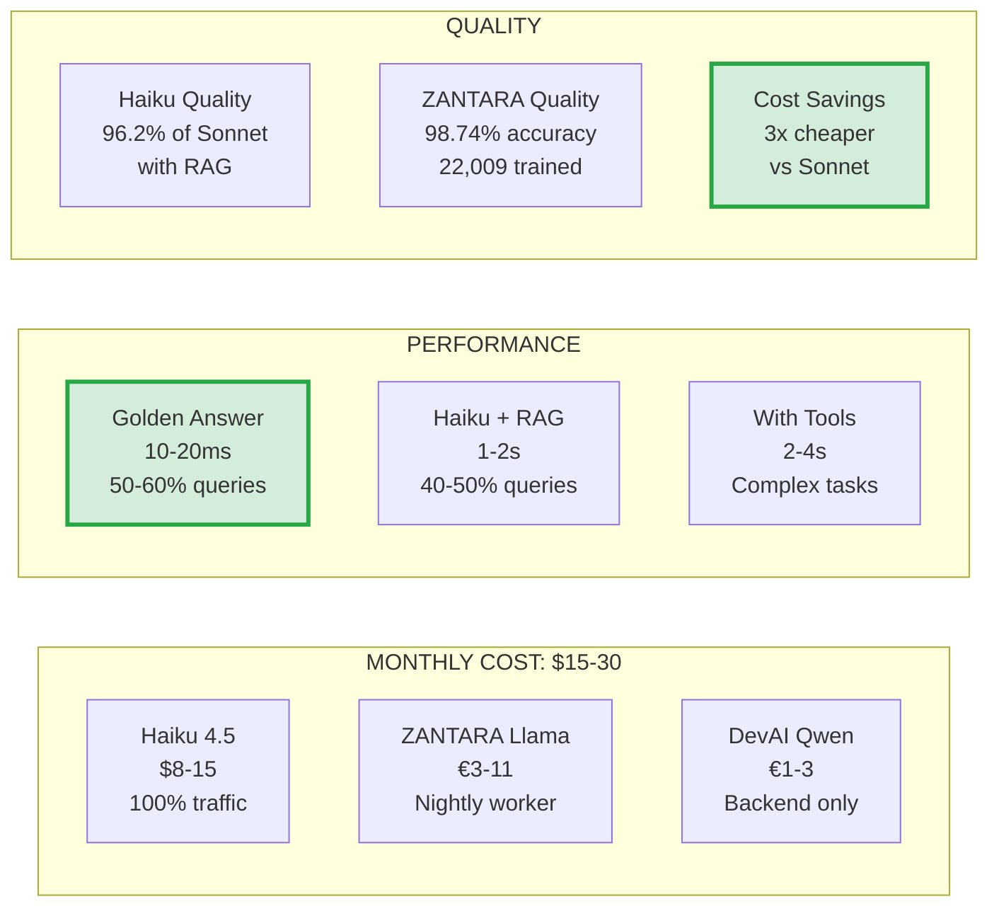

---

## 🔧 DIAGRAM 10: DEPLOYMENT ARCHITECTURE

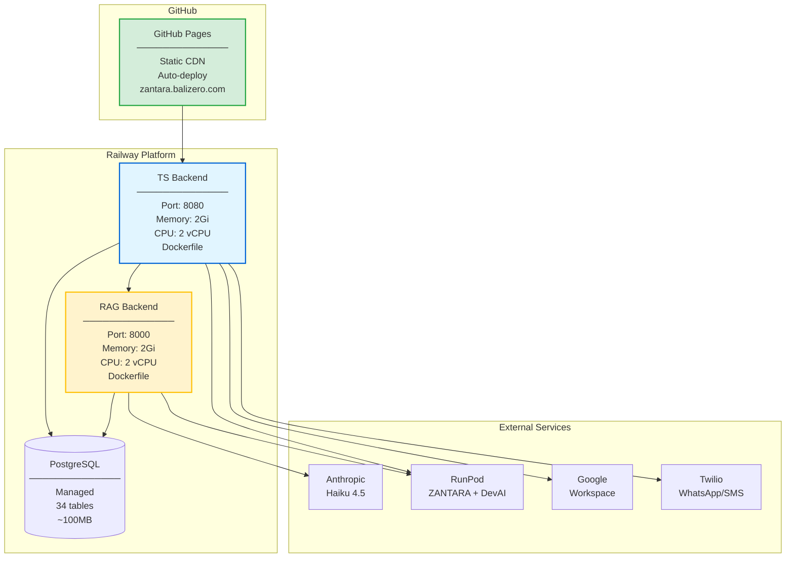

---

## 🧠 DIAGRAM 11: AI DECISION TREE

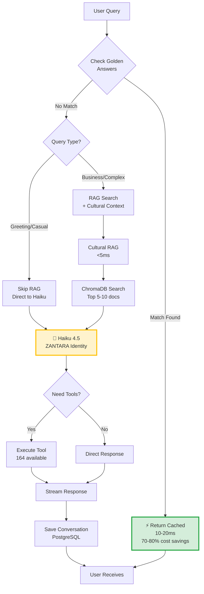

---

## 🌙 DIAGRAM 12: ZANTARA NIGHTLY WORKER (Detailed)

```mermaid
stateDiagram-v2
    [*] --> Start: 2 AM UTC Daily
    
    Start --> QueryExtraction: Extract queries from logs
    
    state QueryExtraction {
        [*] --> ReadLogs: Read last 3-7 days
        ReadLogs --> Filter: Filter user queries
        Filter --> Count: Count frequency
        Count --> [*]: 127 queries found
    }
    
    QueryExtraction --> Clustering: Semantic clustering
    
    state Clustering {
        [*] --> Embed: Generate embeddings
        Embed --> Group: Group similar queries
        Group --> Rank: Rank by frequency
        Rank --> [*]: 23 clusters identified
    }
    
    Clustering --> GoldenGeneration: Generate Golden Answers
    
    state GoldenGeneration {
        [*] --> ForEach: For each cluster
        ForEach --> RAGSearch: ChromaDB search (legal docs)
        RAGSearch --> LlamaCall: ZANTARA Llama generates
        LlamaCall --> Validate: Validate citations
        Validate --> SaveDB: Save to PostgreSQL
        SaveDB --> ForEach
        ForEach --> [*]: 45 answers generated
    }
    
    GoldenGeneration --> CulturalGen: Generate Cultural Knowledge
    
    state CulturalGen {
        [*] --> Topics: 10 cultural topics
        Topics --> LlamaGen: ZANTARA generates
        LlamaGen --> SaveBoth: Save PostgreSQL + ChromaDB
        SaveBoth --> [*]: 10 chunks saved
    }
    
    CulturalGen --> Logging: Log completion
    Logging --> [*]: Complete (4-6h)
```

---

## 🔧 DIAGRAM 13: TOOL EXECUTION (Dual Routing)

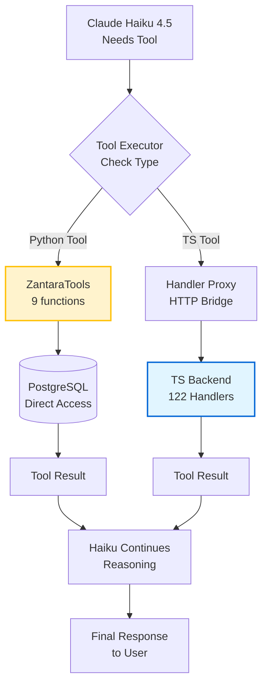

---

## 📊 DIAGRAM 14: DATA STATISTICS

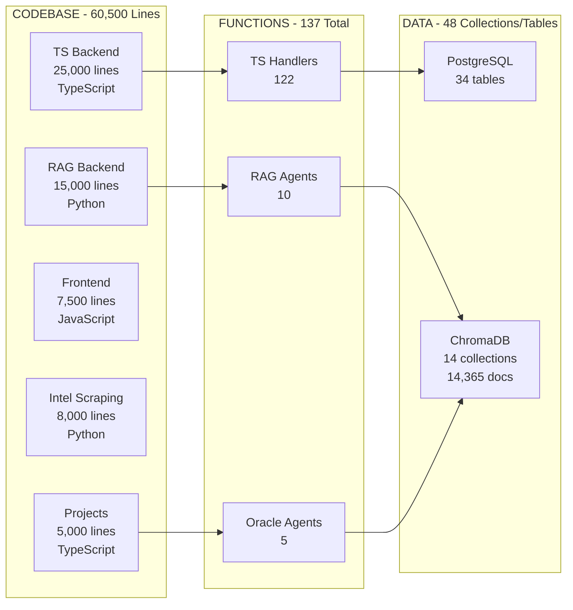

---

## 🎯 DIAGRAM 15: ZANTARA IDENTITY & PERSONALITY

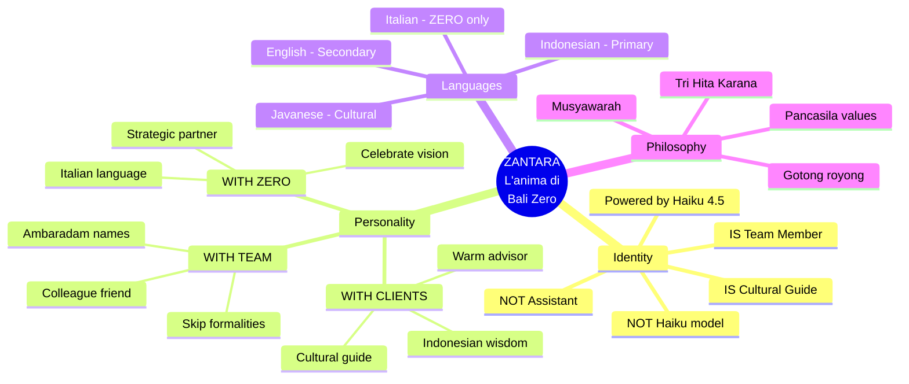

---

## 📈 DIAGRAM 16: PERFORMANCE COMPARISON

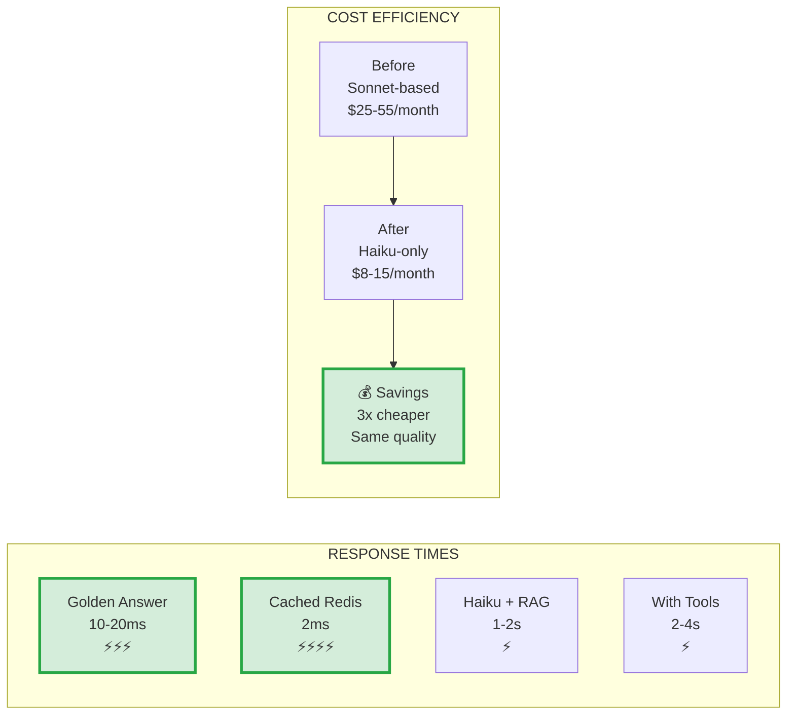

---

**DIAGRAMMI SEMPLIFICATI E LEGGIBILI!** 🎉

Ogni diagram si concentra su un aspetto specifico del sistema, facile da leggere e comprendere.
