# 🗺️ NUZANTARA - MERMAID SYSTEM DIAGRAM

**Data**: 23 Ottobre 2025, 20:45
**StatusMenuComplete System Architecture (Haiku 4.5 ONLY Frontend)

---

## 🏗️ COMPLETE SYSTEM ARCHITECTURE

```mermaid
graph TB
    subgraph "🌐 CLIENT LAYER"
        Browser[Browser/PWA<br/>zantara.balizero.com]
        Mobile[Mobile Apps]
        Admin[Admin Dashboard]
    end

    subgraph "🚀 DEPLOYMENT LAYER"
        Railway[Railway<br/>Auto-deploy]
        GitHub[GitHub Pages/CDN]
        GCloud[Google Cloud Run]
    end

    subgraph "🌊 API GATEWAY LAYER - TS Backend :8080"
        direction TB
        Gateway[API Gateway<br/>Express Router]
        
        subgraph "Middleware Pipeline"
            DemoAuth[Demo User Auth<br/>25 public tools]
            JWTAuth[JWT Auth<br/>Team/Admin]
            RateLimit[Rate Limiter<br/>Selective]
            Logger[Logger<br/>Correlation ID]
        end
        
        subgraph "Handler Registry - 122 Handlers"
            direction LR
            H_GWS[Google Workspace<br/>8 handlers]
            H_AI[AI Services<br/>10 handlers]
            H_BZ[Bali Zero<br/>15 handlers]
            H_ZANT[ZANTARA<br/>20 handlers]
            H_Comm[Communication<br/>10 handlers]
            H_Analytics[Analytics<br/>15 handlers]
            H_Memory[Memory<br/>8 handlers]
            H_Maps[Maps<br/>3 handlers]
            H_RAG[RAG Proxy<br/>4 handlers]
            H_DevAI[DevAI<br/>7 handlers]
            H_Identity[Identity<br/>3 handlers]
            H_System[System<br/>10+ handlers]
        end
    end

    subgraph "🧠 AI INTELLIGENCE LAYER"
        direction TB
        
        subgraph "Frontend AI - 100% Traffic"
            Haiku[Claude Haiku 4.5<br/>ZANTARA Identity<br/>$0.25/$1.25 per 1M tokens<br/>~1-2s response<br/>164 tools access]
        end
        
        subgraph "Background AI - Nightly Worker"
            ZANTARA_Llama[ZANTARA Llama 3.1 8B<br/>Trained: 22,009 conversations<br/>Accuracy: 98.74%<br/>RunPod vLLM + HF fallback<br/>€3-11/month]
        end
        
        subgraph "Development AI - Backend Only"
            DevAI[DevAI Qwen 2.5 Coder<br/>7 handlers<br/>Code analysis<br/>€1-3/month]
        end
    end

    subgraph "🎯 RAG LAYER - Python Backend :8000"
        direction TB
        FastAPI[FastAPI App<br/>12 endpoints]
        
        subgraph "RAG Services"
            Router[Intelligent Router<br/>Haiku ONLY]
            SearchSvc[Search Service<br/>ChromaDB client]
            CulturalRAG[Cultural RAG<br/>Indonesian context]
            GoldenAnswer[Golden Answer Service<br/>10-20ms lookup]
            MemorySvc[Memory Service<br/>PostgreSQL]
            ConvSvc[Conversation Service]
            EmotionalSvc[Emotional Attunement]
            HandlerProxy[Handler Proxy<br/>TS Backend bridge]
            ToolExecutor[Tool Executor<br/>Dual routing]
        end
        
        subgraph "10 Agentic Functions"
            A1[Client Journey<br/>Orchestrator]
            A2[Proactive Compliance<br/>Monitor]
            A3[Knowledge Graph<br/>Builder]
            A4[Auto Ingestion<br/>Orchestrator]
            A5[Cross Oracle<br/>Synthesis]
            A6[Dynamic<br/>Pricing]
            A7[Autonomous<br/>Research]
            A8[Intelligent Query<br/>Router]
            A9[Conflict<br/>Resolution]
            A10[Business Plan<br/>Generator]
        end
    end

    subgraph "🗄️ DATA LAYER"
        direction TB
        
        subgraph "PostgreSQL - 34 Tables"
            PG_Core[(Core<br/>users, conversations<br/>memory_facts)]
            PG_Business[(Business<br/>clients, projects<br/>work_sessions)]
            PG_Analytics[(Analytics<br/>team_analytics<br/>performance_metrics)]
            PG_Oracle[(Oracle - 19 tables<br/>visa, kbli, tax<br/>property)]
            PG_ZANTARA[(ZANTARA<br/>golden_answers<br/>query_clusters<br/>cultural_knowledge<br/>nightly_worker_runs)]
        end
        
        subgraph "ChromaDB - 14 Collections"
            C_Business[(Business<br/>pricing, visa<br/>kbli, tax)]
            C_Knowledge[(Knowledge<br/>zantara_books<br/>kb_indonesian)]
            C_Legal[(Legal<br/>legal_architect<br/>legal_updates)]
            C_Property[(Property<br/>listings<br/>knowledge)]
            C_Tax[(Tax<br/>updates<br/>knowledge)]
            C_Cultural[(Cultural<br/>cultural_insights<br/>oracle_visa<br/>oracle_kbli)]
        end
        
        subgraph "Redis - Caching"
            Redis[(Cache<br/>TTL 5min<br/>Rate Limiting<br/>Metrics)]
        end
    end

    subgraph "🔧 BACKGROUND WORKERS"
        direction TB
        NightlyWorker[ZANTARA Nightly Worker<br/>2 AM UTC daily]
        
        subgraph "Worker Tasks"
            Task1[Query Analysis<br/>& Clustering]
            Task2[Golden Answers<br/>Generation]
            Task3[Cultural Knowledge<br/>Generation]
            Task4[Shadow Mode<br/>A/B Testing]
        end
        
        NightlyWorker --> Task1
        Task1 --> Task2
        Task2 --> Task3
        Task3 --> Task4
    end

    subgraph "🌍 EXTERNAL INTEGRATIONS"
        direction LR
        Anthropic[Anthropic API<br/>Claude Haiku 4.5]
        RunPod[RunPod<br/>ZANTARA Llama 3.1<br/>DevAI Qwen 2.5]
        HuggingFace[HuggingFace<br/>Fallback]
        Google[Google Workspace<br/>Gmail, Drive, Calendar]
        Twilio[Twilio<br/>WhatsApp, SMS]
        SendGrid[SendGrid<br/>Email]
        Slack[Slack API]
        Discord[Discord API]
    end

    %% Client to Gateway
    Browser --> Gateway
    Mobile --> Gateway
    Admin --> Gateway
    
    %% Gateway to Middleware
    Gateway --> DemoAuth
    DemoAuth --> JWTAuth
    JWTAuth --> RateLimit
    RateLimit --> Logger
    
    %% Middleware to Handlers
    Logger --> H_GWS
    Logger --> H_AI
    Logger --> H_BZ
    Logger --> H_ZANT
    Logger --> H_Comm
    Logger --> H_Analytics
    Logger --> H_Memory
    Logger --> H_Maps
    Logger --> H_RAG
    Logger --> H_DevAI
    Logger --> H_Identity
    Logger --> H_System
    
    %% Handlers to RAG Backend
    H_RAG --> FastAPI
    H_AI --> FastAPI
    H_ZANT --> FastAPI
    
    %% RAG Backend to Services
    FastAPI --> Router
    Router --> Haiku
    Router --> SearchSvc
    Router --> CulturalRAG
    Router --> GoldenAnswer
    Router --> MemorySvc
    Router --> ConvSvc
    Router --> EmotionalSvc
    Router --> HandlerProxy
    Router --> ToolExecutor
    
    %% Agents
    FastAPI --> A1
    FastAPI --> A2
    FastAPI --> A3
    FastAPI --> A4
    FastAPI --> A5
    FastAPI --> A6
    FastAPI --> A7
    FastAPI --> A8
    FastAPI --> A9
    FastAPI --> A10
    
    %% Services to Data Layer
    SearchSvc --> C_Business
    SearchSvc --> C_Knowledge
    SearchSvc --> C_Legal
    SearchSvc --> C_Property
    SearchSvc --> C_Tax
    SearchSvc --> C_Cultural
    
    GoldenAnswer --> PG_ZANTARA
    MemorySvc --> PG_Core
    A1 --> PG_Business
    A2 --> PG_Oracle
    H_Memory --> PG_Core
    H_Analytics --> PG_Analytics
    
    Router --> Redis
    GoldenAnswer --> Redis
    
    %% Background Workers
    Task1 --> PG_Core
    Task2 --> ZANTARA_Llama
    Task2 --> PG_ZANTARA
    Task3 --> ZANTARA_Llama
    Task3 --> PG_ZANTARA
    Task3 --> C_Cultural
    Task4 --> ZANTARA_Llama
    Task4 --> Haiku
    
    %% External Integrations
    Haiku --> Anthropic
    ZANTARA_Llama --> RunPod
    ZANTARA_Llama --> HuggingFace
    DevAI --> RunPod
    H_GWS --> Google
    H_Comm --> Twilio
    H_Comm --> SendGrid
    H_Comm --> Slack
    H_Comm --> Discord
    
    %% Styling
    classDef frontend fill:#e1f5ff,stroke:#0366d6,stroke-width:2px
    classDef backend fill:#fff3cd,stroke:#ffc107,stroke-width:2px
    classDef ai fill:#d4edda,stroke:#28a745,stroke-width:2px
    classDef data fill:#f8d7da,stroke:#dc3545,stroke-width:2px
    classDef worker fill:#e7e7ff,stroke:#6f42c1,stroke-width:2px
    
    class Browser,Mobile,Admin frontend
    class Gateway,FastAPI,H_GWS,H_AI,H_BZ,H_ZANT backend
    class Haiku,ZANTARA_Llama,DevAI,Router ai
    class PG_Core,PG_Business,PG_Analytics,PG_Oracle,PG_ZANTARA,C_Business,C_Knowledge,Redis data
    class NightlyWorker,Task1,Task2,Task3,Task4 worker
```

---

## 🔄 COMPLETE REQUEST FLOWS

### **Flow 1: User Chat (Real-time)**

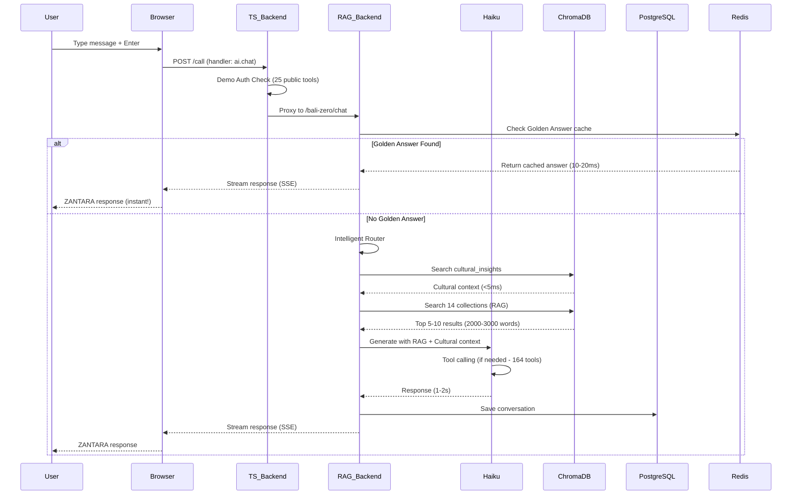

### **Flow 2: ZANTARA Nightly Worker (Background)**

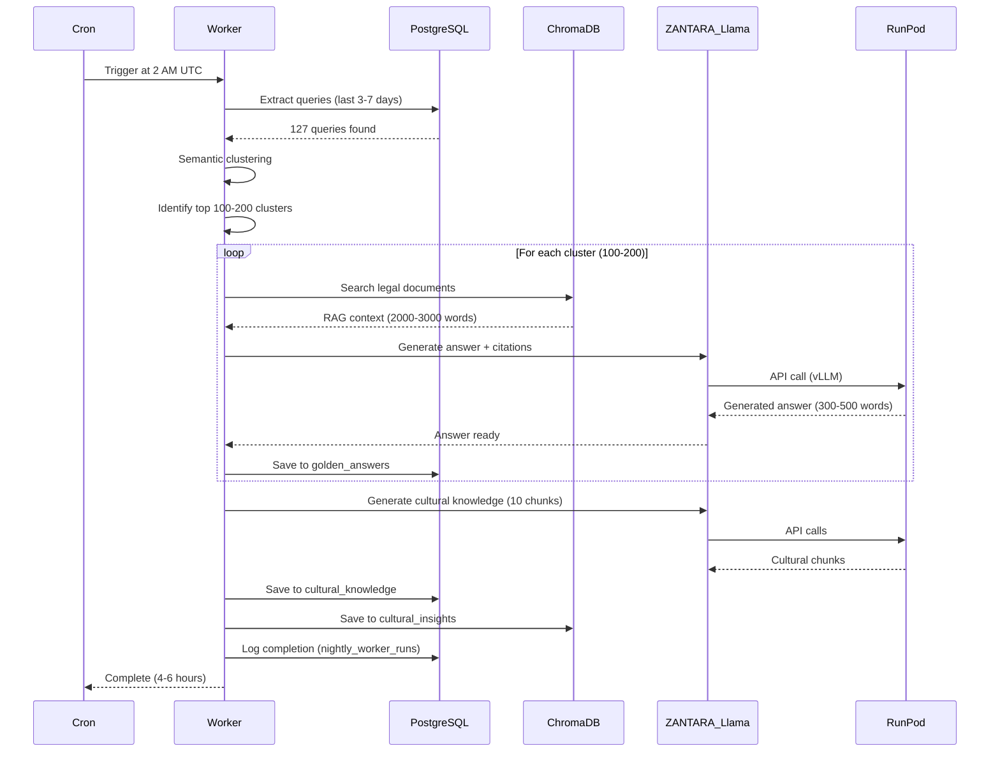

### **Flow 3: Golden Answer Lookup (Cached)**

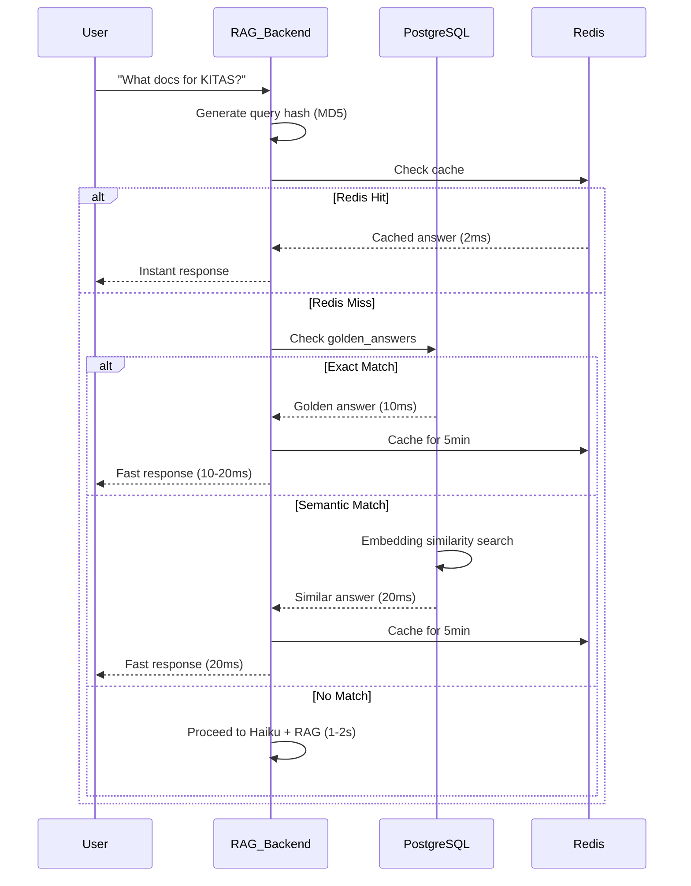

### **Flow 4: Tool Execution (Dual Routing)**

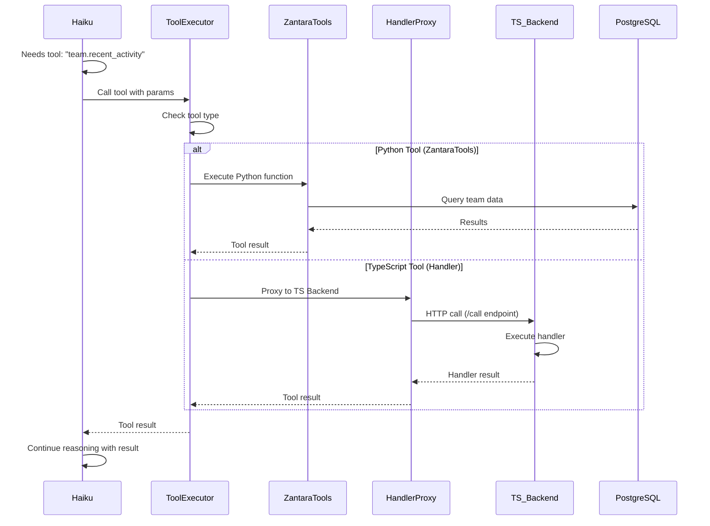

---

## 🧠 AI MODELS ARCHITECTURE

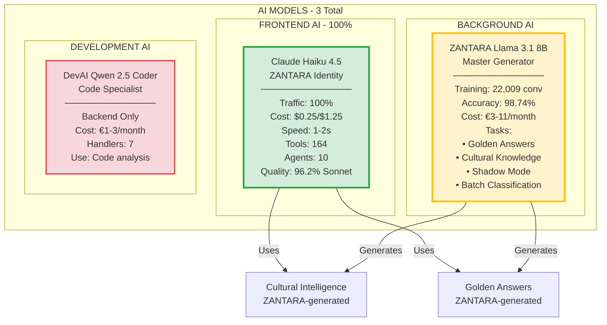

---

## 🗄️ DATABASE ARCHITECTURE

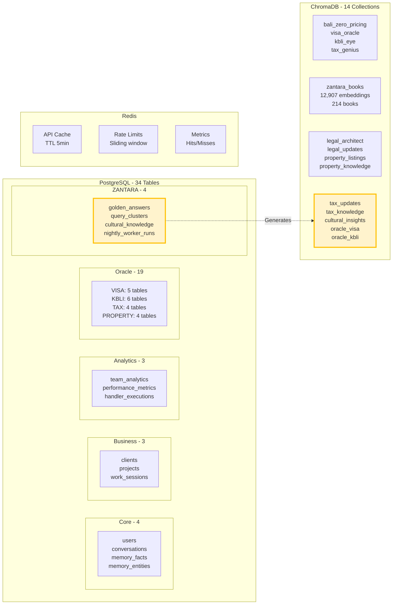

---

## 🤖 AGENTIC ARCHITECTURE

```mermaid
graph TB
    subgraph "15 AGENTS TOTAL"
        direction TB
        
        subgraph "RAG Backend - 10 Agentic Functions"
            A1[1. Client Journey<br/>Orchestrator<br/>──────────────<br/>Multi-step workflows<br/>Progress tracking<br/>Auto notifications]
            A2[2. Proactive Compliance<br/>Monitor<br/>──────────────<br/>Deadline tracking<br/>Auto alerts<br/>Multi-channel notify]
            A3[3. Knowledge Graph<br/>Builder<br/>──────────────<br/>Entity relationships<br/>Semantic mapping<br/>Graph visualization]
            A4[4. Auto Ingestion<br/>Orchestrator<br/>──────────────<br/>Content pipeline<br/>Source monitoring<br/>Auto processing]
            A5[5. Cross Oracle<br/>Synthesis<br/>──────────────<br/>Multi-domain search<br/>Intelligence synthesis<br/>Combined insights]
            A6[6. Dynamic<br/>Pricing<br/>──────────────<br/>Context-aware pricing<br/>Market adaptation<br/>Personalization]
            A7[7. Autonomous<br/>Research<br/>──────────────<br/>Multi-source research<br/>Auto synthesis<br/>Report generation]
            A8[8. Intelligent Query<br/>Router<br/>──────────────<br/>Smart AI routing<br/>Performance optimize<br/>Cost efficiency]
            A9[9. Conflict<br/>Resolution<br/>──────────────<br/>Source contradictions<br/>Intelligent reconcile<br/>Truth synthesis]
            A10[10. Business Plan<br/>Generator<br/>──────────────<br/>Auto planning<br/>Market analysis<br/>Financial projections]
        end
        
        subgraph "Oracle System - 5 Oracle Agents"
            O1[VISA ORACLE<br/>Immigration intel<br/>Visa requirements]
            O2[KBLI EYE<br/>Business codes<br/>Classification]
            O3[TAX GENIUS<br/>Tax optimization<br/>Compliance]
            O4[LEGAL ARCHITECT<br/>Property law<br/>Legal docs]
            O5[MORGANA<br/>Content creation<br/>Marketing]
        end
    end
    
    A5 --> O1
    A5 --> O2
    A5 --> O3
    A5 --> O4
    A5 --> O5
    
    style A1 fill:#e1f5ff,stroke:#0366d6,stroke-width:2px
    style A2 fill:#e1f5ff,stroke:#0366d6,stroke-width:2px
    style A5 fill:#d4edda,stroke:#28a745,stroke-width:3px
```

---

## 🎭 JIWA ARCHITECTURE (Cultural Intelligence)

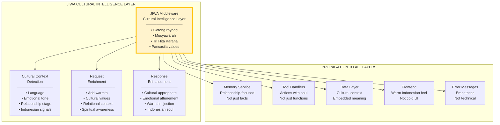

---

## 📊 SYSTEM STATISTICS DIAGRAM

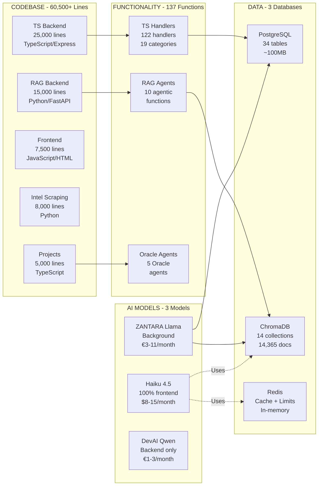

---

## 🎯 ZANTARA CAPABILITIES MAP

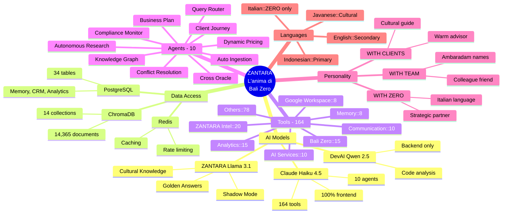

---

## 🔄 DATA FLOW ARCHITECTURE

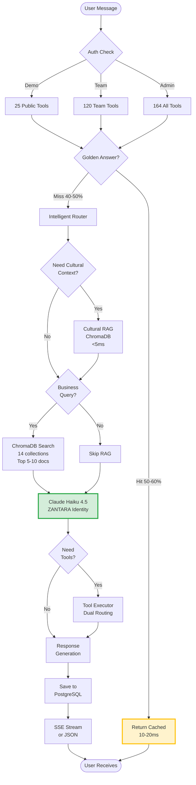

---

**SISTEMA COMPLETO VISUALIZZATO!** 🎉
