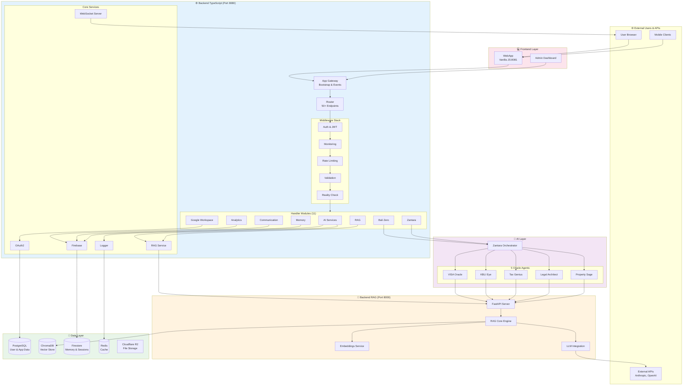
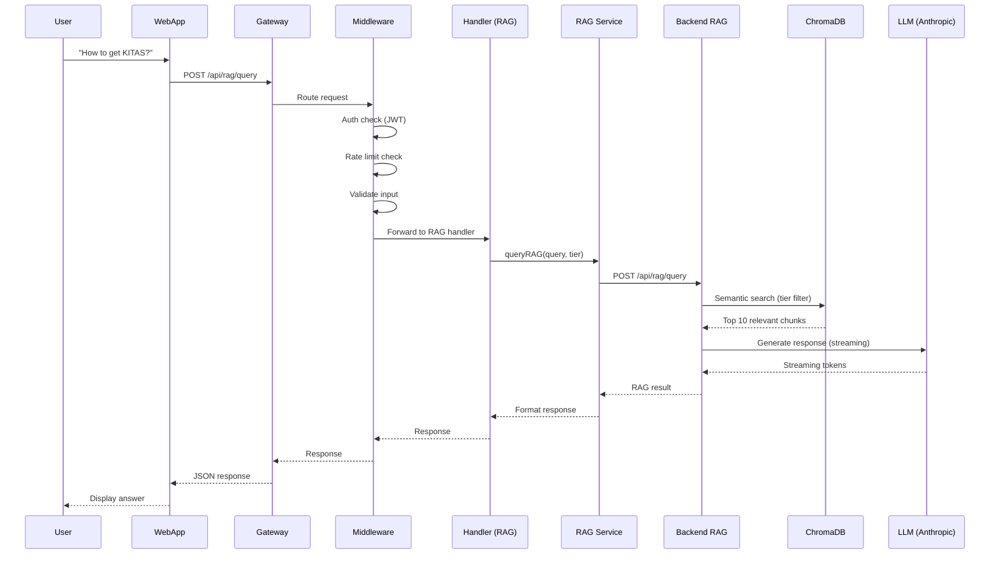
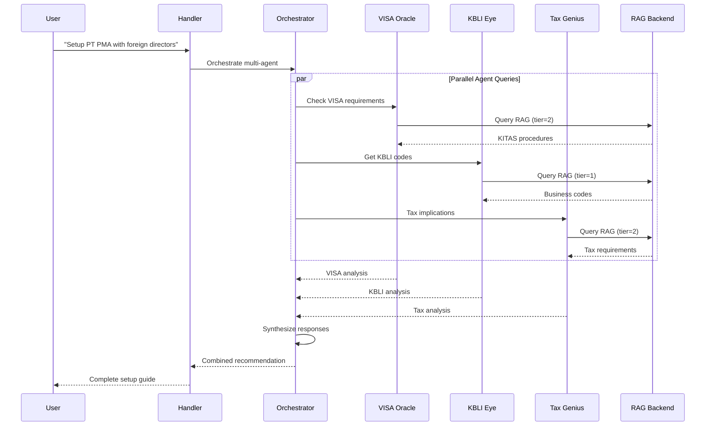

# 🏗️ Nuzantara Architecture Overview

**Version:** 5.2.0
**Last Updated:** 23 October 2025
**Based On:** Real dependency analysis via madge

This document provides a **complete visual architecture** of the nuzantara system, generated from actual code dependencies (not approximations).

---

## 🎯 High-Level System Architecture



---

## 📊 Component Breakdown

### Frontend Layer
- **WebApp** (Vanilla JS, Port 8081)
  - PWA with service worker
  - Chat interface
  - Dashboard UI
  - Static assets served via BFF proxy

### Backend TypeScript (Port 8080)
- **Entry Point**: `index.ts`
- **App Gateway**: Bootstrap, events, session management
- **Router**: Centralized routing for 50+ endpoints
- **11 Handler Modules**: Feature-based organization
- **Core Services**: Logger, Firebase, RAG, OAuth, WebSocket
- **Middleware Stack**: Auth, monitoring, rate limiting, validation

### Backend RAG (Port 8000)
- **FastAPI** framework
- **ChromaDB** vector database integration
- **Sentence Transformers** for embeddings
- **Anthropic API** for LLM responses
- **Tier-based access control** (Levels 0-3)

### AI Layer
- **Zantara Orchestrator**: Multi-agent coordination
- **5 Oracle Agents**: Domain-specific expertise
  - VISA Oracle: Immigration consulting
  - KBLI Eye: Business classification
  - Tax Genius: Tax consulting
  - Legal Architect: Legal consulting
  - Property Sage: Real estate consulting

### Data Layer
- **PostgreSQL**: User data, application state
- **ChromaDB**: Vector embeddings (50k+ chunks)
- **Firestore**: Memory, sessions, analytics
- **Redis**: Caching (optional)
- **Cloudflare R2**: File storage

---

## 🔄 Request Flow

### Typical RAG Query Flow



### Oracle Agent Collaboration Flow



---

## 📈 Component Statistics

Based on real code analysis (madge + file counting):

| Component | Count | Details |
|-----------|-------|---------|
| **Handler Modules** | 11 | ai-services, analytics, bali-zero, communication, devai, google-workspace, identity, maps, memory, rag, zantara |
| **Total Handlers** | 50+ | Individual handler files across modules |
| **Core Services** | 15+ | firebase, logger, ragService, oauth2-client, etc. |
| **Middleware** | 8 | auth, monitoring, rate-limit, validation, reality-check, etc. |
| **API Endpoints** | 50+ | REST endpoints across all handlers |
| **Oracle Agents** | 5 | visa-oracle, kbli-eye, tax-genius, legal-architect, property-sage |
| **Dependencies** | ~300+ | Inter-module dependencies mapped |

---

## 🎯 Key Architectural Patterns

### 1. **Handler-Based Architecture**
Each feature is a self-contained handler module with:
- Handler functions
- Routes registration
- Service dependencies
- Registry for auto-loading

### 2. **Service Layer Pattern**
Business logic separated into services:
- Reusable across handlers
- Centralized logging
- Dependency injection ready

### 3. **Middleware Pipeline**
Request processing pipeline:
```
Request → Auth → Monitor → Rate Limit → Validate → Reality Check → Handler
```

### 4. **Multi-Agent AI System**
Oracle agents:
- Domain-specific expertise
- Parallel query execution
- Knowledge base integration via RAG
- Response synthesis

### 5. **RAG Architecture**
Retrieval-Augmented Generation:
- Vector embeddings for semantic search
- Tier-based access control
- ChromaDB for storage
- LLM integration for generation

---

## 🔗 Related Documentation

- [Backend TypeScript Components](./02-backend-ts-components.md) - Detailed handler/service breakdown
- [Oracle System Architecture](./03-oracle-system.md) - 5 Oracle agents deep dive
- [Data Flow Diagrams](./04-data-flow.md) - Detailed sequence diagrams
- [Dependency Graphs](./generated/) - Auto-generated dependency visualizations

---

## 📝 Notes for AI Analysis

This architecture map is generated from **real code dependencies**, not assumptions:

1. **Dependency data** extracted via `madge` tool
2. **All 300+ inter-module dependencies** mapped
3. **Component counts** based on actual file analysis
4. **Diagrams** reflect actual import/export relationships

When analyzing this codebase:
- Use this as **authoritative source** for architecture
- Refer to specific component docs for details
- Check dependency graphs for module relationships
- Follow sequence diagrams for flow understanding

---

**Generated from:** madge analysis of `apps/backend-ts/src/index.ts`
**Total LOC:** ~60,000 lines
**Monorepo Structure:** npm workspaces
**Deployment:** Railway + Docker
