# 🤖 Oracle System Architecture

**Version:** 5.2.0
**Last Updated:** 23 October 2025
**Components:** 5 Oracle Agents + Orchestrator + Integration Layer

This document describes the **Oracle multi-agent system** - the AI consulting engine at the heart of nuzantara.

---

## 🎯 System Overview

The Oracle System is a **multi-agent AI architecture** where specialized agents provide domain-specific consulting for Indonesian business services.


---

## 📊 Component Breakdown

### 1. Orchestrator (`core/zantara-orchestrator.ts`)

**Dependencies:**
```typescript
import { visaOracle } from 'agents/visa-oracle';
import { kbliEye } from 'agents/eye-kbli';
import { taxGenius } from 'agents/tax-genius';
import { legalArchitect } from 'agents/legal-architect';
import { propertySage } from 'agents/property-sage';
import { memoryFirestore } from 'handlers/memory/memory-firestore';
import { logger } from 'services/logger';
```

**Core Responsibilities:**

1. **Query Classification**
   - Analyze user query
   - Determine domain(s) required
   - Assess complexity level

2. **Agent Selection**
   - Single agent for simple queries
   - Multi-agent for complex queries
   - Parallel execution when appropriate

3. **Coordination**
   - Dispatch queries to agents
   - Manage execution timing
   - Handle agent failures

4. **Response Synthesis**
   - Combine agent responses
   - Resolve conflicts
   - Format unified response

5. **Memory Management**
   - Store conversation context
   - Track user preferences
   - Maintain session state

---

## 🤖 The 5 Oracle Agents

### Agent 1: VISA Oracle

**File:** `agents/visa-oracle.ts`

**Domain:** Immigration & Work Permits

**Expertise:**
- KITAS (Limited Stay Permit) application
- KITAP (Permanent Stay Permit) processes
- Work permit requirements (RPTKA)
- Visa extensions and renewals
- Sponsorship requirements
- Immigration compliance

**Knowledge Base Access:** Tier 1-2 (immigration regulations)

**Typical Queries:**
- "How do I get a KITAS for my foreign employee?"
- "What documents are needed for RPTKA?"
- "Can I convert tourist visa to work permit?"
- "KITAS renewal process timeline"

**Output Format:**
```json
{
  "agent": "visa-oracle",
  "domain": "immigration",
  "response": "...",
  "requirements": ["passport copy", "sponsor letter", "..."],
  "timeline": "4-6 weeks",
  "tier_used": 1,
  "sources": ["Immigration_Law_2011.pdf", "..."]
}
```

---

### Agent 2: KBLI Eye

**File:** `agents/eye-kbli.ts`

**Domain:** Business Classification

**Expertise:**
- KBLI (Klasifikasi Baku Lapangan Usaha Indonesia) codes
- Business activity classification
- NIB (Nomor Induk Berusaha) requirements
- OSS (Online Single Submission) system
- Licensing requirements per KBLI
- Industry-specific regulations

**Knowledge Base Access:** Tier 0-1 (public business classifications)

**Typical Queries:**
- "Which KBLI code for software consulting?"
- "What licenses do I need for KBLI 62013?"
- "Can PT company have multiple KBLI codes?"
- "KBLI for e-commerce business"

**Output Format:**
```json
{
  "agent": "kbli-eye",
  "domain": "business_classification",
  "response": "...",
  "kbli_codes": ["62013", "62021"],
  "licenses_required": ["OSS", "..."],
  "restrictions": ["foreign ownership limit: 49%"],
  "tier_used": 0,
  "sources": ["KBLI_2020.pdf", "OSS_Guide.pdf"]
}
```

---

### Agent 3: Tax Genius

**File:** `agents/tax-genius.ts`

**Domain:** Tax Consulting

**Expertise:**
- Corporate income tax (PPh 25, PPh 29)
- VAT (PPN) obligations
- Withholding tax (PPh 21, 23, 26)
- Tax treaties and benefits
- Transfer pricing
- Tax reporting and compliance
- EFIN and e-Faktur

**Knowledge Base Access:** Tier 1-2 (tax regulations)

**Typical Queries:**
- "What's the corporate tax rate for PT?"
- "How to calculate PPh 21 for employees?"
- "VAT exemptions for services?"
- "Tax treaty between Indonesia and Singapore"

**Output Format:**
```json
{
  "agent": "tax-genius",
  "domain": "taxation",
  "response": "...",
  "tax_rates": {"corporate": "22%", "vat": "11%"},
  "obligations": ["monthly PPh 25", "quarterly tax report"],
  "deadlines": {"annual_return": "April 30"},
  "tier_used": 2,
  "sources": ["Tax_Law_2021.pdf", "PPh_Regulation.pdf"]
}
```

---

### Agent 4: Legal Architect

**File:** `agents/legal-architect.ts`

**Domain:** Legal & Corporate Consulting

**Expertise:**
- Company formation (PT, PT PMA, CV)
- Corporate structure and governance
- Shareholder agreements
- Employment law
- Contract drafting and review
- Intellectual property
- Compliance and regulatory

**Knowledge Base Access:** Tier 2-3 (advanced legal frameworks)

**Typical Queries:**
- "How to establish PT PMA?"
- "Legal requirements for foreign director?"
- "What's in a shareholder agreement?"
- "Employment contract requirements"

**Output Format:**
```json
{
  "agent": "legal-architect",
  "domain": "legal",
  "response": "...",
  "legal_requirements": ["notary deed", "ministry approval"],
  "documents_needed": ["Articles of Association", "..."],
  "timeline": "2-3 months",
  "estimated_cost": "IDR 50-80 million",
  "tier_used": 3,
  "sources": ["Company_Law_2007.pdf", "Legal_Framework.pdf"]
}
```

---

### Agent 5: Property Sage

**File:** `agents/property-sage.ts`

**Domain:** Real Estate & Property

**Expertise:**
- Property ownership rights (Hak Milik, Hak Pakai, Hak Guna Bangunan)
- Foreign ownership regulations
- Property purchase process
- Leasehold vs freehold
- Property management
- Real estate investment
- Notary and land office procedures

**Knowledge Base Access:** Tier 1-2 (property regulations)

**Typical Queries:**
- "Can foreigner buy property in Bali?"
- "What's Hak Pakai and how long does it last?"
- "Process to buy land in Indonesia"
- "Property investment regulations for foreigners"

**Output Format:**
```json
{
  "agent": "property-sage",
  "domain": "property",
  "response": "...",
  "ownership_types": ["Hak Pakai (25-30 years)", "..."],
  "restrictions": ["no Hak Milik for foreigners"],
  "process_steps": ["1. Due diligence", "2. Notary", "..."],
  "estimated_costs": "10% of property value",
  "tier_used": 2,
  "sources": ["Agrarian_Law.pdf", "Property_Guide.pdf"]
}
```

---

## 🔄 Execution Modes

### Mode 1: Single Agent Query

**When:** Simple, domain-specific question

**Example:** "How long does KITAS processing take?"

**Flow:**


**Processing Time:** < 2 seconds

---

### Mode 2: Multi-Agent Collaboration

**When:** Complex query spanning multiple domains

**Example:** "I want to start a PT PMA tech company with 2 foreign partners"

**Flow:**


```mermaid
sequenceDiagram
    participant U as User
    participant O as Orchestrator
    participant L as Legal Architect
    participant K as KBLI Eye
    participant T as Tax Genius
    participant V as VISA Oracle
    participant R as RAG

    U->>O: "Start PT PMA with foreign partners"
    O->>O: Classify → Multi-domain (legal, business, tax, immigration)

    par Parallel Agent Queries
        O->>L: Legal requirements?
        L->>R: Query (tier=3)
        R-->>L: Legal docs
        L-->>O: PT PMA formation steps

        O->>K: Which KBLI codes?
        K->>R: Query (tier=1)
        R-->>K: KBLI list
        K-->>O: Tech company KBLI

        O->>T: Tax implications?
        T->>R: Query (tier=2)
        R-->>T: Tax regulations
        T-->>O: Corporate tax structure

        O->>V: VISA for partners?
        V->>R: Query (tier=1)
        R-->>V: KITAS procedures
        V-->>O: Work permit requirements
    end

    O->>O: Synthesize responses
    O-->>U: Comprehensive setup guide
```

**Processing Time:** 3-5 seconds (parallel execution)

---

## 🧠 Knowledge Base Integration

All agents access knowledge through **RAG Backend (Port 8000)**.

### Tier-Based Access

| Agent | Typical Tier | Knowledge Scope |
|-------|-------------|-----------------|
| VISA Oracle | 1-2 | Immigration laws, procedures |
| KBLI Eye | 0-1 | Public business classifications |
| Tax Genius | 1-2 | Tax regulations, treaties |
| Legal Architect | 2-3 | Legal frameworks, templates |
| Property Sage | 1-2 | Property laws, regulations |

### Knowledge Sources

- **214+ books** ingested into ChromaDB
- **~50,000 chunks** available for retrieval
- **Semantic search** with embeddings
- **Source citations** in responses

---

## 💾 Memory & Context

### Session Memory

**Stored in:** Firestore via `handlers/memory/memory-firestore.ts`

**Tracks:**
- User query history
- Agent interaction patterns
- Preference learning
- Domain expertise tracking

### Conversation Context

**Maintained by:** Orchestrator

**Includes:**
- Previous queries in session
- Multi-turn conversation state
- User tier level
- Language preference

---

## 🎯 Agent Selection Logic

### Classification Algorithm

```typescript
function classifyQuery(query: string): string[] {
  const domains: string[] = [];

  // Keyword matching
  if (matchesKeywords(query, ['kitas', 'visa', 'work permit'])) {
    domains.push('immigration');
  }

  if (matchesKeywords(query, ['kbli', 'business license', 'oss'])) {
    domains.push('business_classification');
  }

  if (matchesKeywords(query, ['tax', 'pph', 'ppn', 'vat'])) {
    domains.push('taxation');
  }

  if (matchesKeywords(query, ['pt', 'company', 'legal', 'contract'])) {
    domains.push('legal');
  }

  if (matchesKeywords(query, ['property', 'land', 'hak milik'])) {
    domains.push('property');
  }

  // Semantic classification via RAG if ambiguous
  if (domains.length === 0) {
    domains.push(...semanticClassification(query));
  }

  return domains;
}
```

### Routing Strategy

| Domains Detected | Strategy | Agents |
|------------------|----------|--------|
| 1 | Single agent | Best match |
| 2-3 | Multi-agent (parallel) | All relevant |
| 4+ | Multi-agent (sequential) | Prioritized order |

---

## 🔧 Configuration

### Agent Prompts

Location: `projects/oracle-system/agents/*/`

Each agent has:
- `system-prompt.txt` - Role definition
- `examples.json` - Few-shot examples
- `constraints.yaml` - Operational limits

### Orchestrator Config

**File:** `core/zantara-orchestrator.ts` configuration

```typescript
const orchestratorConfig = {
  maxConcurrentAgents: 5,
  timeoutPerAgent: 10000,  // 10 seconds
  retryAttempts: 2,
  fallbackStrategy: 'best-effort',
  responseSynthesis: 'weighted-merge'
};
```

---

## 📊 Performance Metrics

**Target Performance:**

| Metric | Target | Current |
|--------|--------|---------|
| Single agent response | < 2s | ~1.5s |
| Multi-agent (2-3) | < 5s | ~3.5s |
| Multi-agent (4-5) | < 8s | ~6s |
| RAG query latency | < 1s | ~800ms |
| Knowledge retrieval accuracy | > 90% | ~92% |

---

## 🚀 API Endpoints

### Single Oracle Query

```bash
POST /api/bali-zero/oracle
Content-Type: application/json
Authorization: Bearer <token>

{
  "query": "How to get KITAS?",
  "tier": 1,
  "language": "en"
}
```

### Multi-Agent Orchestration

```bash
POST /api/zantara/brilliant
Content-Type: application/json
Authorization: Bearer <token>

{
  "query": "Start PT PMA with foreign directors",
  "tier": 2,
  "agents": ["legal-architect", "tax-genius", "visa-oracle"],
  "mode": "parallel"
}
```

---

## 🔍 Testing & Validation

### Agent Testing

**Location:** `projects/oracle-system/tests/`

**Test Types:**
1. **Unit tests** - Individual agent logic
2. **Integration tests** - Agent + RAG integration
3. **Scenario tests** - Real-world consulting scenarios
4. **Multi-agent tests** - Collaboration validation

### Test Scenarios

```python
# Example test scenario
test_scenarios = [
    {
        "query": "KITAS for software engineer",
        "expected_agent": "visa-oracle",
        "expected_tier": 1,
        "min_relevance": 0.85
    },
    {
        "query": "Setup tech company in Bali",
        "expected_agents": ["legal-architect", "kbli-eye", "tax-genius"],
        "expected_tier": 2,
        "min_relevance": 0.80
    }
]
```

---

## 📈 Future Enhancements

### Planned Improvements

1. **Agent Learning**
   - Feedback loop from user ratings
   - Continuous prompt optimization
   - Domain knowledge expansion

2. **Advanced Orchestration**
   - Dynamic agent creation
   - Hierarchical agent structures
   - Agent negotiation protocols

3. **Enhanced Integration**
   - Direct API integrations (OSS, tax systems)
   - Document generation
   - Automated form filling

4. **Performance**
   - Response caching
   - Agent result memoization
   - Parallel RAG queries

---

## 🔗 Related Documentation

- [Architecture Overview](./01-overview.md) - System-wide architecture
- [Backend TypeScript Components](./02-backend-ts-components.md) - Detailed component breakdown
- [Data Flow Diagrams](./04-data-flow.md) - Sequence diagrams
- [RAG System Documentation](../../apps/backend-rag/README.md) - RAG backend details

---

**Based on:** Real code analysis from `core/zantara-orchestrator.ts` and agent files
**Agents:** visa-oracle.ts, eye-kbli.ts, tax-genius.ts, legal-architect.ts, property-sage.ts
**Integration:** All agents → RAG Backend (Port 8000) → ChromaDB
