# 🔄 Data Flow & Sequence Diagrams

**Version:** 5.2.0
**Last Updated:** 23 October 2025
**Purpose:** Detailed sequence diagrams for all critical system flows

This document provides **accurate, detailed sequence diagrams** for understanding how data flows through nuzantara.

---

## 📋 Table of Contents

1. [RAG Query Flow](#1-rag-query-flow)
2. [Authentication Flow](#2-authentication-flow)
3. [Oracle Multi-Agent Collaboration](#3-oracle-multi-agent-collaboration)
4. [Google Workspace Integration](#4-google-workspace-integration)
5. [Memory Management](#5-memory-management)
6. [WebSocket Real-Time Communication](#6-websocket-real-time-communication)
7. [Deployment Pipeline](#7-deployment-pipeline)

---

## 1. RAG Query Flow

**Complete end-to-end flow for semantic search queries.**


### Key Components

| Component | File | Responsibility |
|-----------|------|----------------|
| Gateway | `index.ts` | Request entry |
| Middleware | `middleware/*` | Auth, validation, monitoring |
| RAG Handler | `handlers/rag/rag.ts` | Request handling |
| RAG Service | `services/ragService.ts` | Backend proxy |
| RAG Backend | `apps/backend-rag/backend/app/main_cloud.py` | RAG logic |
| ChromaDB | External | Vector storage |
| Anthropic | External API | LLM generation |

### Performance Targets

- **Query embedding**: < 200ms
- **Vector search**: < 500ms
- **LLM generation**: < 1-2s
- **Total end-to-end**: < 2-3s

---

## 2. Authentication Flow

**JWT-based authentication with Firebase integration.**


### Authentication Stack

**Middleware Chain:**
```
Request
  → correlationId (add request ID)
  → jwt-auth (verify token)
  → monitoring (log authenticated user)
  → rate-limit (per-user limits)
  → handler
```

**Key Files:**
- `handlers/auth/team-login.ts` - Login handler
- `middleware/jwt-auth.ts` - JWT verification
- `services/firebase.ts` - Firebase integration
- `services/logger.ts` - Audit logging

---

## 3. Oracle Multi-Agent Collaboration

**Complex query requiring multiple domain experts.**

```mermaid
sequenceDiagram
    participant U as User
    participant H as Zantara Handler<br/>zantara-brilliant.ts
    participant O as Orchestrator<br/>zantara-orchestrator.ts
    participant V as VISA Oracle
    participant K as KBLI Eye
    participant T as Tax Genius
    participant L as Legal Architect
    participant R as RAG Backend
    participant C as ChromaDB
    participant M as Memory (Firestore)

    U->>H: POST /api/zantara/brilliant<br/>"Setup PT PMA with 2 foreign directors"

    H->>O: orchestrate(query, tier, mode)

    rect rgb(240, 248, 255)
        Note over O: Query Classification

        O->>O: Analyze query keywords
        O->>O: Detect domains:<br/>• Legal (PT PMA)<br/>• Business (KBLI)<br/>• Tax (corporate)<br/>• Immigration (foreign directors)

        O->>O: Select agents:<br/>[legal, kbli, tax, visa]

        O->>O: Determine strategy:<br/>PARALLEL (4 agents)
    end

    rect rgb(255, 248, 240)
        Note over O,C: Parallel Agent Execution

        par Legal Architect Query
            O->>L: "PT PMA formation requirements"
            L->>L: Build prompt with tier=2
            L->>R: POST /api/rag/query<br/>{query: "PT PMA setup", tier: 2}
            R->>C: Search legal documents
            C-->>R: Chunks (legal framework)
            R-->>L: Context chunks
            L->>L: Generate legal response
            L-->>O: {<br/>  response: "PT PMA requires...",<br/>  timeline: "2-3 months",<br/>  cost: "IDR 60-80M"<br/>}

        and KBLI Eye Query
            O->>K: "KBLI codes for tech company"
            K->>K: Build prompt with tier=1
            K->>R: POST /api/rag/query<br/>{query: "tech business KBLI", tier: 1}
            R->>C: Search KBLI database
            C-->>R: Chunks (KBLI codes)
            R-->>K: Context chunks
            K->>K: Generate KBLI response
            K-->>O: {<br/>  response: "Recommended codes...",<br/>  codes: ["62013", "62021"],<br/>  licenses: ["OSS", "NIB"]<br/>}

        and Tax Genius Query
            O->>T: "Tax structure for PT PMA"
            T->>T: Build prompt with tier=2
            T->>R: POST /api/rag/query<br/>{query: "PT PMA tax", tier: 2}
            R->>C: Search tax regulations
            C-->>R: Chunks (tax law)
            R-->>T: Context chunks
            T->>T: Generate tax response
            T-->>O: {<br/>  response: "Corporate tax rate...",<br/>  rates: {corporate: "22%", VAT: "11%"},<br/>  obligations: ["PPh 25", "PPN"]<br/>}

        and VISA Oracle Query
            O->>V: "KITAS for foreign directors"
            V->>V: Build prompt with tier=1
            V->>R: POST /api/rag/query<br/>{query: "KITAS foreign director", tier: 1}
            R->>C: Search immigration docs
            C-->>R: Chunks (KITAS procedures)
            R-->>V: Context chunks
            V->>V: Generate VISA response
            V-->>O: {<br/>  response: "KITAS application...",<br/>  requirements: ["passport", "sponsor"],<br/>  timeline: "4-6 weeks"<br/>}
        end
    end

    rect rgb(240, 255, 240)
        Note over O: Response Synthesis

        O->>O: Collect all agent responses
        O->>O: Check for conflicts
        O->>O: Merge information
        O->>O: Generate unified structure:<br/>{<br/>  summary: "...",<br/>  legal: {...},<br/>  business: {...},<br/>  tax: {...},<br/>  immigration: {...},<br/>  action_plan: [...]<br/>}
    end

    O->>M: Store conversation context
    M-->>O: Context stored

    O-->>H: Combined response
    H-->>U: Comprehensive setup guide

    Note over U,M: Total time: ~3-5 seconds (parallel)
```



### Orchestration Strategy

**Decision Tree:**
```
1 domain detected → Single agent (1-2s)
2-3 domains → Parallel execution (3-5s)
4+ domains → Prioritized parallel (5-8s)
```

**Conflict Resolution:**
- Time conflicts → Take longest estimate
- Cost conflicts → Take highest estimate
- Process conflicts → Merge unique steps
- Legal conflicts → Legal Architect has priority

---

## 4. Google Workspace Integration

**Example: Creating a Google Drive document.**


### Google Workspace Handlers

All 7 Google services follow same pattern:

| Service | Handler | Key Operations |
|---------|---------|----------------|
| Drive | `handlers/google-workspace/drive.ts` | list, create, upload, download |
| Docs | `handlers/google-workspace/docs.ts` | get, update, batchUpdate |
| Sheets | `handlers/google-workspace/sheets.ts` | get, update, batchUpdate |
| Gmail | `handlers/google-workspace/gmail.ts` | list, send, get |
| Calendar | `handlers/google-workspace/calendar.ts` | list, create, update, delete |
| Contacts | `handlers/google-workspace/contacts.ts` | list, create, update |
| Slides | `handlers/google-workspace/slides.ts` | get, create, update |

**Common Dependencies:**
```
Handler
  → google-auth-service.ts (OAuth management)
  → oauth2-client.ts (Token handling)
  → bridgeProxy.ts (API calls)
```

---

## 5. Memory Management

**Session and conversation context storage.**


### Memory Types

```typescript
type MemoryType =
  | 'conversation'   // Chat history
  | 'preference'     // User preferences
  | 'context'        // Session context
  | 'episode'        // Significant events
  | 'fact'           // Learned facts
```

### Memory Retrieval Strategy

1. **Cache Layer** (in-memory)
   - LRU cache with 1000 items
   - TTL: 1 hour
   - Fast retrieval < 10ms

2. **Vector Search** (Firestore)
   - Semantic similarity
   - User-scoped
   - Retrieval < 100ms

3. **Fallback** (Full scan)
   - Keyword matching
   - Date-based filtering
   - Retrieval < 500ms

---

## 6. WebSocket Real-Time Communication

**Real-time updates and notifications.**


### WebSocket Events

**Client → Server:**
```typescript
type ClientMessage =
  | { type: 'auth', token: string }
  | { type: 'ping' }
  | { type: 'subscribe', channel: string }
  | { type: 'unsubscribe', channel: string }
```

**Server → Client:**
```typescript
type ServerMessage =
  | { type: 'auth_success' | 'auth_failed' }
  | { type: 'pong' }
  | { type: 'progress', jobId: string, percent: number }
  | { type: 'notification', title: string, message: string }
  | { type: 'complete', jobId: string, result: any }
  | { type: 'error', error: string }
```

---

## 7. Deployment Pipeline

**Automated deployment to Railway.**


### Deployment Configuration

**File:** `railway.json`

```json
{
  "$schema": "https://railway.app/railway.schema.json",
  "build": {
    "builder": "DOCKERFILE",
    "dockerfilePath": "apps/backend-rag/backend/Dockerfile"
  },
  "deploy": {
    "startCommand": "uvicorn app.main_cloud:app --host 0.0.0.0 --port 8000",
    "restartPolicyType": "ON_FAILURE",
    "restartPolicyMaxRetries": 3
  }
}
```

### Health Check Endpoints

**Backend TypeScript:**
```typescript
// apps/backend-ts/src/index.ts
app.get('/health', (req, res) => {
  res.json({
    status: 'healthy',
    uptime: process.uptime(),
    timestamp: new Date().toISOString()
  });
});
```

**Backend RAG:**
```python
# apps/backend-rag/backend/app/main_cloud.py
@app.get("/health")
def health_check():
    return {
        "status": "healthy",
        "chromadb": "connected",
        "timestamp": datetime.now().isoformat()
    }
```

---

## 📊 Performance Summary

| Flow | Components | Avg Time | Max Time |
|------|-----------|----------|----------|
| RAG Query | 8 | 1.5s | 3s |
| Authentication | 4 | 200ms | 500ms |
| Multi-Agent (3) | 10+ | 3.5s | 6s |
| Multi-Agent (5) | 15+ | 5s | 8s |
| Google Workspace | 5 | 800ms | 2s |
| Memory Search | 4 | 150ms | 500ms |
| WebSocket Message | 2 | 10ms | 50ms |
| Deployment | 10+ | 3min | 5min |

---

## 🔗 Related Documentation

- [Architecture Overview](./01-overview.md) - High-level system architecture
- [Backend TypeScript Components](./02-backend-ts-components.md) - Component details
- [Oracle System](./03-oracle-system.md) - Multi-agent architecture

---

**Generated from:** Real code analysis of handler dependencies and service interactions
**Accuracy:** Based on actual component relationships from madge analysis
**Diagrams:** Mermaid sequence diagrams with real component names and file paths
