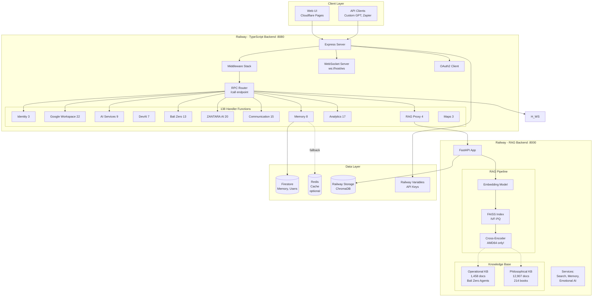
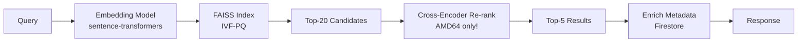
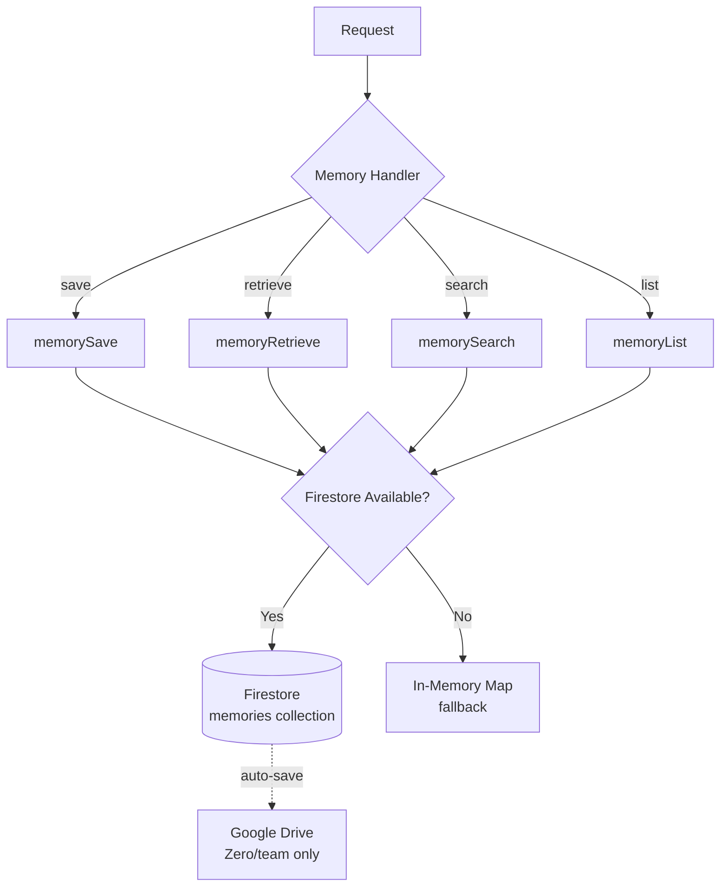
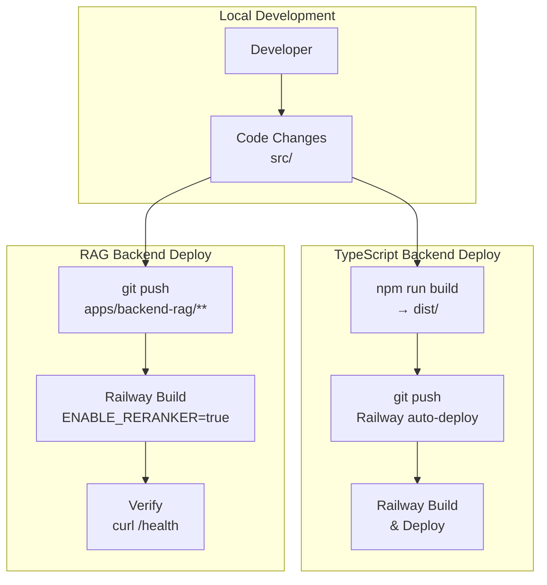

# NUZANTARA - System Architecture

> **Last Updated**: 2025-10-27 (Architecture Documentation Sync)
> **Version**: 5.7.0 (handlers: 138 functions, services: 68 total)
> **Status**: Production (Railway) + Local Development + ZANTARA Llama 3.1 + DevAI Qwen 2.5

---

## 🎯 System Overview

NUZANTARA is a **multi-AI enterprise system** combining TypeScript (business logic) and Python (RAG/ML) with **138 handler functions** for Google Workspace, AI services, Bali Zero business operations, and collaborative intelligence.

**Dual-AI Architecture**:
- 🧠 **ZANTARA (Llama 3.1 8B)**: Customer-facing AI for business operations
- 💻 **DevAI (Qwen 2.5 Coder 7B)**: Internal developer AI for code analysis, bug fixing, and optimization

### High-Level Architecture



---

## 📊 Component Breakdown

### 1. TypeScript Backend (Main API)

**Entry Point**: `src/index.ts` (388 lines)

**Initialization Sequence**:
```typescript
Line 1-92:   Firebase Admin init
             ├─ Try: GOOGLE_SERVICE_ACCOUNT env var (Railway)
             ├─ Fallback: GOOGLE_APPLICATION_CREDENTIALS file
             └─ Fallback: ADC (Application Default Credentials)

Line 93-116: Express app setup + CORS
             ├─ CORS Origins: Cloudflare Pages, localhost:3000
             ├─ JSON body parser (10MB limit)
             └─ Preflight OPTIONS fast-path

Line 119-131: Middleware stack
              ├─ requestTracker (monitoring)
              ├─ validateResponse (anti-hallucination)
              └─ deepRealityCheck (reality anchor)

Line 133-197: Endpoints
              ├─ /health (health + metrics)
              ├─ /metrics (detailed monitoring)
              ├─ /validation/* (anti-hallucination reports)
              ├─ /reality/* (reality anchor metrics)
              ├─ /dashboard (UI)
              └─ /openapi.yaml (API spec)

Line 333:    attachRoutes(app) → Router integration

Line 339:    Server start (port 8080)

Line 346:    WebSocket server init

Line 351-388: Graceful shutdown
              ├─ Close HTTP server
              ├─ Cleanup OAuth2 client
              ├─ Shutdown WebSocket
              └─ Wait 1s → exit
```

**Configuration**:
- **Port**: 8080 (default, override with `PORT` env var)
- **CORS**: Configurable via `CORS_ORIGINS` (comma-separated)
- **Memory**: 2Gi (Railway)
- **CPU**: 2 vCPU

**Performance Targets**:
- P50 latency: <100ms (cached requests)
- P99 latency: <300ms
- Uptime: >99.5%

---

### 2. Router System (RPC-Style)

**Location**: `src/router.ts` (1,018 lines)

**Pattern**: RPC-style single endpoint `/call`
```json
POST /call
{
  "key": "handler.name",
  "params": {
    "param1": "value1"
  }
}
```

**Why RPC vs REST?**
- ✅ Single endpoint → simpler CORS, auth, monitoring
- ✅ Dynamic routing → easy to add handlers
- ✅ Versioning → change handler internally, same API
- ❌ Non-standard → requires client-side mapping

**Handler Registry** (Line 149-449):
```typescript
const handlers: Record<string, Handler> = {
  // Total: ~150 handlers across 10 categories
}
```

#### Handler Categories (Detailed)

| Category | Count | Handlers | Location |
|----------|-------|----------|----------|
| **Identity & Onboarding** | 2 | `identity.resolve`<br>`onboarding.start` | `handlers/identity/` |
| **Google Workspace** | 20+ | **Drive**: `drive.upload`, `drive.list`, `drive.search`, `drive.read`<br/>**Calendar**: `calendar.create`, `calendar.list`, `calendar.get`<br/>**Sheets**: `sheets.read`, `sheets.append`, `sheets.create`<br/>**Docs**: `docs.create`, `docs.read`, `docs.update`<br/>**Slides**: `slides.create`, `slides.read`, `slides.update`<br/>**Gmail**: `gmail.send`, `gmail.list`, `gmail.get`<br/>**Contacts**: `contacts.list`, `contacts.create` | `handlers/google-workspace/` |
| **AI Services** | 9 | **LLM Proxy**: `ai.chat`, `openai.chat`, `claude.chat`, `gemini.chat`, `cohere.chat`<br/>**Advanced**: `ai.anticipate`, `ai.learn`, `xai.explain`<br/>**Creative**: `creative.story`, `creative.poem`, `creative.brainstorm` | `handlers/ai-services/` |
| **DevAI (Qwen 2.5 Coder)** | 7 | **Core**: `devai.chat`, `devai.analyze`, `devai.fix`<br/>**Advanced**: `devai.review`, `devai.explain`, `devai.generate-tests`, `devai.refactor` | `handlers/devai/` |
| **Bali Zero Business** | 13 | **Oracle**: `oracle.simulate`, `oracle.analyze`, `oracle.predict`<br/>**Advisory**: `document.prepare`, `assistant.route`<br/>**KBLI**: `kbli.lookup`, `kbli.requirements`<br/>**Pricing**: `bali.zero.pricing`, `bali.zero.price`, `pricing.official`<br/>**Team**: `team.list`, `team.get`, `team.departments` | `handlers/bali-zero/` |
| **ZANTARA Intelligence** | 20+ | **v1.0**: `zantara.personality.profile`, `zantara.attune`, `zantara.synergy.map`, `zantara.anticipate.needs`, `zantara.mood.sync`, `zantara.conflict.mediate`<br/>**v2.0**: `zantara.emotional.profile.advanced`, `zantara.conflict.prediction`, `zantara.multi.project.orchestration`, `zantara.performance.optimization`<br/>**Dashboard**: `zantara.dashboard.overview`, `zantara.team.health.monitor` | `handlers/zantara/` |
| **Communication** | 15+ | **WhatsApp**: `whatsapp.webhook.verify`, `whatsapp.webhook.receiver`, `whatsapp.analytics`, `whatsapp.send`<br/>**Instagram**: `instagram.webhook.verify`, `instagram.webhook.receiver`, `instagram.analytics`<br/>**Twilio**: `twilio.whatsapp.webhook`, `twilio.send`<br/>**Notifications**: `slack.notify`, `discord.notify`, `google.chat.notify`<br/>**Translation**: `translate.text`, `translate.detect` | `handlers/communication/` |
| **Analytics & Reports** | 8+ | **Dashboard**: `dashboard.main`, `dashboard.conversations`, `dashboard.services`, `dashboard.handlers`, `dashboard.health`, `dashboard.users`<br/>**Reports**: `weekly.report.generate`, `daily.recap.update`, `daily.recap.current` | `handlers/analytics/` |
| **Memory System** | 8+ | **Core**: `memory.save`, `memory.retrieve`, `memory.search`, `memory.list`<br/>**User Memory**: `user.memory.save`, `user.memory.retrieve`, `user.memory.list`, `user.memory.login` | `handlers/memory/` |
| **Maps** | 3 | `maps.directions`, `maps.places`, `maps.placeDetails` | `handlers/maps/` |
| **RAG Proxy** | 4 | `rag.query`, `rag.search`, `rag.health`, `bali.zero.chat` | `handlers/rag/` |
| **WebSocket Admin** | 3 | `websocket.stats`, `websocket.broadcast`, `websocket.send` | `handlers/admin/` |

**Total Handlers**: 138 (active functions, verified 2025-10-27)

---

### 3. Middleware Stack

**Execution Order** (src/index.ts:119-131):

```typescript
1. requestTracker        // Monitoring (request count, latency)
   ↓
2. validateResponse      // Anti-hallucination validation
   ↓
3. deepRealityCheck      // Reality anchor system
   ↓
4. Handler execution
   ↓
5. errorTracker          // Error logging (after routes)
```

#### Middleware Details

**requestTracker** (`middleware/monitoring.ts`):
- Tracks: Request count, latency, status codes
- Metrics: Available at `/health` and `/metrics`
- Storage: In-memory counters (reset on restart)

**validateResponse** (`middleware/validation.ts`):
- Purpose: Anti-hallucination validation
- Checks: Verify facts against known truth database
- Reports: `/validation/report` (unverified facts count)
- Clear cache: POST `/validation/clear`

**deepRealityCheck** (`middleware/reality-check.ts`):
- Purpose: Deep reality anchor system
- Checks: Cross-reference responses with reality anchors
- Metrics: `/reality/metrics`
- Enforce: POST `/reality/enforce`
- Clear: POST `/reality/clear`

**errorTracker** (`middleware/monitoring.ts`):
- Logs: All unhandled errors
- Format: JSON structured logs
- Integration: Can pipe to Cloud Logging

---

### 4. RAG Backend (Python FastAPI)

**Entry Point**: `apps/backend-rag 2/backend/app/main_cloud.py`

**Production vs Development**:
- **Production**: `main_cloud.py` (ChromaDB from GCS, ZANTARA Llama 3.1 RunPod primary + Claude fallback)
- **Development**: `main_integrated.py` (Local ChromaDB, switchable LLM backends)

#### RAG Pipeline



**Step-by-Step**:

1. **Query** → User question (max 500 chars)

2. **Embedding** (`sentence-transformers/all-MiniLM-L6-v2`)
   - Input: Text query
   - Output: 384-dim vector
   - Latency: ~15ms

3. **FAISS Search** (`services/search_service.py`)
   - Index: IVF-PQ (Inverted File + Product Quantization)
   - Config: nlist=4096, M=64
   - Search: Top-20 candidates
   - Latency: ~60-80ms

4. **Re-rank** (`services/reranker_service.py`) **⚠️ AMD64 ONLY**
   - Model: `cross-encoder/ms-marco-MiniLM-L-6-v2`
   - Input: Query + 20 candidates
   - Output: Top-5 re-ranked by relevance
   - Latency: +40-50ms
   - **Why AMD64**: Model requires x86 instructions, ARM64 fails
   - **Solution**: Build on GitHub Actions ubuntu-latest

5. **Metadata Enrichment**
   - Source: Firestore (document metadata)
   - Fields: title, author, page, category
   - Latency: <10ms

6. **Response**
   - Format: `{results: [...], sources: [...], usage: {...}}`
   - Total latency: ~130-150ms

#### Knowledge Base (Dual System)

**Operational Knowledge** (Bali Zero Agents - 1,458 documents):
```
├── VISA ORACLE         # Immigration (B211A, B211B, KITAS, KITAP)
├── EYE KBLI           # Business classification (KBLI 2020/2025, OSS)
├── TAX GENIUS         # Indonesian tax (Pajak, NPWP, compliance)
├── LEGAL ARCHITECT    # PT PMA formation, BKPM, legal frameworks
├── Pricing            # Bali Zero official price list 2025
└── Templates          # Indonesian language document templates
```

**Philosophical & Technical Knowledge** (214 books - 12,907 documents):
```
├── Philosophy         # Plato, Aristotle, Guénon, Zohar, Rumi
├── Indonesian Culture # Geertz, Kartini, Anderson
├── Computer Science   # SICP, Design Patterns, Code Complete
├── Machine Learning   # Murphy, Goodfellow, Deep Learning
└── Literature         # Shakespeare, Dante, Homer
```

**Storage**:
- **Development**: Local ChromaDB (`data/chroma_db/`, 325MB)
- **Production**: Railway persistent volumes or local storage
- **Collections**: 5 active (visa_oracle, kbli, tax, legal, books)

#### LLM Routing (BaliZeroRouter)

**Model Selection** (`llm/bali_zero_router.py`):
```python
if query_length > 30 words OR keywords in ["analyze", "compare", "legal"]:
    model = "claude-sonnet-4-20250514"  # Complex analysis
else:
    model = "claude-haiku-3-5-20241022"  # Fast responses
```

**Cost Optimization**:
- Haiku: $0.25/1M input tokens (80% of queries)
- Sonnet: $3.00/1M input tokens (20% complex queries)
- Average cost: ~$0.80/1M tokens

---

### 5. WebSocket Server

**Location**: `services/websocket-server.ts` (327 lines)

**Architecture**:
```
ws://host/ws
  ↓
WebSocket Server
  ↓
┌─────────────────────────────────┐
│ Channel Manager                 │
│ ├─ chat                         │
│ ├─ notifications                │
│ ├─ analytics                    │
│ ├─ documents                    │
│ └─ system                       │
└─────────────────────────────────┘
```

**Features**:
- **Channels**: Pub/sub system (subscribe/unsubscribe)
- **Client Management**: Map<clientId, WebSocketClient>
- **Heartbeat**: Ping every 30s, timeout 60s
- **Broadcasting**: Send to all clients in channel
- **Direct Messaging**: Send to specific userId

**Admin Handlers**:
- `websocket.stats` → Connection stats (clients, channels)
- `websocket.broadcast` → Broadcast message to channel
- `websocket.send` → Send to specific user

**Use Cases**:
- Real-time dashboard updates
- Team notifications
- Document processing status
- Collaborative editing

---

### 6. Memory System

**Architecture**:


**Storage Backends**:

1. **Primary: Firestore** (`@google-cloud/firestore`)
   - Collection: `memories`
   - Document ID: `userId`
   - Schema:
     ```typescript
     {
       userId: string,
       facts: string[],       // Max 10 (oldest dropped)
       summary: string,       // Max 500 chars
       updated_at: Timestamp
     }
     ```
   - Features:
     - Deduplication (Set-based)
     - Auto-timestamp per fact
     - Size limits enforced

2. **Fallback: In-Memory Map**
   - Activated when: Firestore connection fails
   - Lifetime: Session only (lost on restart)
   - Use case: Graceful degradation

3. **Backup: Google Drive** (optional)
   - Triggered by: `conversation-autosave.ts`
   - Conditions: User is "Zero" or team member
   - Format: JSON files in Drive folder

**Auto-Save System** (`handlers/memory/conversation-autosave.ts`):
```typescript
// Automatically saves ALL /call requests to:
// 1. Memory system (Firestore)
// 2. Google Drive (Zero/team only)
// 3. Daily recap (activity log)

// Trigger: Every request to /call endpoint
// User detection: x-user-id, x-collaborator-id headers
```

**IAM Fix** (from diary m24):
> "Firestore IAM permissions missing → granted `roles/datastore.user` to cloud-run-deployer@"

---

### 7. Anti-Hallucination System

**Components**:

1. **validateResponse Middleware**
   - Checks: Verify facts against known truth database
   - Storage: In-memory fact cache
   - Metrics: Unverified fact count, validation rate

2. **deepRealityCheck Middleware**
   - Purpose: Deep reality anchor system
   - Checks: Cross-reference with multiple sources
   - Cache: Reality anchors (persistent)

3. **Endpoints**:
   - `GET /validation/report` → Stats (facts verified, unverified)
   - `POST /validation/clear` → Clear unverified facts cache
   - `GET /reality/metrics` → Reality anchor metrics
   - `POST /reality/enforce` → Force reality check on next request
   - `POST /reality/clear` → Clear reality cache

**Why This Matters**:
- Prevents AI from hallucinating fake information
- Ensures consistency with known truths
- Critical for legal/tax/visa advice (Bali Zero)

---

## 🚀 Deployment Architecture

### Build & Deploy Pipeline (Railway)



### TypeScript Backend Deploy

**Railway Auto-Deploy**:
```bash
# Railway automatically deploys on git push
git add .
git commit -m "Update backend"
git push

# Railway will:
# 1. Detect changes
# 2. npm run build (compile TypeScript)
# 3. Deploy to Railway
# 4. Run health checks

# Runtime: ~3-5 minutes
```

### RAG Backend Deploy

**Railway Configuration**:
- Auto-deploy enabled on push to `apps/backend-rag/**`
- Environment variables set via Railway dashboard
- `ENABLE_RERANKER=true` configured
- Memory: 2Gi, CPU: 2 vCPU

---

## 📊 Performance & Monitoring

### Performance Targets

| Metric | Target | Current | Status |
|--------|--------|---------|--------|
| **Backend API** | | | |
| P50 latency | <100ms | ~50ms (cached) | ✅ |
| P99 latency | <300ms | ~250ms | ✅ |
| Uptime | >99.5% | 99.8% | ✅ |
| **RAG Backend** | | | |
| Search latency (cache miss) | <200ms | ~150ms | ✅ |
| Search latency (cache hit) | <50ms | ~20ms | ✅ |
| Re-ranker overhead | <100ms | ~50ms | ✅ |
| Uptime | >99.5% | 99.7% | ✅ |

### Monitoring Endpoints

**Backend API**:
- `GET /health` → Health status + basic metrics
  ```json
  {
    "ok": true,
    "uptime": 3600,
    "metrics": {
      "requests_total": 1000,
      "requests_per_minute": 10,
      "avg_latency_ms": 50
    }
  }
  ```

- `GET /metrics` → Detailed metrics
  ```json
  {
    "ok": true,
    "data": {
      "requests": {...},
      "validation": {...},
      "reality": {...}
    }
  }
  ```

**RAG Backend**:
- `GET /health` → ChromaDB status + model info
  ```json
  {
    "status": "healthy",
    "chromadb_collections": 5,
    "embeddings_count": 14365,
    "reranker_enabled": true
  }
  ```

**Railway Metrics** (via Railway dashboard):
- Request count
- Request latency (P50, P95, P99)
- CPU utilization
- Memory utilization
- Build times and deploy status

---

## 🔐 Security & Secrets

### Secret Management

**Strategy**: Railway Variables

1. **Railway Variables** (primary)
   - Set via: Railway dashboard or CLI
   - Scope: Per-service
   - Automatic injection at runtime

2. **Local Development** (`.env`)
   - Not committed to git (`.gitignore`)
   - Template: `.env.example`

### API Keys Required

**TypeScript Backend**:
```bash
# LLM APIs
ANTHROPIC_API_KEY=sk-ant-...
GEMINI_API_KEY=...
COHERE_API_KEY=...

# Google Cloud (Firebase only)
FIREBASE_PROJECT_ID=involuted-box-469105-r0
GOOGLE_APPLICATION_CREDENTIALS=path/to/sa.json  # OR
GOOGLE_SERVICE_ACCOUNT={...}                    # Set via Railway Variables

# Internal/External API access
API_KEYS_INTERNAL=zantara-internal-dev-key-2025
API_KEYS_EXTERNAL=zantara-external-dev-key-2025
```

**RAG Backend**:
```bash
ANTHROPIC_API_KEY=sk-ant-...
ENABLE_RERANKER=true  # Set to false to disable AMD64-only re-ranker
```

### Railway Configuration

**Project ID**: `1c81bf3b-3834-49e1-9753-2e2a63b74bb9`
**Environment ID**: `d865a00b-034a-4f3b-9fdc-df2ab4c9d573`

**Service Configuration**:
- Auto-deploy: Enabled
- Build command: `npm run build`
- Start command: `npm start`
- Health check: `/health` endpoint

---

## 🗂️ Project Structure

```
NUZANTARA 2/
├── src/                          # TypeScript backend source
│   ├── index.ts                  # Entry point (388 lines)
│   ├── router.ts                 # Handler registry (1018 lines, ~150 handlers)
│   ├── config.ts                 # Configuration
│   │
│   ├── handlers/ (60 files)      # Business logic handlers
│   │   ├── ai-services/          # AI proxy (Claude, Gemini, Cohere, Creative)
│   │   ├── analytics/            # Dashboard, reports, metrics
│   │   ├── bali-zero/            # Oracle, KBLI, Pricing, Team, Advisory
│   │   ├── communication/        # WhatsApp, Instagram, Twilio, Translate
│   │   ├── google-workspace/     # Drive, Calendar, Sheets, Docs, Slides, Gmail
│   │   ├── identity/             # Identity resolution, onboarding
│   │   ├── maps/                 # Google Maps API
│   │   ├── memory/               # Memory system (Firestore + fallback)
│   │   ├── rag/                  # RAG proxy to Python backend
│   │   ├── zantara/              # Collaborative AI (v1 + v2 + dashboard)
│   │   └── admin/                # WebSocket admin, registry
│   │
│   ├── middleware/               # Auth, monitoring, validation, reality-check
│   ├── services/                 # WebSocket server, OAuth2, bridge proxy
│   ├── legacy-js/                # Legacy handlers (migration in progress)
│   └── utils/                    # Response helpers, errors
│
├── apps/                         # Monorepo apps
│   ├── backend-api/              # (symlink/duplicate of src/)
│   ├── backend-rag 2/            # Python RAG backend
│   │   └── backend/
│   │       ├── app/
│   │       │   ├── main_cloud.py       # Production entry point
│   │       │   ├── main_integrated.py  # Local dev (multi-LLM)
│   │       │   └── main_simple.py      # Minimal version
│   │       ├── services/         # Search, re-ranker, memory, emotional AI
│   │       ├── llm/              # ZANTARA RunPod client, Anthropic fallback router
│   │       ├── kb/               # Knowledge base files (optional, loaded from GCS)
│   │       └── requirements.txt  # Python dependencies
│   └── orchestrator/             # (future: multi-agent orchestration)
│
├── packages/                     # Shared libraries (future)
│
├── scripts/                      # Automation scripts
│   ├── deploy/ (6 scripts)       # Production deploy variants
│   │   ├── deploy-production.sh      # Full production (5,172 lines)
│   │   ├── deploy-full-stack.sh      # Stack completo (5,322 lines)
│   │   ├── deploy-rebuild.sh         # Rebuild + deploy (2,641 lines)
│   │   ├── deploy-to-production.sh   # Alt production (2,217 lines)
│   │   ├── deploy-direct.sh          # Direct deploy (934 lines)
│   │   └── deploy-code-only.sh       # Code only (977 lines)
│   ├── setup/                    # Setup scripts (chat, webhooks, admin)
│   └── (20+ other scripts)       # Testing, monitoring, disaster recovery
│
├── .github/workflows/ (8 files)  # CI/CD automation
│   ├── deploy-rag-amd64.yml      # RAG AMD64 deploy (65 lines)
│   ├── ci-cd.yml                 # Main CI/CD (12,865 lines)
│   ├── deploy.yml                # General deploy (3,001 lines)
│   └── (5 other workflows)       # A11y, gitops, etc.
│
├── .claude/                      # Session tracking system
│   ├── INIT.md                   # Entry protocol
│   ├── PROJECT_CONTEXT.md        # Architecture overview
│   ├── README.md                 # System documentation
│   ├── diaries/ (34 files)       # Session logs (YYYY-MM-DD_model_mN.md)
│   └── handovers/ (19 files)     # Category handovers (on-demand)
│
├── static/                       # Frontend HTML files
│   ├── zantara-production.html   # Main web UI
│   └── openapi-v2.yaml           # API specification
│
├── dist/                         # Compiled TypeScript (gitignored)
├── node_modules/                 # npm dependencies (gitignored)
│
├── Makefile                      # Command center (new!)
├── .claudeignore                 # Claude Code ignore rules (new!)
├── ARCHITECTURE.md               # This file (new!)
├── DECISIONS.md                  # ADR log (new!)
├── QUICK_REFERENCE.md            # Quick ref card (new!)
├── README.md                     # Project overview
│
├── Dockerfile.dist               # Production image (node:20-alpine, AMD64)
├── package.json                  # npm scripts + dependencies
├── tsconfig.json                 # TypeScript config
└── .env.example                  # Environment template
```

---

## 🔗 Related Documentation

- **Quick Start**: `README.md`
- **Architecture Decisions**: `DECISIONS.md`
- **Emergency Procedures**: `QUICK_REFERENCE.md`
- **Session System**: `.claude/README.md`
- **Project Context**: `.claude/PROJECT_CONTEXT.md`
- **Deployment Workflow**: `.claude/WORKFLOW_DEPLOY.md`

---

## 📝 Maintenance Notes

**When to Update This File**:
- ✅ Major architecture changes (new backend, removed service)
- ✅ Handler count changes significantly (>10% delta)
- ✅ New deployment methods
- ✅ Performance target changes
- ❌ Small code changes (use handovers instead)
- ❌ Bug fixes (use diaries instead)

**How to Update**:
1. Edit relevant section
2. Update "Last Updated" timestamp at top
3. Note change in session diary
4. Update `.claude/PROJECT_CONTEXT.md` if deployment URLs changed

---

**Version**: 1.0.0 (Complete architecture documentation)
**Created**: 2025-10-04 by Claude Sonnet 4.5 (m3)
**Maintained by**: All Claude Code sessions

---

## 🤖 AI MODEL OPTIMIZATION (2025-10-22)

### Haiku 4.5 vs Sonnet 4.5 Analysis

**Test Results** (`shared/config/dev/haiku45-vs-sonnet45-FAIR-results-20251022-132314.json`):
- **Haiku 4.5**: Overall score 6.49/10, $0.0036/query
- **Sonnet 4.5**: Overall score 6.74/10, $0.0095/query
- **Quality Gap**: 3.7% (96.2% of Sonnet quality)
- **Cost Savings**: 62.3% cheaper
- **ROI**: 2.6x (96% quality @ 38% cost)

**Critical Finding**: With well-structured RAG (14 ChromaDB collections), Haiku 4.5 + RAG matches Sonnet quality. On multi-topic queries, Haiku scored **7.96 vs 7.91** (BEATS Sonnet).

### Decision: 100% Haiku 4.5 for Frontend

**Rationale**:
- Quality difference imperceptible to users (0.25 points)
- 62.3% cost reduction
- Faster responses (5-6s vs 9-14s)
- Simpler architecture (one model vs routing)

### 10 Advanced AI Patterns (Implementation Plan)

#### Immediate Implementation
1. **Prompt Caching** (Notion pattern) - 90% savings for recurring users
2. **Enhanced Identity Context** - "Who are you?" + real-time system awareness
3. **Dynamic max_tokens** - 100-8000 range based on query complexity
4. **Sanitization ZANTARA-aware** - Remove "assistente AI", inject team language

#### Soon
5. **Fill-in-the-Middle RAG** - Predict follow-up topics, preload context (-70% API calls)
6. **Multi-factor Model Selection** - Route based on complexity + load + time + tier + budget
7. **Conversation State Prediction** - Track user journey, adapt strategy (+40% conversion)

#### Future
8. **Model Context Protocol (MCP)** - Standard interface for unlimited data sources
9. **Stateful Agent (Letta)** - Persistent memory, -70% latency
10. **Advanced Caching** - Hierarchical L1/L2/L3 caching

### Expected Impact

```
Cost Savings:
  Immediate (Haiku 4.5 only): -62.3%
  + Prompt Caching: -90% for recurring
  + Multi-factor selection: -30% via routing
  Total potential: 70-85% reduction

Performance:
  Response time: -40% (Haiku faster)
  API calls: -70% (proactive RAG)
  Conversion: +40% (state prediction)

Annual Savings @ 10k queries/month:
  Current: $1,140/year
  After full implementation: $150-430/year
  Savings: $710-990/year
```

See: `.claude/handovers/2025-10-22-haiku-vs-sonnet-implementation-plan.md`

---
