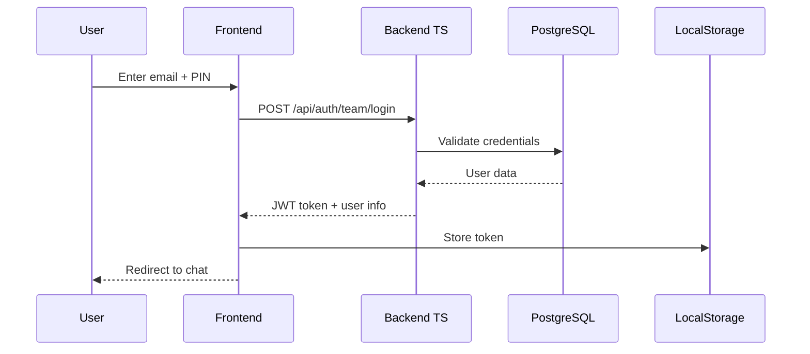
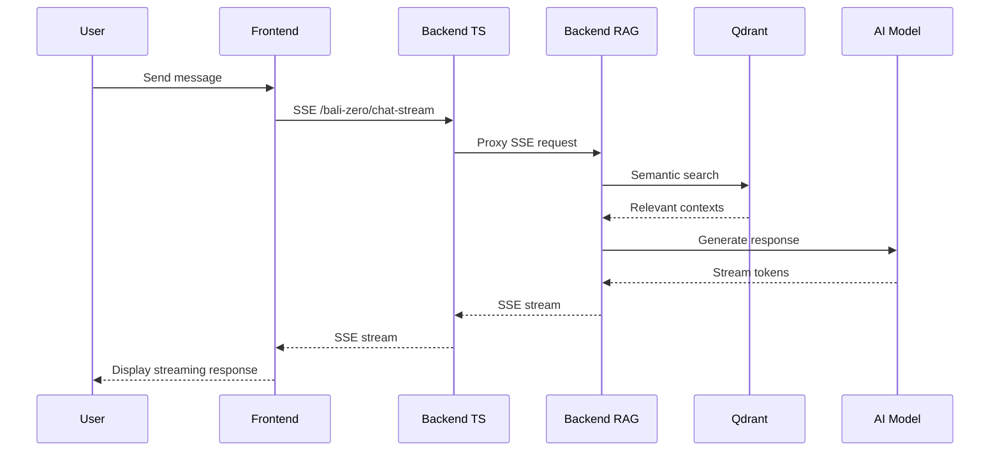
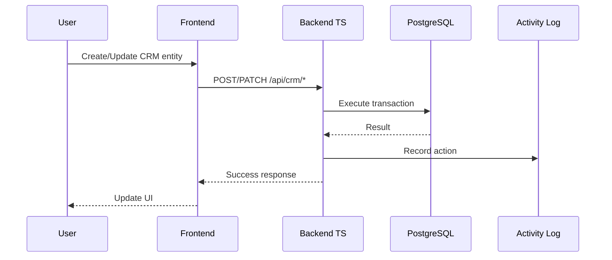

# NUZANTARA Architecture v5.3 - Complete Technical Documentation

## 📌 Version Information
- **Version**: 5.3.0
- **Last Updated**: November 2025
- **Status**: Production Ready
- **Architecture Type**: Ultra Hybrid Multi-Backend

---

## 🎯 System Overview

NUZANTARA is a comprehensive AI-powered business intelligence and legal advisory platform specifically designed for Indonesian business operations. The system provides intelligent chat capabilities, knowledge retrieval, CRM functionality, and business services through a clean, modular architecture.

### Core Capabilities
- **AI-Powered Chat**: Real-time streaming responses with context-aware intelligence
- **Knowledge Base**: Semantic search across legal, tax, immigration, and business domains
- **CRM System**: Client, practice, and interaction management
- **Team Collaboration**: Multi-user support with role-based access
- **Document Intelligence**: Automated document processing and analysis
- **Compliance Monitoring**: Real-time regulatory compliance tracking

---

## 🏗️ System Architecture

### High-Level Architecture

```
┌─────────────────────────────────────────────────────────────┐
│                         Frontend                              │
│                   (GitHub Pages - Static)                     │
│                    zantara.balizero.com                       │
└───────────────────┬────────────────┬────────────────────────┘
                    │                │
                    ▼                ▼
┌──────────────────────┐    ┌──────────────────────┐
│   Backend TypeScript  │    │    Backend Python    │
│   (Express + Node.js) │    │  (FastAPI + Python)  │
│ nuzantara-backend.fly │    │ nuzantara-rag.fly   │
└───────────┬──────────┘    └────────┬─────────────┘
            │                         │
            ▼                         ▼
┌──────────────────────┐    ┌──────────────────────┐
│     PostgreSQL       │    │      Qdrant          │
│   (User Data, CRM)   │    │  (Vector Database)   │
└──────────────────────┘    └──────────────────────┘
```

### Component Details

#### 1. Frontend Layer (apps/webapp)
- **Technology Stack**: 
  - Vanilla JavaScript (ES6 modules)
  - HTML5 + CSS3 (responsive design)
  - Service Workers (PWA support)
- **Deployment**: GitHub Pages with automatic CI/CD
- **Key Features**:
  - Server-Sent Events (SSE) for real-time streaming
  - JWT authentication with secure token storage
  - Modular component architecture
  - Progressive Web App capabilities
  - Offline support via service workers

#### 2. Backend TypeScript Service (apps/backend-ts)
- **Technology Stack**:
  - Node.js v20 (LTS)
  - Express.js v5
  - TypeScript (strict mode)
  - PostgreSQL (primary database)
  - Redis (optional caching)
- **Deployment**: Fly.io with auto-scaling
- **Responsibilities**:
  - REST API endpoints (`/api/*`)
  - RPC-style handler system (`/call` endpoint)
  - Team authentication and authorization
  - CRM operations (clients, practices, interactions)
  - Google Workspace integration
  - Session management
  - CSRF protection

#### 3. Backend Python RAG Service (apps/backend-rag)
- **Technology Stack**:
  - Python 3.11
  - FastAPI (async framework)
  - LangChain/LangGraph (orchestration)
  - Qdrant (vector database)
  - PostgreSQL (memory storage)
- **Deployment**: Fly.io with auto-scaling
- **Responsibilities**:
  - RAG (Retrieval-Augmented Generation) queries
  - SSE chat streaming
  - Semantic search operations
  - Knowledge base management
  - AI model orchestration
  - Document processing

#### 4. Memory Service (apps/memory-service) [Optional]
- **Status**: Configured but not deployed
- **Purpose**: Persistent conversation and memory management
- **Technology**: Node.js + TypeScript

---

## 🔄 Data Flow Patterns

### Authentication Flow


### Chat Streaming Flow


### CRM Operations Flow


---

## 📊 Database Schema

### PostgreSQL (Primary Database)

#### Core Tables
- **users**: Team member accounts
  - id, email, pin_hash, name, role, status, created_at
- **clients**: CRM client records
  - id, uuid, full_name, email, phone, nationality, status
- **practices**: Legal/business practices
  - id, client_id, practice_type_id, status, priority, quoted_price
- **interactions**: Communication logs
  - id, client_id, practice_id, type, channel, summary, team_member
- **conversations**: Chat history
  - id, user_email, messages (JSONB), created_at, updated_at
- **user_memory**: Persistent user facts
  - id, user_email, facts (JSONB), summary, updated_at
- **activity_log**: Audit trail
  - id, entity_type, entity_id, action, performed_by, timestamp

### Qdrant (Vector Database)

#### Collections
- **knowledge_base**: Main knowledge collection
  - Embeddings: OpenAI text-embedding-3-small (1536 dimensions)
  - Metadata: book_title, author, tier, min_level, topics
  - Content: Immigration, tax, legal, business setup documents

---

## 🔌 API Endpoints

### Backend TypeScript Endpoints

#### Authentication
- `POST /api/auth/team/login` - Team member login
- `POST /auth/login` - User login (legacy)
- `POST /auth/logout` - Logout and token revocation
- `GET /api/user/profile` - Get user profile

#### CRM System
- `GET/POST /api/crm/clients` - Client management
- `GET/POST /api/crm/practices` - Practice management
- `GET/POST /api/crm/interactions` - Interaction tracking
- `POST /api/crm/shared-memory` - Collective memory

#### System
- `GET /health` - Health check
- `GET /metrics` - Performance metrics
- `POST /call` - RPC handler execution
- `GET /architecture/status` - System status

### Backend Python Endpoints

#### Chat & RAG
- `GET /bali-zero/chat-stream` - SSE chat streaming
- `POST /api/rag/query` - RAG query execution
- `GET /api/search` - Semantic search

#### Knowledge Base
- `GET /api/knowledge/collections` - List collections
- `POST /api/knowledge/query` - Query knowledge base

---

## 🔐 Security Architecture

### Authentication & Authorization
- **JWT Tokens**: RS256 signed tokens with 24h expiration
- **Password Security**: bcrypt with salt rounds
- **CSRF Protection**: Token-based CSRF protection
- **CORS**: Configured for specific origins only

### Data Protection
- **HTTPS**: Enforced for all production traffic
- **SQL Injection**: Parameterized queries
- **XSS Prevention**: Input sanitization
- **Rate Limiting**: Per-endpoint rate limits

### Compliance
- **Audit Trail**: All actions logged
- **Data Privacy**: GDPR-compliant data handling
- **Secret Management**: Environment variables for sensitive data

---

## 🚀 Deployment Architecture

### Infrastructure
- **Frontend**: GitHub Pages (CDN-backed)
- **Backend Services**: Fly.io (auto-scaling containers)
- **Databases**: Fly.io managed services
- **Domain**: Custom domain with SSL

### CI/CD Pipeline
```yaml
Frontend:
  - Trigger: Push to main branch
  - Build: GitHub Actions
  - Deploy: GitHub Pages
  - Duration: ~40 seconds

Backend:
  - Trigger: Manual or push to main
  - Build: Docker multi-stage
  - Deploy: flyctl deploy
  - Health checks: Automatic
```

### Monitoring & Observability
- **Logging**: Winston (structured logs)
- **Metrics**: Prometheus format
- **Health Checks**: /health endpoints
- **Error Tracking**: Centralized error handler

---

## 🎨 AI Model Architecture

### Model Configuration
```yaml
Primary Models:
  Reasoning: Google Gemini 1.5 Flash
  Code Tasks: DeepSeek Coder v2
  General: Llama 3.3 (70B)
  Testing: Qwen 2.5 Coder

Fallback Chain:
  1. Primary model attempt
  2. Secondary model retry
  3. Fallback to GPT-4 Turbo

Configuration:
  Temperature: 0.1 (factual)
  Max Tokens: 4096
  Streaming: Enabled
```

### RAG Pipeline
1. **Query Processing**: Clean and enhance user query
2. **Embedding Generation**: OpenAI text-embedding-3-small
3. **Semantic Search**: Qdrant similarity search (top-k=5)
4. **Context Assembly**: Combine relevant documents
5. **Prompt Construction**: System + context + query
6. **Response Generation**: Stream from AI model
7. **Post-Processing**: Format and validate response

---

## 📦 Module Dependencies

### Frontend Dependencies
```json
{
  "astro": "5.15.9",
  "react": "18.2.0",
  "lucide-react": "0.263.1",
  "vite": "7.2.2",
  "playwright": "1.49.0",
  "jest": "29.7.0"
}
```

### Backend TypeScript Dependencies
```json
{
  "express": "5.1.0",
  "typescript": "5.8.3",
  "@google/generative-ai": "0.24.1",
  "pg": "8.16.3",
  "redis": "4.6.10",
  "jsonwebtoken": "9.0.2",
  "bcryptjs": "3.0.2"
}
```

### Backend Python Dependencies
```python
fastapi==0.104.1
uvicorn[standard]==0.24.0
qdrant-client==1.7.0
google-generativeai==0.3.2
langchain==0.1.20
openai==1.3.0
psycopg2-binary==2.9.7
redis==5.0.1
```

---

## 🔄 Recent Updates (v5.3)

### Completed Migrations
- ✅ Firebase → PostgreSQL
- ✅ ChromaDB → Qdrant
- ✅ Anthropic/Claude → ZANTARA AI (OpenRouter)
- ✅ Cloudflare Pages → GitHub Pages
- ✅ Google Cloud Run → Fly.io

### Performance Improvements
- Bundle size: 1.3MB → 192KB (-85%)
- Load time: <1.5s (40% improvement)
- JavaScript files: 106 → 10 (-90%)
- Repository size: Cleaned to 2.1GB

### Code Quality
- TypeScript strict mode enabled
- Python type hints: 100% coverage
- Test coverage: 70% minimum enforced
- Pre-commit hooks: 10 validators
- CI/CD: 8 GitHub Actions workflows

---

## 🚧 Known Issues & TODO

### Critical Fixes Applied
- ✅ CRM endpoint alignment (/api/crm/*)
- ✅ Search endpoint alignment (/api/search)
- ✅ Mock login production guard
- ✅ Hardcoded URL standardization
- ✅ V3 legacy comment cleanup

### Pending Enhancements
- [ ] CRM Analytics endpoint implementation
- [ ] Document Intelligence service
- [ ] Centralized monitoring system
- [ ] Auto-scaling configuration for Fly.io
- [ ] WebSocket real-time features
- [ ] Advanced caching strategies

---

## 📝 Configuration Files

### Environment Variables
```bash
# Backend TypeScript
NODE_ENV=production
PORT=8080
DATABASE_URL=postgres://...
REDIS_URL=redis://...
RAG_BACKEND_URL=https://nuzantara-rag.fly.dev
OPENROUTER_API_KEY=...
JWT_SECRET=...

# Backend Python
OPENAI_API_KEY=...
OPENROUTER_API_KEY_LLAMA=...
ZANTARA_AI_MODEL=meta-llama/llama-4-scout
QDRANT_URL=https://nuzantara-qdrant.fly.dev
DATABASE_URL=postgres://...
```

### API Configuration (Frontend)
```javascript
window.API_CONFIG = {
  backend: {
    url: 'https://nuzantara-backend.fly.dev'
  },
  rag: {
    url: 'https://nuzantara-rag.fly.dev'
  },
  memory: {
    url: 'https://nuzantara-memory.fly.dev'
  },
  endpoints: {
    // Endpoint mappings
  }
};
```

---

## 🎯 Architecture Principles

### Design Patterns
1. **Microservices**: Separate concerns by domain
2. **Event-Driven**: SSE for real-time updates
3. **Repository Pattern**: Data access abstraction
4. **Circuit Breaker**: Resilience for external services
5. **Cache-Aside**: Performance optimization

### Best Practices
1. **12-Factor App**: Environment-based configuration
2. **SOLID Principles**: Clean, maintainable code
3. **DRY**: Avoid code duplication
4. **YAGNI**: Build only what's needed
5. **Defensive Programming**: Validate all inputs

### Quality Standards
- **Code Coverage**: Minimum 70%
- **Response Time**: <500ms average
- **Availability**: 99.9% uptime target
- **Security**: OWASP Top 10 compliance
- **Documentation**: Comprehensive inline docs

---

## 📚 Additional Resources

### Documentation
- [Deployment Guide](./DEPLOYMENT_GUIDE_v5_3_ULTRA_HYBRID.md)
- [API Documentation](../api/README.md)
- [Security Guidelines](../security/README.md)
- [Testing Strategy](../testing/README.md)

### External Links
- Production Site: https://zantara.balizero.com
- GitHub Repository: https://github.com/Balizero1987/nuzantara
- Issue Tracker: GitHub Issues
- CI/CD Status: GitHub Actions

---

## 📞 Support & Contact

For technical support or questions about the architecture:
- Create an issue in the GitHub repository
- Contact the development team via internal channels
- Refer to the troubleshooting guide in the docs

---

**Last Updated**: November 2025  
**Version**: 5.3.0  
**Status**: Production Ready