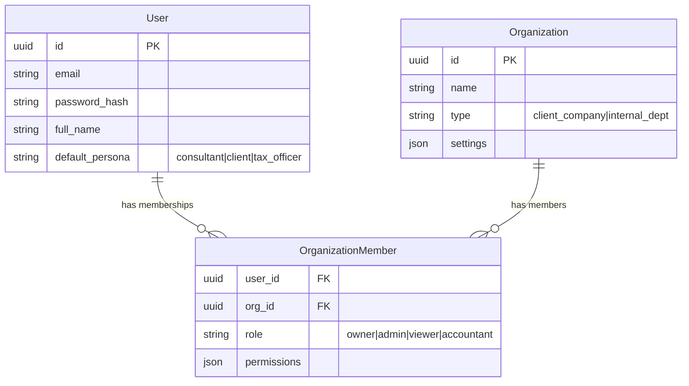

# NUZANTARA PRIME: The Galaxy Core (v2.0)
**Technical Manifesto & Architectural Blueprint**

> "One Core to rule them all, One Core to bind them."

## 1. THE NERVOUS SYSTEM (Event-Driven Core)
**Goal:** Reactive, decoupled communication between modules and "Planets" (Frontends).

### Architecture: Internal Event Bus
We will use **`fastapi-events`** (built on top of Starlette) for in-process, async event handling. This decouples the "Action" (e.g., "Invoice Created") from the "Reaction" (e.g., "Notify Client", "Update Vector DB").

*   **Pattern:** Fire-and-Forget for side effects.
*   **External Real-time:** `Redis Pub/Sub` + `SSE (Server-Sent Events)` for pushing updates to Frontends.

```python
# Concept: The Nervous System
from fastapi_events.dispatcher import dispatch
from fastapi_events.handlers.local import local_handler
from fastapi_events.typing import Event

# 1. Trigger (The Stimulus)
def create_invoice(invoice_data):
    # ... logic ...
    dispatch("invoice.created", payload={"id": 123, "amount": 1000})

# 2. Reaction (The Reflex)
@local_handler.register(event_name="invoice.created")
async def handle_invoice_notification(event: Event):
    # Send WhatsApp via Notification Module
    await notifications.send_whatsapp(...)
    # Push SSE to Client Portal
    await sse.publish(channel="client_123", message="New Invoice")
```

## 2. UNIFIED IDENTITY (The Soul)
**Goal:** B2B & B2C Hybrid. A user is an individual who can be a member of multiple organizations.

### Database Schema (SQLModel)
We move from raw SQL to **SQLModel** (Pydantic + SQLAlchemy) for type-safe interactions.



*   **Context Awareness:** The API Request Context (`req.state.user`) will carry not just the User, but the *Active Organization* context.

## 3. MULTIMODAL SENSES (The Eyes & Ears)
**Goal:** Ingest, Understand, and Index any data type.

### The Perception Layer Pipeline
1.  **Ingestion (The Mouth):** Unified endpoint `/api/ingest/upload`. Accepts PDF, IMG, DOCX.
2.  **Processing (The Visual Cortex):**
    *   **PDF/Text:** `Unstructured` or `LlamaParse` for layout preservation.
    *   **Images/Scans:** `Google Cloud Vision` or `GPT-4o-Vision` (via API) for OCR + Description.
3.  **Memory (The Hippocampus):** **Qdrant**.
    *   **Vectors:** Dense embeddings (text-embedding-3-small or similar).
    *   **Payload:** Stores the "Description" generated by Vision models, making images searchable by text.

## 4. THE BRAIN (Bi-Cameral AI Engine)
**Goal:** Logic (Reasoner) separated from Style (Persona). Model Agnostic.

### Architecture: The "Thought-Speech" Split

```python
# Interface: The Abstract Brain
class AIReasoner(ABC):
    async def think(self, context: str, query: str) -> str:
        """Returns raw, logical answer."""
        pass

# Implementation: Gemini 2.5 (Current)
class GeminiReasoner(AIReasoner):
    async def think(self, context, query):
        return gemini.generate(system_prompt="Be logical.", user_input=query)

# The Persona Layer (The "Jaksel" Filter)
class PersonaLayer:
    async def speak(self, raw_thought: str, style: str = "jaksel") -> str:
        if style == "jaksel":
            return await llm.rewrite(raw_thought, tone="South Jakarta slang, professional but chill")
        return raw_thought

# The Orchestrator
class AIOrchestrator:
    def __init__(self, reasoner: AIReasoner, persona: PersonaLayer):
        self.reasoner = reasoner
        self.persona = persona

    async def process(self, query):
        thought = await self.reasoner.think(context, query)
        speech = await self.persona.speak(thought)
        return speech
```

## 5. DIRECTORY STRUCTURE (The Skeleton)
Modular Monolith design to prevent spaghetti code.

```text
apps/backend-rag/backend/app/
├── core/                   # The Nervous System
│   ├── events.py           # Event Bus Config
│   ├── config.py           # Global Settings
│   └── database.py         # DB Connection
├── modules/                # The Organs (Domains)
│   ├── identity/           # Auth, Users, Orgs
│   │   ├── models.py       # SQLModel classes
│   │   ├── service.py      # Business Logic
│   │   └── router.py       # API Endpoints
│   ├── perception/         # Ingestion, OCR, Vision
│   ├── brain/              # AI Orchestrator, Reasoners, Personas
│   ├── crm/                # Clients, Interactions
│   └── knowledge/          # RAG, Qdrant Interface
├── routers/                # API Gateway (aggregates module routers)
└── main.py                 # App Entrypoint
```

## 6. MIGRATION BRIDGE (The Path Forward)
**Goal:** Absorb Node.js Auth immediately.

1.  **Dual-Read:** Python's `Identity` module connects to the *existing* Postgres tables used by Node.
2.  **Shadow Models:** Create SQLModel classes that *mirror* the current Node schema exactly (even if it's ugly).
3.  **The Switch:**
    *   Update Python to hash passwords using `bcrypt` (same as Node).
    *   Point Frontend Login to Python.
    *   Python generates the JWT (using the same `JWT_SECRET`).
    *   Node verifies Python's tokens (it already does!).
4.  **Deprecation:** Once Frontend uses Python for login, Node's `/auth` routes are disabled.
