# 🌍 System Overview - NUZANTARA

**Document:** 01-system-overview.md
**Audience:** Architects, Product Managers, Leadership
**Purpose:** High-level understanding of the complete system

---

## 🎯 What is NUZANTARA?

**NUZANTARA is a production-ready AI platform for Indonesian business services**, combining:

- 🤖 **3 AI Models** (Haiku 4.5 frontend, ZANTARA Llama background, DevAI backend)
- ⚙️ **2 Backends** (TypeScript API + Python RAG)
- 🌐 **1 Frontend** (PWA webapp on Cloudflare Pages)
- 🗄️ **3 Databases** (PostgreSQL + ChromaDB + Redis)
- 🤖 **15 AI Agents** (10 RAG + 5 Oracle)
- 🔧 **164 Tools** (Google Workspace, CRM, Analytics, Communication)

---

## 🏗️ DIAGRAM 1: Complete System Architecture

```mermaid
graph TB
    subgraph "🌐 CLIENT LAYER"
        User[👤 User<br/>Browser/Mobile]
    end
    
    subgraph "FRONTEND - Cloudflare Pages"
        WebApp[🌐 WebApp<br/>zantara.balizero.com<br/>65 JS files + PWA]
    end
    
    subgraph "BACKEND - Fly.io"
        TS[⚙️ TS Backend :8080<br/>117 Handlers + 24 Services<br/>Express + TypeScript]
        RAG[🧠 RAG Backend :8000<br/>FastAPI + Python<br/>44 Services + AI + RAG]
    end
    
    subgraph "AI MODELS"
        Haiku[🤖 Haiku 4.5<br/>Frontend 100%<br/>$8-15/month]
        Llama[🧠 ZANTARA Llama<br/>Background Worker<br/>€3-11/month]
        DevAI[💻 DevAI Qwen<br/>Backend Only<br/>€1-3/month]
    end
    
    subgraph "DATA"
        PG[(🗄️ PostgreSQL<br/>34 tables)]
        Chroma[(🔍 ChromaDB<br/>14 collections<br/>14,365 docs)]
        Redis[(⚡ Redis<br/>Cache + Limits)]
    end
    
    User --> WebApp
    WebApp --> TS
    TS --> RAG
    RAG --> Haiku
    RAG --> Llama
    TS --> DevAI
    
    Haiku --> Chroma
    Haiku --> PG
    Haiku --> Redis
    
    Llama --> Chroma
    Llama --> PG
    
    style Haiku fill:#d4edda,stroke:#28a745,stroke-width:3px
    style Llama fill:#fff3cd,stroke:#ffc107,stroke-width:3px
    style WebApp fill:#e1f5ff,stroke:#0366d6,stroke-width:2px
```



---

## 📊 System Statistics

### Codebase (Updated: 28 October 2025)

| Component | Lines | Language | Description |
|-----------|-------|----------|-------------|
| **TS Backend** | 36,683 | TypeScript | Business logic, 117 handlers, 24 services |
| **RAG Backend** | 36,166 | Python | AI, RAG, 44 services, agents, ML |
| **Frontend** | ~12,000 | JavaScript | PWA, UI, 2064 files |
| **Total** | **~85,000** | Multi | Production system |
| **Projects** | 5,000 | TypeScript | Oracle, DevAI, Orchestrator |
| **TOTAL** | **60,500** | - | Complete platform |

### Functionality

| Category | Count | Description |
|----------|-------|-------------|
| **TS Handlers** | 122 | Business operations (19 categories) |
| **RAG Agents** | 10 | Agentic AI functions |
| **Oracle Agents** | 5 | Specialized intelligence |
| **Total Functions** | **137** | Executable capabilities |
| **Tools Available** | 164 | For ZANTARA tool calling |
| **API Endpoints** | 20 | 8 TS + 12 RAG |

### Data

| Database | Size | Purpose |
|----------|------|---------|
| **PostgreSQL** | 34 tables | Relational data, memory, CRM |
| **ChromaDB** | 14 collections | Vector search, embeddings |
| **Documents** | 14,365+ | Knowledge base |
| **Redis** | In-memory | Caching, rate limiting |

### AI Models

| Model | Role | Traffic | Cost/Month |
|-------|------|---------|------------|
| **Claude Haiku 4.5** | Frontend ONLY | 100% | $8-15 |
| **ZANTARA Llama 3.1** | Background Worker | Nightly | €3-11 |
| **DevAI Qwen 2.5** | Development | Backend | €1-3 |
| **TOTAL** | - | - | **$15-30** |

---

## 🚀 Deployment Architecture

```mermaid
graph TB
    subgraph "Fly.io Platform"
        direction TB
        
        TS_Service[TS Backend<br/>──────────────<br/>Port: 8080<br/>Memory: 2Gi<br/>CPU: 2 vCPU<br/>Dockerfile]
        
        RAG_Service[RAG Backend<br/>──────────────<br/>Port: 8000<br/>Memory: 2Gi<br/>CPU: 2 vCPU<br/>Dockerfile]
        
        DB_Service[(PostgreSQL<br/>──────────────<br/>Managed<br/>34 tables<br/>~100MB)]
    end
    
    subgraph "Cloudflare"
        Pages[Cloudflare Pages<br/>──────────────<br/>Edge CDN (330+ locations)<br/>Auto-deploy (30-60s)<br/>zantara.balizero.com]
    end
    
    subgraph "External Services"
        API1[Anthropic<br/>Haiku 4.5]
        API2[RunPod<br/>ZANTARA + DevAI]
        API3[Google<br/>Workspace]
        API4[Twilio<br/>WhatsApp/SMS]
    end
    
    Pages --> TS_Service
    TS_Service --> RAG_Service
    TS_Service --> DB_Service
    RAG_Service --> DB_Service
    
    RAG_Service --> API1
    RAG_Service --> API2
    TS_Service --> API2
    TS_Service --> API3
    TS_Service --> API4
    
    style TS_Service fill:#e1f5ff,stroke:#0366d6,stroke-width:2px
    style RAG_Service fill:#fff3cd,stroke:#ffc107,stroke-width:2px
    style Pages fill:#d4edda,stroke:#28a745,stroke-width:2px
```

**URLs**:
- **Frontend**: https://zantara.balizero.com
- **TS Backend**: https://nuzantara-backend.fly.dev
- **RAG Backend**: https://nuzantara-rag.fly.dev

---

## 🎯 Core Capabilities

### What ZANTARA Can Do

**ZANTARA** (powered by Haiku 4.5) can:

1. **Converse** in Italian, English, Indonesian, Javanese
2. **Access** 164 tools (Google Workspace, CRM, Memory, Analytics)
3. **Orchestrate** 10 agentic functions
4. **Search** 14,365+ documents (ChromaDB semantic search)
5. **Remember** conversations, preferences, facts (PostgreSQL memory)
6. **Notify** via 6 channels (Email, WhatsApp, SMS, In-App, Slack, Discord)
7. **Analyze** team performance and health
8. **Manage** CRM automatically (auto-detect clients/practices)
9. **Respond** in 10-20ms (Golden Answers) or 1-2s (RAG+Haiku)
10. **Learn** daily (nightly worker generates new knowledge)

---

## 💰 Economics

### Cost Breakdown

| Component | Monthly Cost | Notes |
|-----------|-------------|-------|
| **Claude Haiku 4.5** | $8-15 | 100% user traffic, 3x cheaper than Sonnet |
| **ZANTARA Llama** | €3-11 | RunPod vLLM flat rate |
| **DevAI Qwen** | €1-3 | Backend development only |
| **Fly.io Hosting** | $0 | Free tier / Starter |
| **Cloudflare Pages** | $0 | Free static hosting (330+ edge locations) |
| **External APIs** | Variable | Google, Twilio (usage-based) |
| **TOTAL** | **$15-30** | Highly cost-optimized |

### Cost Comparison

| Scenario | Before (Sonnet) | After (Haiku ONLY) | Savings |
|----------|-----------------|-------------------|---------|
| **3,000 requests/month** | $25-55 | $8-15 | **3x cheaper** |
| **With Golden Answers** | - | $5-10 | **5x cheaper** |

---

## ⚡ Performance

### Response Times


| Scenario | Response Time | Hit Rate | Speedup |
|----------|--------------|----------|---------|
| **Golden Answer (cached)** | 10-20ms | 50-60% | 250x |
| **Redis Cache** | 2ms | Select queries | 500x |
| **Haiku + RAG** | 1-2s | 40-50% | Baseline |
| **With Tools** | 2-4s | Complex tasks | - |

---

## 🏢 Business Context

### Company

**PT. BALI NOL IMPERSARIAT** (Bali Zero)

**Services:**
- Visa & KITAS (IDR 15M, 90 days)
- PT PMA company formation (IDR 25M, 120 days)
- Tax & accounting (NPWP, BPJS, SPT)
- Real estate (property search, legal)

**Contact:**
- WhatsApp: +62 859 0436 9574
- Email: info@balizero.com
- Location: Kerobokan, Bali
- Website: balizero.com
- Instagram: @balizero0
- Motto: "From Zero to Infinity ∞"

---

## 🌟 What Makes NUZANTARA Unique?

### 1. JIWA Cultural Intelligence

**JIWA** = Indonesian soul embedded in every interaction

- Not just translations, but cultural understanding
- Gotong royong (cooperation), Musyawarah (consensus)
- Tri Hita Karana (harmony with God, people, nature)
- Pancasila values (unity, humanity, democracy)

### 2. Multi-AI Hybrid System

- **Haiku 4.5**: User-facing (100% traffic)
- **ZANTARA Llama**: Background worker (Golden Answers + Cultural Knowledge)
- **DevAI Qwen**: Development (backend only)

Each AI does what it's best at!

### 3. Golden Answers System

- Pre-generated FAQ (ZANTARA Llama + RAG)
- 250x speedup (20-30s → 10-20ms)
- 50-60% cache hit rate
- 70-80% cost reduction

### 4. Adaptive Personality

ZANTARA adapts to who you are:

- **WITH ZERO**: Strategic partner, Italian language
- **WITH TEAM**: Colleague friend, Ambaradam names
- **WITH CLIENTS**: Warm advisor, cultural guide

---

## 📈 Performance Highlights

```
⚡ 10-20ms golden answers (50-60% queries)
⚡ 98% faster with caching (2ms)
⚡ 250x speedup vs generation
⚡ 70-80% cost reduction
⚡ 96.2% Sonnet quality (with RAG)
⚡ 98.74% accuracy (ZANTARA training)
```

---

## 🎯 Next Steps

**Choose your path:**

1. **Understand AI** → [03-ai-intelligence.md](./03-ai-intelligence.md)
2. **Understand Code** → [02-technical-architecture.md](./02-technical-architecture.md)
3. **Understand Flows** → [04-data-flows.md](./04-data-flows.md)
4. **Understand Data** → [05-database-schema.md](./05-database-schema.md)

---

**Let's explore the galaxy!** 🌌🚀
