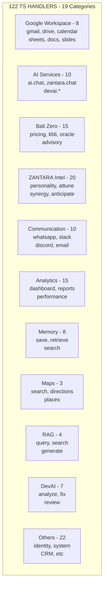
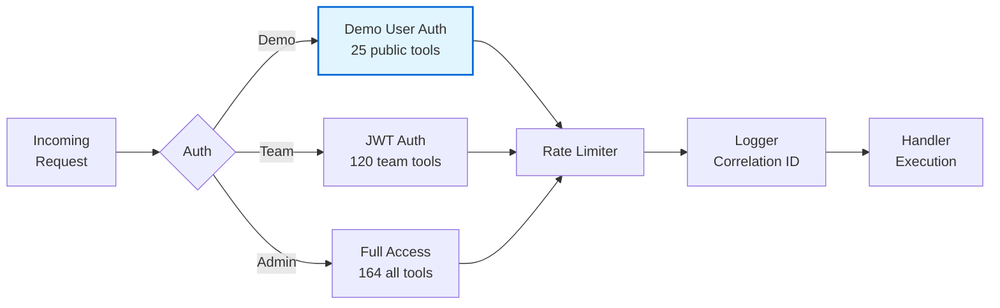
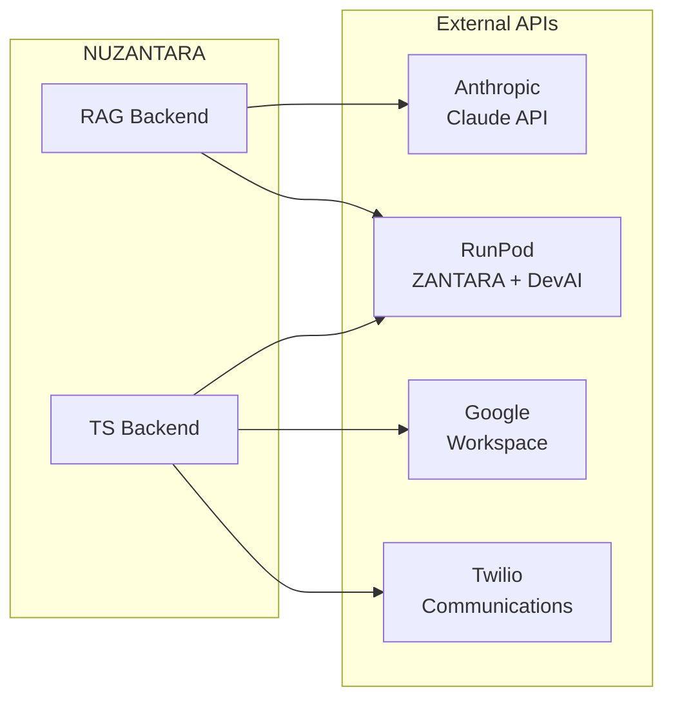

# 🔧 Technical Architecture - NUZANTARA

**Document:** 02-technical-architecture.md
**Audience:** Developers, Engineers
**Purpose:** Code structure, handlers, services, dependencies

---

## 📁 Project Structure

```
nuzantara-railway/
├── apps/              # Deployable applications
│   ├── backend-ts/   # TypeScript API (122 handlers)
│   ├── backend-rag/  # Python RAG system (48 services)
│   ├── webapp/       # Frontend (65 JS files)
│   └── dashboard/    # Admin dashboard
│
├── projects/          # Specialized projects
│   ├── oracle-system/   # 5 Oracle agents
│   ├── orchestrator/    # Multi-agent orchestration
│   └── devai/          # DevAI integration
│
├── scripts/           # Automation scripts
├── docs/              # Documentation (Galaxy Map!)
└── data/              # ChromaDB + Oracle KB
```

---

## ⚙️ TS Backend Architecture

### Handler Categories (122 Total)



### Core Services (26 Files)

| Service | Purpose | Dependencies |
|---------|---------|--------------|
| `logger.js` | Centralized logging | Winston |
| `oauth2-client.js` | Google OAuth | googleapis |
| `redis-client.js` | Redis connection | redis |
| `handler-registry.ts` | Auto-registration | Core |
| `load-all-handlers.ts` | Dynamic loading | Core |
| **+21 more services** | Various | - |

### Middleware Pipeline (16 Files)



---

## 🧠 RAG Backend Architecture

### Services (48 Files)

**Core Services:**
- `intelligent_router.py` - AI routing (Haiku ONLY)
- `claude_haiku_service.py` - Claude Haiku client
- `search_service.py` - ChromaDB search
- `memory_service_postgres.py` - PostgreSQL memory
- `conversation_service.py` - Conversation management

**Intelligence Services:**
- `emotional_attunement.py` - Emotional AI
- `collaborative_capabilities.py` - Team intelligence
- `cultural_rag_service.py` - Cultural intelligence
- `golden_answer_service.py` - Golden answers lookup
- `shadow_mode_service.py` - A/B testing

**Integration Services:**
- `handler_proxy.py` - TS handler bridge
- `tool_executor.py` - Tool execution (dual routing)
- `alert_service.py` - Multi-channel notifications
- `work_session_service.py` - Session tracking
- `team_analytics_service.py` - Team analytics

**+33 more services**

### API Endpoints (12 Main)

| Endpoint | Purpose | Method |
|----------|---------|--------|
| `/bali-zero/chat` | Main chat | POST |
| `/search` | RAG search | POST |
| `/api/oracle/*` | Oracle endpoints | Various |
| `/api/agents/*` | Agent endpoints | Various |
| `/api/notifications/*` | Notifications | Various |
| `/cache/stats` | Cache statistics | GET |
| `/health` | Health check | GET |
| **+5 more** | - | - |

---

## 🌐 Frontend Architecture

### JavaScript Files (65 Total)

**Core Services (8):**
- `api-client.js` - API integration
- `cache-manager.js` - Client caching
- `error-handler.js` - Error handling
- `request-deduplicator.js` - Request dedup
- `pwa-installer.js` - PWA support
- `router.js` - SPA routing
- `state-manager.js` - State management
- `websocket-manager.js` - WebSocket

**Features:**
- SSE streaming
- Message virtualization
- Feature discovery
- Onboarding system
- Theme switcher
- Team login
- ZANTARA knowledge

**+48 more files**

---

## 🔗 Key Integrations



---

## 📚 For More Details

- **AI Intelligence**: [03-ai-intelligence.md](./03-ai-intelligence.md)
- **Data Flows**: [04-data-flows.md](./04-data-flows.md)
- **Database Schema**: [05-database-schema.md](./05-database-schema.md)

---

**Code is poetry. This is its structure.** 🏗️
