# 🧠 AI Intelligence - NUZANTARA

**Document:** 03-ai-intelligence.md
**Audience:** AI/ML Engineers, Product Managers
**Purpose:** ZANTARA system, AI models, JIWA, Golden Answers

---

## 🤖 AI Models Ecosystem

```mermaid
graph LR
    subgraph "FRONTEND - 100%"
        H[Claude Haiku 4.5<br/>──────────────<br/>✅ ALL user queries<br/>✅ 164 tools access<br/>✅ 10 agents orchestration<br/>✅ $0.25/$1.25 per 1M<br/>✅ 1-2s response<br/>✅ ZANTARA Identity]
    end
    
    subgraph "BACKGROUND"
        Z[ZANTARA Llama 3.1<br/>──────────────<br/>🌟 Golden Answers<br/>🎭 Cultural Knowledge<br/>🔬 Shadow Mode<br/>📊 Batch Classification<br/>€3-11/month<br/>Nightly 4-6h]
    end
    
    subgraph "DEVELOPMENT"
        D[DevAI Qwen 2.5<br/>──────────────<br/>💻 Code analysis<br/>🐛 Bug fixing<br/>📝 Code review<br/>€1-3/month<br/>Backend only]
    end
    
    H -.Uses.-> Output[Cultural Intelligence<br/>Golden Answers]
    Z -.Generates.-> Output
    
    style H fill:#d4edda,stroke:#28a745,stroke-width:4px
    style Z fill:#fff3cd,stroke:#ffc107,stroke-width:4px
    style D fill:#f8d7da,stroke:#dc3545,stroke-width:2px
```

---

## 🌟 ZANTARA Golden Answers System

### What is it?

**Golden Answers** is an intelligent caching system where ZANTARA Llama pre-generates high-quality FAQ answers.

**Impact:**
- **250x speedup** (20-30s → 10-20ms)
- **50-60% cache hit** rate
- **70-80% cost** reduction

### How It Works

**Database Tables:**
- `golden_answers` - Pre-generated FAQ
- `query_clusters` - Query mapping
- `cultural_knowledge` - Cultural chunks
- `nightly_worker_runs` - Worker logs

**Performance:**
- Generation: 2-3 min per answer
- Batch: 100-200 answers per night
- Duration: 4-6 hours total
- Cost: €0.50-1.00 per run

---

## 🎭 JIWA Architecture

### Cultural Intelligence Layer

**JIWA Middleware** = Indonesian soul in every interaction

```mermaid
graph TB
    Request[User Request]
    
    Request --> JIWA[🕉️ JIWA Middleware<br/>Cultural Intelligence<br/>──────────────<br/>Gotong royong<br/>Musyawarah<br/>Tri Hita Karana]
    
    JIWA --> Detect[Detect Cultural<br/>Context]
    JIWA --> Enrich[Enrich Request]
    JIWA --> Enhance[Enhance Response]
    
    Detect --> Components[All System<br/>Components]
    Enrich --> Components
    Enhance --> Components
    
    Components --> Memory[Memory:<br/>Relationships<br/>not just facts]
    Components --> Tools[Tools:<br/>Actions with soul<br/>not just functions]
    Components --> Data[Data:<br/>Cultural context<br/>embedded]
    
    Memory --> Response[Response<br/>with JIWA]
    Tools --> Response
    Data --> Response
    
    Response --> User[User Receives<br/>Culturally Intelligent]
    
    style JIWA fill:#fff3cd,stroke:#ffc107,stroke-width:4px
```

**Indonesian Philosophical Foundation:**
- **Gotong royong**: Mutual cooperation, community over individual
- **Musyawarah**: Consensus through deliberation
- **Pancasila values**: Unity, humanity, democracy, justice
- **Tri Hita Karana**: Harmony with God, people, nature

---

## 🎯 ZANTARA Identity & Capabilities

### Who is ZANTARA?

**ZANTARA = Zero's Adaptive Network for Total Automation and Relationship Architecture**

**NOT an assistant** - A team member with cultural intelligence

---

## 🔄 ZANTARA Nightly Worker

### What Does It Do?

```mermaid
flowchart LR
    Cron[⏰ 2 AM UTC]
    
    Cron --> Worker[🌙 Nightly Worker]
    
    Worker --> Task1[📊 Query Analysis<br/>Extract & Cluster<br/>30-60 min]
    
    Task1 --> Task2[🌟 Golden Answers<br/>100-200 FAQ<br/>3-5 hours]
    
    Task2 --> Task3[🎭 Cultural Knowledge<br/>10 chunks<br/>30-60 min]
    
    Task3 --> Save[(💾 Save<br/>PostgreSQL<br/>ChromaDB)]
    
    Save --> Done[✅ Complete]
    
    style Worker fill:#e7e7ff,stroke:#6f42c1,stroke-width:3px
    style Task2 fill:#fff3cd,stroke:#ffc107,stroke-width:3px
```

**Activation:** Manual or Cron (daily)
**Duration:** 4-6 hours
**Cost:** €0.50-1.00 per run
**Output:** 100-200 Golden Answers + 10 Cultural Chunks

---

## 📊 Cost Analysis

### Monthly Costs

| Component | Cost | Usage | Notes |
|-----------|------|-------|-------|
| **Claude Haiku 4.5** | $8-15 | 100% traffic | 3x cheaper than Sonnet |
| **ZANTARA Llama** | €3-11 | Nightly | RunPod flat rate |
| **DevAI Qwen** | €1-3 | Backend | Development only |
| **TOTAL** | **$15-30** | - | Highly optimized |

### Cost Comparison

```mermaid
graph LR
    Before[Before<br/>Sonnet-based<br/>──────────────<br/>$25-55/month]
    
    After[After<br/>Haiku-only<br/>──────────────<br/>$8-15/month]
    
    Savings[💰 Savings<br/>──────────────<br/>3x cheaper<br/>Same quality]
    
    Before --> After
    After --> Savings
    
    style Savings fill:#d4edda,stroke:#28a745,stroke-width:3px
```

---

## ⚡ Performance Metrics

### Response Times

| Scenario | Time | Hit Rate | Speedup |
|----------|------|----------|---------|
| **Golden Answer** | 10-20ms | 50-60% | 250x ⚡⚡⚡ |
| **Redis Cache** | 2ms | Select | 500x ⚡⚡⚡⚡ |
| **Haiku + RAG** | 1-2s | 40-50% | Baseline ⚡ |
| **With Tools** | 2-4s | Complex | - |

### Quality Metrics

- **Haiku 4.5**: 96.2% of Sonnet quality (with RAG)
- **ZANTARA Llama**: 98.74% accuracy (22,009 trained conversations)
- **Golden Answers**: Verified legal accuracy, citations included

---

## 🎯 Tools & Agents

### 164 Tools Available

### 15 AI Agents

**10 RAG Agents:**
1. Client Journey Orchestrator
2. Proactive Compliance Monitor
3. Knowledge Graph Builder
4. Auto Ingestion Orchestrator
5. Cross Oracle Synthesis
6. Dynamic Pricing
7. Autonomous Research
8. Intelligent Query Router
9. Conflict Resolution
10. Business Plan Generator

**5 Oracle Agents:**
1. VISA Oracle (immigration)
2. KBLI Eye (business classification)
3. TAX Genius (tax consulting)
4. Legal Architect (legal consulting)
5. Morgana (content creation)

---

## 🔬 Shadow Mode (A/B Testing)

**Purpose:** A/B test LLAMA vs Claude in background
**Impact:** Zero user latency
**Use:** Quality comparison, routing optimization

---

## 📚 For More Details

- **Data Flows**: [04-data-flows.md](./04-data-flows.md)
- **Database Schema**: [05-database-schema.md](./05-database-schema.md)
- **Technical Architecture**: [02-technical-architecture.md](./02-technical-architecture.md)

---

**Intelligence is distributed. Performance is optimized. Culture is embedded.** 🧠🌟
