# 🔄 Data Flows - NUZANTARA

**Document:** 04-data-flows.md
**Audience:** DevOps, QA, Engineers
**Purpose:** Request flows, performance analysis, testing scenarios

---

## 🔄 FLOW 1: User Chat (Real-time)

```mermaid
sequenceDiagram
    autonumber
    
    User->>WebApp: Type message + Enter
    WebApp->>TS Backend: POST /call
    TS Backend->>TS Backend: Demo Auth (25 public tools)
    TS Backend->>RAG Backend: Proxy to /bali-zero/chat
    RAG Backend->>PostgreSQL: Check Golden Answer
    
    alt Golden Answer Found (50-60%)
        PostgreSQL-->>User: ⚡ Instant (10-20ms)
    else No Golden Answer (40-50%)
        RAG Backend->>ChromaDB: Search cultural_insights
        ChromaDB-->>RAG Backend: Cultural context (<5ms)
        RAG Backend->>ChromaDB: Search 14 collections
        ChromaDB-->>RAG Backend: Top 5-10 docs (2000-3000 words)
        RAG Backend->>Haiku 4.5: Generate with context
        Haiku 4.5->>Haiku 4.5: Tool calling (if needed)
        Haiku 4.5-->>RAG Backend: Response
        RAG Backend->>PostgreSQL: Save conversation
        RAG Backend-->>User: 🤖 Stream (SSE) 1-2s
    end
```



**Performance:**
- Golden Answer: 10-20ms (50-60% queries)
- Haiku + RAG: 1-2s (40-50% queries)
- With Tools: 2-4s (complex tasks)

---

## 🌙 FLOW 2: ZANTARA Nightly Worker


**Activation:** Manual or Cron
**Duration:** 4-6 hours
**Cost:** €0.50-1.00 per run
**Output:** 100-200 FAQ + 10 Cultural Chunks

---

## ⚡ FLOW 3: Golden Answer Lookup


---

## 🔧 FLOW 4: Tool Execution (Dual Routing)


**Python Tools (9):**
- Direct PostgreSQL access
- Team logins, sessions, stats
- Memory operations

**TypeScript Tools (155):**
- Google Workspace integration
- CRM, Analytics, Communication
- All other business operations

---

## 📊 Performance Analysis

### Response Time Distribution


**Average User Experience:**
- 50-60% get instant response (10-20ms)
- 40-50% get fast response (1-2s)
- **Overall avg: 600-800ms** ⚡

### Cost Per Query

| Scenario | Cost | Notes |
|----------|------|-------|
| **Golden Answer** | $0.0000 | Free (pre-generated) |
| **Redis Cache** | $0.0000 | Free (cached) |
| **Haiku + RAG** | $0.0012 | Anthropic API cost |
| **With Tools** | $0.0015 | Additional API calls |

**70-80% cost reduction** with Golden Answers!

---

## 🧪 Testing Scenarios

### Scenario 1: Simple Greeting

```
Input: "Ciao!"
Expected Flow:
1. Check Golden Answer → Miss
2. Skip RAG (greeting)
3. Haiku direct response
4. Response time: 300-500ms
5. No tools needed
```

### Scenario 2: Business Query (Golden Answer)

```
Input: "What docs for KITAS?"
Expected Flow:
1. Check Golden Answer → HIT
2. Return cached answer
3. Response time: 10-20ms
4. Cost: $0.0000
```

### Scenario 3: Complex Business Query

```
Input: "Open PT PMA for IT consulting, capital requirements?"
Expected Flow:
1. Check Golden Answer → Miss
2. RAG search (legal, kbli, tax)
3. Cultural context injection
4. Haiku generation with tools
5. Tools: kbli.lookup, oracle.analyze
6. Response time: 2-4s
7. Citations included
```

---

## 📚 For More Details

- **AI Intelligence**: [03-ai-intelligence.md](./03-ai-intelligence.md)
- **Database Schema**: [05-database-schema.md](./05-database-schema.md)
- **Technical Architecture**: [02-technical-architecture.md](./02-technical-architecture.md)

---

**Every flow optimized. Every millisecond counts.** ⚡🔄
