# 🗄️ Database Schema - NUZANTARA

**Document:** 05-database-schema.md
**Audience:** DBAs, Backend Engineers
**Purpose:** Complete database structure (PostgreSQL + ChromaDB + Redis)

---

## 🗄️ PostgreSQL - 34 Tables

```mermaid
graph TB
    subgraph "PostgreSQL - 34 Tables"
        Core[Core - 4<br/>users<br/>conversations<br/>memory_facts<br/>memory_entities]
        
        Business[Business - 3<br/>clients<br/>projects<br/>work_sessions]
        
        Analytics[Analytics - 3<br/>team_analytics<br/>performance_metrics<br/>handler_executions]
        
        Oracle[Oracle - 19<br/>VISA: 5 tables<br/>KBLI: 6 tables<br/>TAX: 4 tables<br/>PROPERTY: 4 tables]
        
        ZANTARA[ZANTARA - 4<br/>golden_answers<br/>query_clusters<br/>cultural_knowledge<br/>nightly_worker_runs]
    end
    
    ZANTARA -.Generates via.-> Worker[🌙 Nightly Worker]
    
    style ZANTARA fill:#fff3cd,stroke:#ffc107,stroke-width:3px
```



---

## 📊 Core Tables (4)

### `users`
- User profiles and authentication
- Team member information
- Permissions and roles

### `conversations`
- Chat history
- AI responses
- Session tracking

### `memory_facts`
- User facts and preferences
- Context for personalization
- Relationship memory

### `memory_entities`
- Named entities
- Extracted from conversations
- For entity recognition

---

## 🏢 Business Tables (3)

### `clients`
- CRM client profiles
- Auto-extracted from conversations
- Contact information

### `projects`
- Client projects (KITAS, PT PMA, etc.)
- Status tracking
- Timeline management

### `work_sessions`
- Team work sessions
- Time tracking
- Analytics data

---

## 🌟 ZANTARA Tables (4)

### `golden_answers`

```sql
CREATE TABLE golden_answers (
    id SERIAL PRIMARY KEY,
    cluster_id VARCHAR(100) UNIQUE,
    canonical_question TEXT,
    variations TEXT[],
    answer TEXT,
    sources JSONB,
    generated_by VARCHAR(50),  -- 'llama-3.1-zantara'
    confidence FLOAT,
    usage_count INTEGER DEFAULT 0,
    last_used_at TIMESTAMP,
    created_at TIMESTAMP DEFAULT NOW()
);
```

**Purpose:** Pre-generated FAQ answers
**Generated by:** ZANTARA Llama (nightly worker)
**Impact:** 250x speedup (10-20ms lookup)

### `query_clusters`

```sql
CREATE TABLE query_clusters (
    id SERIAL PRIMARY KEY,
    cluster_id VARCHAR(100),
    query_text TEXT,
    query_hash VARCHAR(64) UNIQUE,
    similarity_score FLOAT,
    frequency INTEGER DEFAULT 1,
    FOREIGN KEY (cluster_id) REFERENCES golden_answers(cluster_id)
);
```

**Purpose:** Map user queries to golden answers
**Matching:** MD5 hash + semantic similarity

### `cultural_knowledge`

```sql
CREATE TABLE cultural_knowledge (
    id SERIAL PRIMARY KEY,
    topic VARCHAR(100),
    content TEXT,
    when_to_use TEXT[],
    tone VARCHAR(50),
    generated_by VARCHAR(50) DEFAULT 'llama-3.1-zantara',
    usage_count INTEGER DEFAULT 0,
    created_at TIMESTAMP DEFAULT NOW()
);
```

**Purpose:** Indonesian cultural intelligence chunks
**Generated by:** ZANTARA Llama (nightly worker)
**Used by:** Haiku for cultural context enhancement

**Example Topics:**
- `indonesian_greetings`
- `bureaucracy_patience`
- `face_saving_culture`
- `tri_hita_karana`

### `nightly_worker_runs`

```sql
CREATE TABLE nightly_worker_runs (
    id SERIAL PRIMARY KEY,
    run_date DATE,
    start_time TIMESTAMP,
    end_time TIMESTAMP,
    golden_answers_generated INTEGER DEFAULT 0,
    cultural_chunks_generated INTEGER DEFAULT 0,
    llama_tokens_used INTEGER DEFAULT 0,
    status VARCHAR(20) DEFAULT 'running',
    created_at TIMESTAMP DEFAULT NOW()
);
```

**Purpose:** Track ZANTARA nightly worker execution
**Monitoring:** Performance, cost, success rate

---

## 🔍 ChromaDB - 14 Collections


### Collection Details

| Collection | Documents | Purpose | Source |
|------------|-----------|---------|--------|
| `bali_zero_pricing` | ~100 | Pricing info | Manual |
| `visa_oracle` | ~500 | Visa knowledge | Scraped |
| `kbli_eye` | ~1,000 | KBLI codes | Official |
| `tax_genius` | ~800 | Tax knowledge | Scraped |
| `zantara_books` | 12,907 | Indonesian books | Uploaded |
| `kb_indonesian` | ~200 | Indonesian KB | Manual |
| `legal_architect` | ~600 | Legal knowledge | Scraped |
| `legal_updates` | ~400 | Legal updates | Scraped |
| `property_listings` | ~300 | Property data | Scraped |
| `property_knowledge` | ~200 | Property knowledge | Manual |
| `tax_updates` | ~300 | Tax updates | Scraped |
| `tax_knowledge` | ~500 | Tax knowledge | Scraped |
| `cultural_insights` | ~58 | Cultural chunks | **ZANTARA generated** |
| `oracle_kbli_knowledge` | ~1,000 | KBLI Oracle | Migrated |

**Total:** 14,365+ documents

---

## ⚡ Redis - Caching Layer

### Purpose


### Cache Configuration

| Endpoint | TTL | Hit Rate |
|----------|-----|----------|
| `/bali-zero/chat` (golden) | 5 min | 50-60% |
| `/search` | 5 min | 30-40% |
| `/api/oracle/*` | 10 min | 20-30% |
| Default | 5 min | Variable |

### Rate Limits

| Endpoint | Limit | Window |
|----------|-------|--------|
| `/api/agents/journey/create` | 10 | 1 hour |
| `/api/agents/compliance/*` | 20 | 1 hour |
| `/bali-zero/chat` | 30 | 1 minute |
| Default | 200 | 1 minute |

---

## 🔄 Data Flow: Write Operations


---

## 📈 Database Performance

### Query Performance

| Operation | Time | Optimization |
|-----------|------|--------------|
| Golden Answer lookup | 10ms | Indexed query_hash |
| Memory facts retrieval | 5-10ms | Indexed user_id |
| ChromaDB search | 50-100ms | Vector index |
| Redis cache | 2ms | In-memory |

### Storage Size

| Database | Size | Growth Rate |
|----------|------|-------------|
| PostgreSQL | ~100MB | ~5MB/month |
| ChromaDB | ~500MB | ~10MB/month |
| Redis | In-memory | Cleared daily |

---

## 🔒 Security

### Access Control

| User Type | PostgreSQL Access | ChromaDB Access | Redis Access |
|-----------|------------------|-----------------|--------------|
| **Demo** | Read-only (limited tables) | Read-only | Read-only |
| **Team** | Read-write (most tables) | Read-only | Read-write |
| **Admin** | Full access | Full access | Full access |

---

## 📚 For More Details

- **AI Intelligence**: [03-ai-intelligence.md](./03-ai-intelligence.md)
- **Data Flows**: [04-data-flows.md](./04-data-flows.md)
- **System Overview**: [01-system-overview.md](./01-system-overview.md)

---

**Data is the foundation. Schema is the blueprint.** 🗄️📊
