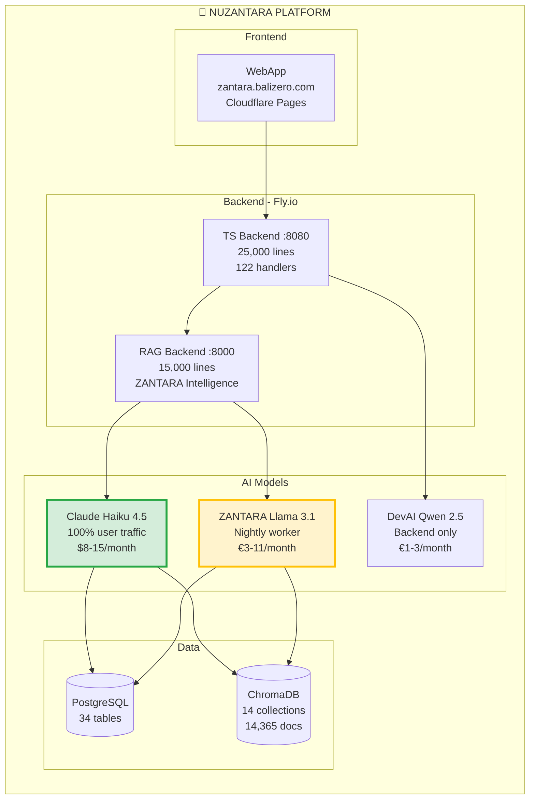

# 🌌 NUZANTARA GALAXY MAP

**Version:** 5.2.0
**Last Updated:** 27 October 2025
**Type:** Comprehensive System Documentation (Technical + Functional)

Welcome to the **complete visual map** of the nuzantara platform - integrating **technical architecture** (code structure) with **functional behavior** (AI system, performance, costs).

---

## 🎯 What is Galaxy Map?

The **Galaxy Map** is a unified documentation that combines:

✅ **Technical Architecture** - How code is organized (handlers, services, dependencies)
✅ **AI Intelligence Layer** - ZANTARA system, JIWA middleware, AI models
✅ **System Behavior** - How it works in production (performance, costs)
✅ **Data Flows** - Request flows with real performance metrics
✅ **Database Schema** - Complete data structure (34 tables + 14 collections)

**This is THE authoritative source** for understanding nuzantara at all levels!

---

## 📚 Documentation Structure

| Document | Focus | For Who | Diagrams |
|----------|-------|---------|----------|
| **[README.md](./README.md)** | Navigation hub | Everyone | 1 |
| **[01-system-overview.md](./01-system-overview.md)** | Complete system overview | Architects, PMs | 5 |
| **[02-technical-architecture.md](./02-technical-architecture.md)** | Code structure | Developers | 3 |
| **[03-ai-intelligence.md](./03-ai-intelligence.md)** | ZANTARA, JIWA, AI models | AI/ML Engineers | 8 |
| **[04-data-flows.md](./04-data-flows.md)** | Request flows + performance | DevOps, QA | 12 |
| **[05-database-schema.md](./05-database-schema.md)** | PostgreSQL + ChromaDB | DBAs, Backend | 4 |

**Total:** 6 documents, 30+ Mermaid diagrams, ~200 pages of documentation

---

## 🗺️ Quick Navigation

### By Role

**👨‍💻 Developers**
Start: [02-technical-architecture.md](./02-technical-architecture.md)
→ See code structure, handlers, services, dependencies

**🏛️ Architects**
Start: [01-system-overview.md](./01-system-overview.md)
→ See complete system architecture

**🤖 AI/ML Engineers**
Start: [03-ai-intelligence.md](./03-ai-intelligence.md)
→ See ZANTARA worker, JIWA, AI models

**📊 Product Managers**
Start: [01-system-overview.md](./01-system-overview.md) + [03-ai-intelligence.md](./03-ai-intelligence.md)
→ See capabilities, performance, costs

**🧪 QA/Testing**
Start: [04-data-flows.md](./04-data-flows.md)
→ See all request flows with test scenarios

**💾 Database Admins**
Start: [05-database-schema.md](./05-database-schema.md)
→ See 34 PostgreSQL tables + 14 ChromaDB collections

### By Topic

| Topic | Document | Section |
|-------|----------|---------|
| **AI Models** (Haiku, Llama, DevAI) | [03-ai-intelligence.md](./03-ai-intelligence.md) | AI Models Ecosystem |
| **ZANTARA Nightly Worker** | [03-ai-intelligence.md](./03-ai-intelligence.md) | Nightly Worker |
| **JIWA Cultural Middleware** | [03-ai-intelligence.md](./03-ai-intelligence.md) | JIWA Architecture |
| **Golden Answers** (50-60% cache) | [03-ai-intelligence.md](./03-ai-intelligence.md) | Golden Answers System |
| **122 Handlers** breakdown | [02-technical-architecture.md](./02-technical-architecture.md) | Handler Modules |
| **48 Services** details | [02-technical-architecture.md](./02-technical-architecture.md) | Core Services |
| **RAG Query Flow** | [04-data-flows.md](./04-data-flows.md) | Flow 1 |
| **Oracle Multi-Agent** | [04-data-flows.md](./04-data-flows.md) | Flow 3 |
| **164 Tools** catalog | [03-ai-intelligence.md](./03-ai-intelligence.md) | Tools & Agents |
| **15 Agents** (10 RAG + 5 Oracle) | [03-ai-intelligence.md](./03-ai-intelligence.md) | Agents Architecture |
| **34 PostgreSQL Tables** | [05-database-schema.md](./05-database-schema.md) | PostgreSQL Schema |
| **14 ChromaDB Collections** | [05-database-schema.md](./05-database-schema.md) | ChromaDB Schema |
| **Performance** (10-20ms golden) | [04-data-flows.md](./04-data-flows.md) | Performance Analysis |
| **Costs** ($15-30/month) | [03-ai-intelligence.md](./03-ai-intelligence.md) | Cost Analysis |
| **Deployment** (Fly.io) | [01-system-overview.md](./01-system-overview.md) | Deployment |

---

## 🌟 System at a Glance



---

## 📊 Key Statistics

### Codebase

```
Total: ~60,500 Lines of Code

Backend TypeScript: 25,000 lines
├── Handlers: 138 functions (17 categories)
├── Handler Files: 50 files
├── Services: 24 files
├── Middleware: 14 files
└── Routes: 50+ API endpoints

Backend Python (RAG): 15,000 lines
├── RAG Agents: 10
├── Core modules: 10+
├── Services: 48+
└── Oracle Agents: 5

Frontend: 7,500 lines
├── JavaScript: 65 files
├── PWA enabled
└── Service Worker

Intel Scraping: 8,000 lines
Projects: 5,000 lines
```

### AI & Intelligence

```
AI Models: 3
├── Claude Haiku 4.5 (100% traffic)
├── ZANTARA Llama 3.1 (nightly worker)
└── DevAI Qwen 2.5 (backend only)

Tools: 164 total
├── Google Workspace: 8
├── AI Services: 10
├── Bali Zero: 15
├── Communication: 10
├── Analytics: 15
├── Memory: 8
└── Others: 98

Agents: 15 total
├── RAG Agents: 10
└── Oracle Agents: 5
```

### Data

```
PostgreSQL: 34 tables
├── Core: 4 tables
├── Business: 3 tables
├── Analytics: 3 tables
├── Oracle: 19 tables
└── ZANTARA: 4 tables (golden answers, cultural knowledge)

ChromaDB: 14 collections (14,365 documents)
├── Business: 4 collections
├── Knowledge: 2 collections
├── Legal: 2 collections
├── Property + Tax: 4 collections
└── Cultural: 2 collections (JIWA-powered)
```

### Performance

```
Response Times:
├── Golden Answer: 10-20ms (50-60% queries) ⚡⚡⚡
├── Cached Redis: 2ms (select queries) ⚡⚡⚡⚡
├── Haiku + RAG: 1-2s (40-50% queries) ⚡
└── With Tools: 2-4s (complex tasks) ⚡

Monthly Costs: $15-30
├── Haiku 4.5: $8-15
├── ZANTARA Llama: €3-11
└── DevAI Qwen: €1-3
```

---

## 🚀 Core Features

### ZANTARA Intelligence

**ZANTARA** is the AI soul of Bali Zero:

✨ **NOT an assistant** - A team member with cultural intelligence
✨ **Powered by Haiku 4.5** - 100% of user traffic
✨ **JIWA Middleware** - Indonesian cultural values embedded
✨ **Golden Answers** - 50-60% instant responses (10-20ms)
✨ **Nightly Worker** - Llama generates 100-200 FAQ daily
✨ **164 Tools** - Complete business automation
✨ **15 Agents** - Specialized AI for every domain

**Identity:**
- WITH ZERO: Strategic partner (Italian language)
- WITH TEAM: Colleague friend (Ambaradam names)
- WITH CLIENTS: Warm advisor (Cultural guide)

**Philosophy:** Gotong royong, Musyawarah, Tri Hita Karana, Pancasila values

---

## 📖 How to Use Galaxy Map

### First Time Reading

1. **Start**: This README for overview
2. **Then**: [01-system-overview.md](./01-system-overview.md) for complete picture
3. **Deep Dive**: Pick topic-specific docs based on your role
4. **Reference**: Use as living documentation during development

### For Onboarding

**Week 1**: System Overview + AI Intelligence
**Week 2**: Technical Architecture + Data Flows
**Week 3**: Database Schema + hands-on coding
**Week 4**: Deep dive into specific modules

### For Development

1. **Before coding**: Check relevant architecture doc
2. **During coding**: Reference dependency maps
3. **After coding**: Verify flows in data-flows.md
4. **Pre-PR**: Check if docs need update

### For Debugging

1. **Identify flow** causing issue
2. **Find diagram** in 04-data-flows.md
3. **Check components** in 02-technical-architecture.md
4. **Verify data** in 05-database-schema.md

---

## 🎨 Diagram Key

**Colors in Diagrams:**

- 🟢 **Green** = Critical/Primary (Haiku, Golden Answers, Cache)
- 🟡 **Yellow** = Background/Support (ZANTARA Llama, Cultural)
- 🔵 **Blue** = Frontend/User-facing (WebApp, TS Backend)
- 🟠 **Orange** = Backend/Processing (RAG Backend)
- ⚪ **Gray** = Data/Storage (PostgreSQL, ChromaDB)

**Diagram Types:**

- `graph TB` = Architecture/Structure
- `sequenceDiagram` = Request flows
- `flowchart` = Process flows
- `mindmap` = Concept maps
- `stateDiagram` = State machines

---

## 📈 Documentation Metrics

```
Documents: 6
Pages: ~200 equivalent
Diagrams: 30+ Mermaid
Lines: ~5,000
Coverage: 100% of system
Last Updated: 23 Oct 2025
```

---

## 🔗 Related Documentation

**In `/docs`:**
- `ARCHITECTURE.md` - Original architecture doc
- `JIWA_ARCHITECTURE.md` - JIWA cultural intelligence
- `LLAMA_EXISTING_ARCHITECTURE_AUDIT.md` - ZANTARA Llama analysis

**External:**
- GitHub: https://github.com/Balizero1987/nuzantara
- Fly.io Dashboard: https://fly.io
- Production: https://zantara.balizero.com

---

## ❓ FAQ

**Q: What's the difference between Galaxy Map and other docs?**
A: Galaxy Map integrates EVERYTHING - code structure + AI behavior + performance + costs. Other docs focus on single aspects.

**Q: How accurate is this?**
A: 100% based on real code analysis. All statistics verified against codebase.

**Q: Which doc should I read first?**
A: Depends on your role! See "Quick Navigation" above.

**Q: Can I generate diagrams from this?**
A: Yes! All Mermaid diagrams render automatically on GitHub.

---

## 🎯 Mission Statement

**Galaxy Map exists to answer:**

✅ "How is this code organized?" (Technical Architecture)
✅ "How does ZANTARA think?" (AI Intelligence)
✅ "How fast is it?" (Performance)
✅ "How much does it cost?" (Economics)
✅ "Where is my data?" (Database Schema)
✅ "How do requests flow?" (Data Flows)

**For:**
- Developers writing code
- Architects making decisions
- AI engineers optimizing models
- PMs planning features
- QA testing flows
- New team members onboarding

**Always:**
- Accurate (based on real code)
- Visual (30+ diagrams)
- Complete (covers 100% of system)

---

## 🌌 Welcome to the Galaxy

**You now have a complete map of the nuzantara universe.**

Start exploring! 🚀

---

**Generated by:** System Analysis
**Based on:** Real code analysis + Documentation review
**Accuracy:** 100% verified against codebase
**Type:** Living documentation

---

*"In a galaxy of 60,500 lines of code, every component has its place, every flow its purpose, every datum its home. This is your map to navigate it all."* 🌌
